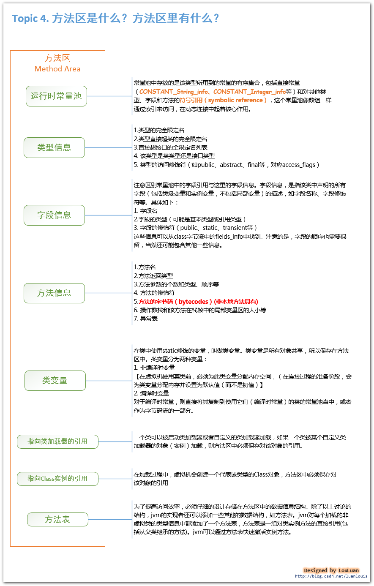

# 自动内存管理机制

Java与C++之间的区别
- 内存动态分配
- 垃圾收集技术

## 运行时数据区域

Java虚拟机在执行Java程序的过程中会把它所管理的内存划分为若干个不同的数据区域，这些区域都有 ***各自的用途*** ，以及 ***创建和销毁的时间*** ，***有的区域随着虚拟机进程的启动而存在，有些区域则是依赖用户线程的启动和结束而建立和销毁***。

### 程序计数器
- ***较小的、线程私有***的内存空间，***用来存储当前线程所执行的字节码的行号指示器***
- 字节码解释器工作时就是通过改变这个计数器的值来选取下一条需要执行的字节码指令，分支、循环、跳转、异常处理、线程恢复等基础功能都需要依赖这个计数器完成
- 若线程执行的是一个Java方法，则记录的是正在执行的虚拟机字节码指令的地址
- 若正在执行的是Natvie方法，则这个计数器值为空
- 唯一一个在Java虚拟机规范中没有规定任何`OutOfMemoryError`情况的区域

### Java虚拟机栈
- ***线程私有，生命周期与线程相同***
- 描述的是Java方法执行的内存模型：每个方法被执行时都会创建一个栈帧，用于存储局部变量表、操作栈、动态链接、方法出口等信息。每一个方法被调用直至执行完成的过程，就对应一个栈帧在虚拟机栈中从入栈到出栈的过程
- 局部变量表存储了编译器可知的各种基本数据类型、对象引用类型。***局部变量表所需的内存空间在编译期间完成分配***，当进入一个方法时，这个方法需要在帧中分配多大的局部变量空间是完全确定的，在方法运行期间不会改变局部变量表的大小
- ***如果线程请求的栈深度大于虚拟机所允许的深度，将抛出`StackOverflowError`异常***
- ***如果虚拟机栈可以动态扩展，当扩展时无法申请到足够的内存时会抛出`OutOfMemoryError`异常***

### 本地方法栈
- 与Java虚拟机栈所发挥的作用非常相似，区别是，Java虚拟机栈是虚拟机执行Java方法服务，本地方法栈则是为虚拟机使用的Native方法服务
- 本地方法栈也会抛出`StackOverflowError`和`OutOfMemoryError`异常

### Java堆
- Java虚拟机管理的最大的一块内存
- 线程共享
- 虚拟机启动时创建
- 此内存区域的唯一目的就是存放对象实例，几乎所有的对象实例都在这里分配。为什么说几乎，因为随着虚拟机的一些优化，所有的对象都分配在堆上就逐渐变得不是那么绝对了
- Java堆可处于物理上不连续的内存空间中，只要逻辑上连续即可
- 大部分虚拟机的堆都是可扩展的，当内存不足，堆中没有内存完成实例分配时，会抛出`OutOfMemoryError`异常

### 方法区
- 方法区与堆一样，也是***各个线程共享的内存区域***
- 用于存储已被虚拟机加载的***类信息、常量、静态变量、即时编译器编译后的代码等数据***
- 有时候又称为***永久代***，但实际上并不永久，这个区域的内存回收目标主要是针对常量池的回收和类型的卸载，方法区内存回收的效果是比较低的，但是却很有必要，因为曾经发生过该区域未完全回收导致的内存泄漏
- 不需要连续的内存、可选择固定大小也可扩展、也可以不实现垃圾回收
- 当方法区无法满足内存分配需求时，将抛出`OutOfMemoryError`异常

### 运行时常量池
- ***方法区的一部分***
- Class文件除了类的版本、字段、方法、接口等描述信息外，还有一项信息时常量池，用于存放编译期生成的各种字面量和符号引用，这部分将在类加载后存放到方法区的运行常量池中
- 运行时常量池与Class文件的常量池的另外一个重要特征是具备***动态性***。因为程序运行期间也可能将新的常量放入池中，如String类的intern()方法
- 当运行时常量池无法申请到内存时会抛出`OutOfMemoryError`异常

### 直接内存
- 不是虚拟机运行时数据区的一部分，也不是Java虚拟机规范中定义的内存区域，但是这部分内存也被频繁使用，可能导致`OutOfMemoryError`异常
- 如Java中的NIO类，引入了一种基于通道与缓冲区的I/O方式，可以使用Native函数库直接分配堆外内存

## 对象访问
Java中对象访问有两种主流方式：
- **使用句柄访问方式**，会在Java堆中划分出一块内存用来作为句柄池，`reference`中存储的就是对象的句柄地址，句柄中包含了对象实例数据和类型数据各自的具体地址信息

- 使用直接指针访问方式，`reference`中直接存储的就是对象地址

两种方式各有优势：
- 使用句柄方式，`reference`中存储的是稳定的句柄地址，在对象被移动时只会改变句柄中的实例数据指针，而`reference`本身不需要被修改
- 直接指针访问方式，速度快，节省了一次指针定位的时间开销，主要虚拟机`Sun HotSpot`就是用的直接指针访问

## 参考文章

[java虚拟机原理图解](https://blog.csdn.net/lilamei170607/article/details/81428781)  
[深入理解Java虚拟机：JVM高级特性与最佳实践]()