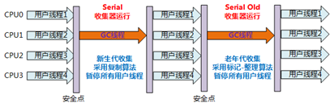
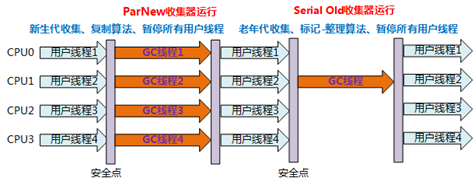

# 垃圾收集器与内存分配策略

垃圾收集（GC）需要完成的三件事情：
- 哪些内存需要回收
- 什么时候回收
- 如何回收

程序计数器、虚拟机栈、本地方法栈三个区域随线程而生，随线程而灭。栈帧随方法进入和退出而入栈和出栈，栈帧分配多少内存在编译期基本就是已知的。所以这几个区域的内存分配和回收都具备确定性。

Java堆和方法区不一样，这部分区域的内存分配和回收都是动态的，垃圾收集器所关注的都是这部分内存。

## 如何确定对象已死呢

### 引用计数算法
给对象中添加一个引用计数器，每当有一个地方引用它时，计数器值就加1；当引用失效时，计数器值就减1；任何时刻，计数器都为0的对象就是不可能再被使用的。

**缺点：**  
无法解决对象之间的相互引用问题

### 根搜索算法
通过一系列的名为“GC Roots”的对象作为起始点，从这些节点开始向下搜索，搜索所走过的路径称为引用链，当一个对象到`GC Roots`没有任何引用链相连时，则证明此对象是不可用的。Java语言使用的就是根搜索算法

可以作为`GC Roots`的对象包括以下几种：
- 虚拟机栈（栈帧中的本地变量表）中的引用对象
- 方法区中的类静态属性引用的对象
- 方法区中常量引用的对象
- 本地方法栈中JNI（即一般所说的Native方法）的引用的对象

### Java中的引用
Java中的引用分为四种：
- 强引用——代码中普遍存在，类似`Object obj = new Object()`，只要强引用还在，垃圾收集器永远不会回收掉被引用的对象
- 软引用——用来描述一些还有用，但并非必需的对象。对于软引用关联着的对象，在系统将要发生内存溢出异常之前，将会把这些对象列进回收范围之中并进行第二次回收，如果这次回收还是没有足够的内存，才会抛出内存溢出异常。`SoftReference`类来实现软引用
- 弱引用——描述非必需对象，被弱引用关联的对象只能生存到下一次垃圾收集发生之前。当垃圾收集器工作时，无论当前内存是否足够，都会回收掉只被弱引用关联的对象。`WeakReference`类来实现弱引用
- 虚引用——最弱的一种引用关系。一个对象是否有虚引用的存在，完全不会对其生存时间构成影响，也无法通过虚引用来取得一个实例对象。当一个对象设置虚引用关联的位移目的就是希望能在这个对象被收集器回收时收到一个系统通知。`PhantomReference`类来实现虚引用

### finalize()方法

一个对象真正的死亡，至少要经历两次标记过程：如果对象在经历根搜索后发现没有与`GC Roots`相连接的引用链，那它将被第一次标记并且进行一次筛选，筛选的条件是此对象是否有必要执行`finalize()`方法。当对象没有覆盖`finalize()`方法或者`finalize()`方法已经被虚拟机调用过，虚拟机将这两种情况都视为“没有必要执行”。如果这个对象被判定为有必要执行`finalize()`方法，那么这个对象将会被放置在一个名为`F-Queue`的队列中，并在稍后由一条由虚拟机自动建立的、低优先级的`Finalize`线程去执行。

### 方法区的回收
- 方法区（永久代）的垃圾收集主要回收***废弃常量***和***无用的类***，回收性价比较低
- 回收废弃常量与回收Java堆中的对象非常相似，也是通过引用来判断常量是否有用，如果没用，就会被回收
- 判断一个类是否是无用的类，需要满足以下三个条件：
    - 该类所有的实例已经被回收
    - 加载该类的`ClassLoader`已经被回收
    - 该类对应的`java.lang.Class`对象没有任何地方被引用，无法在任何地方通过反射访问该类的方法
- 类的回收，除满足以上三个条件，还需要根据虚拟机相关参数`-Xnoclassgc`来判断
- 在大量使用反射、动态代理、CGLib等框架的场景下，都需要虚拟机具备类卸载的功能，保证永久代不会溢出

## 垃圾收集算法

### 标记-清除算法
算法分为“标记”和“清除”两阶段：首先标记出需要回收的对象，在标记完成后同一回收掉所有被标记的对象

缺点：
- 标记和清除过程的效率都不高
- 标记清除之后会产生大量不连续的内存碎片

### 复制算法
将可用内存按容量分为大小相等的两块，每次只使用其中一块。当这一块的内存用完了，就将还存活着的对象复制到另一块上面，然后再已使用过的内存空间一次清理掉。

目前的商业虚拟机都采用这种收集算法来回收新生代，将内存分为一块较大的`Eden`空间和两块较小的`Survivor`空间，每次使用`Eden`和其中的一块`Survivor`，大小比例为8:1。当`Survivor`空间不够用时，需要依赖其他内存（老年代）进行分配担保。

优点：
- 实现简单、运行高效

缺点：
- 代价高，将可用内容缩小为原先的一半

### 标记-整理算法
标记-整理算法适用于老年代的内存回收，标记过程仍然与标记-清理算法一致，但后续步骤不是直接对可回收对象进行清理，而是让所有存活的对象都向一端移动，然后直接清理掉端边界以外的内存。

### 分代收集算法
- 新生代——复制算法
- 老年代——标记清理或标记整理算法

## 垃圾收集器

### Serial 收集器

**特点：**
- 针对新生代
- 采用复制算法
- 单线程收集
- 进行垃圾收集时，必须暂停所有工作线程，直到完成，即`Stop The World`

**应用场景： ** 
依然是HotSpot在Client模式下默认的新生代收集器

**特点：**
- 对于限定单个CPU的环境来说，Serial收集器没有线程交互（切换）开销，可以获得最高的单线程收集效率；
- 在用户的桌面应用场景中，可用内存一般不大（几十M至一两百M），可以在较短时间内完成垃圾收集（几十MS至一百多MS）,只要不频繁发生，这是可以接受的

**Serial/Serial Old组合收集器运行示意图如下：**

### ParNew收集器

**特点：**
- 除多线程外，与Serial一样

**应用场景：**
- 在Server模式下，ParNew收集器是一个非常重要的收集器，因为除Serial外，目前只有它能与CMS收集器配合工作；
- 但在单个CPU环境中，不会比Serail收集器有更好的效果，因为存在线程交互开销。

**ParNew/Serial Old 组合收集器运行示意图：**

### Parallel Scavenge收集器

**特点：**
- 也称为吞吐量收集器
- 新生代收集器
- 采用复制算法
- 多线程收集

**应用场景：**
- 高吞吐量为目标，即减少垃圾收集时间，让用户代码获得更长的运行时间
- 当应用程序运行在具有多个CPU上，对暂停时间没有特别高的要求时，即程序主要在后台进行计算，而不需要与用户进行太多交互。如：执行批量处理、订单处理、工资支付、科学计算的应用程序

### Serial Old收集器

**特点：**
- Serial收集器的老年代版本
- 采用标记-整理算法（还有压缩，Mark-Sweep-Compact）
- 单线程收集

**应用场景：**
- 主要用于Client模式

**Serial/Serial Old收集器运行示意图如下：** 

### Paraller Old收集器

**特点：**
- Paraller Old垃圾收集器是`Paraller Scavenge`收集器的老年代版本
- 标记-整理算法
- 多线程收集

**应用场景：**
- JDK1.6及以后用来代替老年代的Serial Old收集器
- Server模式，多CPU模式下
- 注重吞吐量以及CPU资源敏感的场景

**Paraller Scavenge/Paraller Old收集器运行示意图如下：**

### CMS收集器

并发标记清理（Concurrent Mark Sweep, CMS）收集器也称为并发低停顿收集器或低延迟垃圾收集器

**特点：**
- 针对老年代
- 标记清除算法（产生内存碎片）
- 以获取最短回收停顿时间为目标
- 并发收集、低停顿
- 需要更多的内存

**应用场景：**
- 与用户交互较多的场景
- 希望系统停顿时间最短，注重服务的响应速度
- 常见WEB、B/S系统的服务器上的应用

**CMS收集器运作过程：**
1. 初始标记  
    仅标记一下`GC Roots`能直接关联到的对象，速度很快，但需要`Stop The World`
2. 并发标记  
    进行`GC Roots Tracing`的过程，刚才产生的集合中标记出存活对象，应用程序也在运行，并不能保证可以标记出所有的存活对象
3. 重新标记  
    为了修正并发标记期间因用户程序继续运行而导致标记变动的那一部分对象的标记记录；需要`Stop The World`，且停顿时间比初始标记稍长，但远比并发标记短；采用多线程并发执行来提升效率
4. 并发清除  
    回收所有垃圾对象

**缺点：**
- 对CPU资源非常敏感  
    并发收集虽不会暂停用户线程，但因为占用一部分CPU资源，还是会导致应用程序变慢，总吞吐量降低。CMS默认并发收集线程数量=（CPU数量+3）/4；当CPU数量多于4个，收集线程占用的CPU资源多于25%，对用户程序影响可能较大；不足4个时，影响更大
- 无法处理浮动垃圾，可能出现`Concurrent Mode Failure`失败
- 产生大量内存碎片

**CMS收集器运行示意图如下：**

### G1收集器

G1（Garbage-First）是JDK7才推出商用的收集器

**特点：**
- 并行与并发  
    能充分利用多CPU、多核环境下的硬件优势；可以并行来缩短"Stop The World"停顿时间;也可以并发让垃圾收集与用户程序同时进行；
- 分代收集，收集范围包括新生代和老年代  
    能独立管理整个GC堆（新生代和老年代），而不需要与其他收集器搭配；能够采用不同方式处理不同时期的对象；  
    虽然保留分代概念，但Java堆的内存布局有很大差别；将整个堆划分为多个大小相等的独立区域（Region）；新生代和老年代不再是物理隔离，它们都是一部分Region（不需要连续）的集合；
- 结合多种垃圾收集算法，空间整合，不产生碎片  
    从整体看，是基于标记-整理算法；从局部（两个Region间）看，是基于复制算法；这是一种类似火车算法的实现； 都不会产生内存碎片，有利于长时间运行；
- 可预测的停顿：低停顿的同时实现高吞吐量  
    G1除了追求低停顿处，还能建立可预测的停顿时间模型；可以明确指定M毫秒时间片内，垃圾收集消耗的时间不超过N毫秒；

**应用场景：**  
面向服务端应用，针对具有大内存、多处理器的机器；  
最主要的应用是为需要低GC延迟，并具有大堆的应用程序提供解决方案；  
如：在堆大小约6GB或更大时，可预测的暂停时间可以低于0.5秒；

**G1收集器运行过程：**
1. 初始标记  
    仅标记一下GC Roots能直接关联到的对象；且修改TAMS（Next Top at Mark Start）,让下一阶段并发运行时，用户程序能在正确可用的Region中创建新对象；需要"Stop The World"，但速度很快；
2. 并发标记  
    进行GC Roots Tracing的过程；刚才产生的集合中标记出存活对象；耗时较长，但应用程序也在运行；并不能保证可以标记出所有的存活对象；
3. 最终标记  
    为了修正并发标记期间因用户程序继续运作而导致标记变动的那一部分对象的标记记录；上一阶段对象的变化记录在线程的Remembered Set Log；这里把Remembered Set Log合并到Remembered Set中；需要"Stop The World"，且停顿时间比初始标记稍长，但远比并发标记短；采用多线程并行执行来提升效率；
4. 筛选回收  
    首先排序各个Region的回收价值和成本；然后根据用户期望的GC停顿时间来制定回收计划；最后按计划回收一些价值高的Region中垃圾对象；  
    回收时采用"复制"算法，从一个或多个Region复制存活对象到堆上的另一个空的Region，并且在此过程中压缩和释放内存；可以并发进行，降低停顿时间，并增加吞吐量；

**G1收集器运行示意图如下：**

## 内存分配和回收策略

