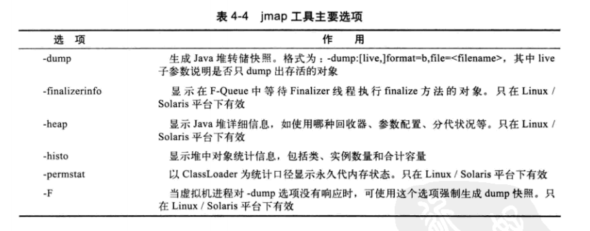
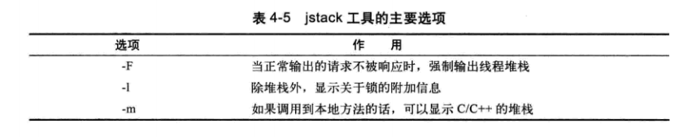

# 虚拟机性能监控与故障处理工具

给系统定位问题时，知识、经验时关键基础，数据是依据，工具是运用知识处理数据的手段。这里说的数据包括：运行日志、异常堆栈、GC日志、线程快照(threaddump / javacore文件)、堆转储快照（heapdump / hprof文件）等

## JDK的命令行工具

| 名称 | 主要作用 |
| :-- | :--|
| jps | 显示指定系统内所有的HotSpot 虚拟机进程 |
| jstat | 用于收集HotSpot虚拟机各方面的运行数据 |
| jinfo | 显示虚拟机配置信息 |
| jmap | 生成虚拟机的内存转储快照（heapdump文件） |
| jhat | 用于分析heapdump文件，会建立一个HTTP/HTML服务器，让用户可以在浏览器上查看分析结果 |
| jstack | 显示虚拟机的线程快照 |

### jps：虚拟机进程状况工具

- 列出正在运行的虚拟机进程，并显示虚拟机执行主类的名称，以及这些进程的本地虚拟机的唯一ID（LVMID）
- 命令格式  
    `jps [option] [hostid]`
- jps 常用选项

| 选项 | 作用 |
| :-- | :--|
| -q | 会输出LVMID，省略主类的名称 |
| -m | 输出虚拟机进程启动时传递给主类`main()`函数的参数 |
| -l | 输出主类的全名，如果进程执行的是jar包，输出jar路径 |
| -v | 输出虚拟机进程启动时JVM参数 |

### jstat：虚拟机统计信息监视工具

- 用于监视虚拟机各种运行状态信息的命令行工具
- 可以显示本地或远程虚拟机进程中的类装载、内存、垃圾收集、JIT编译等运行数据
- 命令格式：  
    `jstat [ option vmid [inteval [s|ms] [count] ] ]`
- 参数`interval`和`count`代表查询间隔和次数，如`jstat -gc 2764 250 20`代表每250毫秒查询一次进程2764垃圾收集的状况，一共查询20次
- 选项`option`代表着用户希望查询的虚拟机信息，主要分为3类：类装载、垃圾收集、运行期编译状况
- jstat常用选项

| 选项 | 作用 |
| :-- | :--|
| -class | 监视类装载、卸载数量、总空间、类装载所耗费的时间 |
| -gc | 监视java堆状况，包括`Eden`区、2个`Survivor`区、老年代、永久代等的容量、已用空间、GC时间合计等信息 |
| -gccapacity | 监视内容与`-gc`基本相同，但输出主要关注`Java`堆各个区域使用到的最大和最小空间 |
| -gcutil | 监视内容与`-gc`基本相同，但输出主要关注已使用空间占总空间的百分比 |
| -gccase | 与`-gcutil`功能一样，但是会额外输出导致上一次GC产生的原因 |
| -gcnew | 监视新生代GC的状况 |
| -gcnewcapacity | 监视内容与`-gcnew`基本相同，但输出主要关注使用到的最大和最小空间 |
| -gcold | 监视老年代GC的状况 |
| -gcoldcapacity | 监视内容与`-gcold`基本相同，但输出主要关注使用到的最大和最小空间 |
| -gcpermcapacity | 监视永久代使用到的最大和最小空间 |
| -compiler | 输出JIT编译器编译过的方法、耗时等信息 |
| -printcompilation | 输出已经被JIT编译的方法 |

### jinfo：Java配置信息工具
- 实时的查看和调整虚拟机的各项参数
- 使用`jinfo -flag`选项可以知道虚拟机启动时显式和隐式指定的参数值
- `jinfo`可以使用`-sysprops`选项把虚拟机进程的`System.getProperties()`的内容打印出来
- JDK1.6之后，加入了运行期修改虚拟机参数值的功能，可以使用`-flag [+|-] name`或`-flag name=value`修改
- jinfo命令格式  
    `jinfo [option] pid`

### jmap：Java内存映像工具
- 用于生成堆转储快照（一般称为heapdump 或 dump文件）
- 除了`jmap`命令，也有其他暴力的方式获取到java堆转储文件：
    1. 使用`-XX:+HeapDumpOnOutOfMemoryError`参数，可以让虚拟机在OOM异常出现之后自动生成dump文件
    2. 通过`-XX:+HeapDumpOnCtrlBreak`参数则可以使用[Ctrl][Break]键让虚拟机生成dump文件
    3. 或者在Linux系统下通过`Kill -3`命令发送进程退出信号“恐吓”一下虚拟机，也能拿到dump文件
- `jmap`命令还可以查询`finalize`执行队列，Java堆和永久代的详细信息，如空间使用率、当前用的是哪种收集器
- 命令格式  
    `jmap [ option ] vmid`

### jhat：虚拟机堆转储快照分析工具
- `jhat`命令与`jmap`搭配使用，来分析`jmap`生成的堆转储快照
- 较少用

### jstack：Java堆栈跟踪工具
- 用于生成虚拟机当前时刻的线程快照（一般称为`threaddump`或`javacore`文件）
- 生成快照的主要目的是定位线程出现长时间停顿的原因，如线程间死锁、死循环、请求外部资源导致的长时间等待等都是导致线程长时间停顿的常见原因
- 命令格式  
    `jstack [ option ] vmid`
- JDK5中，`java.lang.Thread`类新增了一个`getAllStackTrace()`方法用于获取虚拟机中所有线程的`StackTraceElement`对象

## JDK的可视化工具

- `JConsole`：可视化查看虚拟机内存、线程、类等信息
- `VisualVM`：强大的运行监视和故障处理程序，还可以做性能分析。可以通过丰富的插件做到更多的功能

