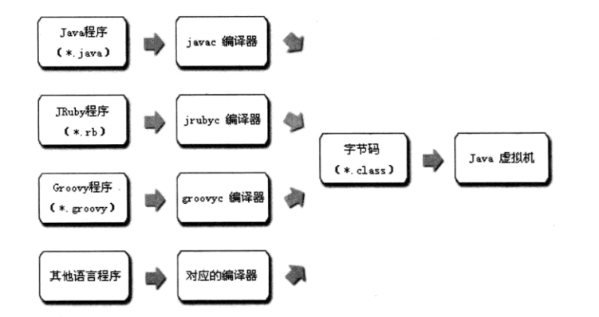
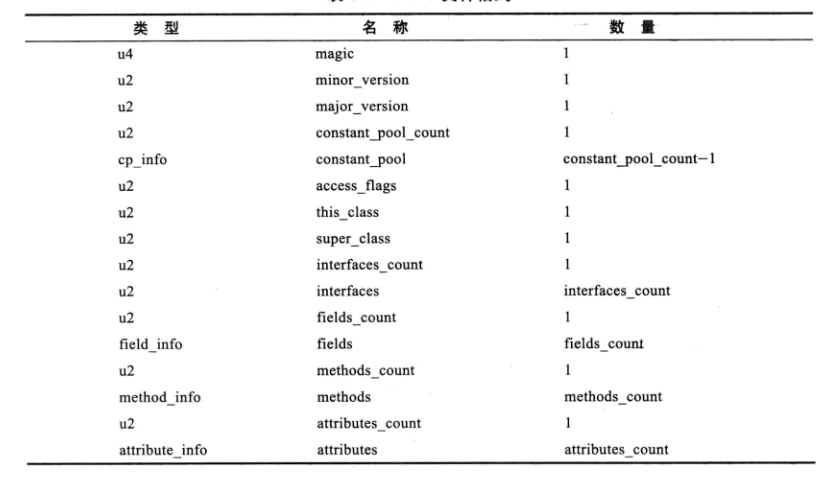

# 类文件结构

- 实现语言无关性的基础仍然是`虚拟机`和`字节码存储格式`

Java虚拟机提供的语言无关性

## Class类文件的结构

- Class文件是一组以8位字节为基础单位的二进制流，各个数据项目严格按照顺序紧凑的排列在Class文件之中，中间没有添加任何分隔符
- 当遇到需要占用8位字节以上空间的数据项时，则会按照高位在前的方式分割成若干个8位字节进行存储
- Class文件格式采用一种类似C语言结构体的伪结构来存储，这种伪结构中只有两种数据结构：`无符号数`和`表`
- **无符号数**：基本的数据类型，以`u1、u2、u4、u8`来分别代表1个字节、2个字节、4个字节、8个字节。无符号数可以用来描述**数字、索引引用、数量值、按照UTF-8编码构成字符串值**
- **表**是由多个无符号数或者其他表作为数据项构成的复合数据类型，所有表都习惯性的以“_info”结尾。**用于描述有层次关系的复合结构的数据**，整个Class文件本质上就是一张表
- 无论是无符号数还是表，当需要描述同一类型但数量不定的多个数据时，经常会使用一个前置的容量计数器加若干个连续的数据项的形式，这时候称这一系列连续的某一类型的数据为某一类型的集合
- Class文件的数据项，无论是顺序还是数量，都是被严格限定的，哪个字节代表什么含义，长度是多少，先后顺序如何，都不允许改变

Class文件格式

### 魔数和Class文件的版本

- 每个Class文件的头4个字节称为**魔数（Magic Number）**，唯一作用是用于确定这个文件是否为一个能被虚拟机接受的Class文件。固定为`0xCAFEBABE`
- 紧跟着魔数的四个字节存储的是Class文件的版本号，第5和第6字节是次版本号（Minor Version），第7和第8个字节是主版本号（Major Version）。高版本的JDK能向下兼容以前版本的Class文件，但不能运行以后版本的Class文件，即使文件格式并未发生变化

### 常量池

- 主次版本号之后是常量池入口
- 常量池是Class文件结构中与其他项目关联最多的数据类型，也是占用Class文件空间最大的数据项目之一，也是Class文件中第一个出现的表类型数据项目
- 常量池中常量的数量是不固定的，所以常量池的入口需要放置一项u2类型的数据，代表常量池容量计数值（constant_pool_count），容量计数从1开始而不是0开始
- 第0项常量空出来是为了满足后面某些指向常量池的索引值的数据在特定情况下需要表达“不引用任何一个常量池项目”的意思
- 常量池中主要存放两大类常量
    - 字面量：比较接近于Java语言层面的常量概念，如文本字符串、被声明为final的常量值等
    - 符号引用
        - 类和接口的全限定名
        - 字段的名称和描述符
        - 方法的名称和描述符

