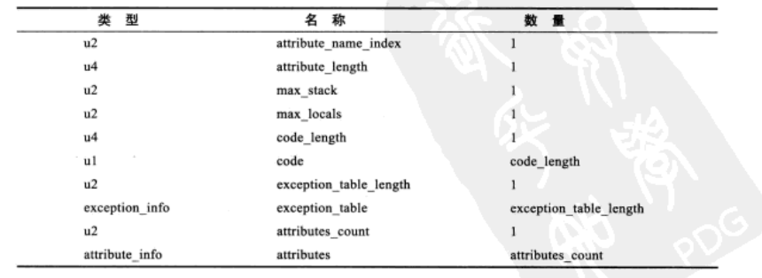

# 类文件结构

- 实现语言无关性的基础仍然是`虚拟机`和`字节码存储格式`

Java虚拟机提供的语言无关性

## Class类文件的结构

- Class文件是一组以8位字节为基础单位的二进制流，各个数据项目严格按照顺序紧凑的排列在Class文件之中，中间没有添加任何分隔符
- 当遇到需要占用8位字节以上空间的数据项时，则会按照高位在前的方式分割成若干个8位字节进行存储
- Class文件格式采用一种类似C语言结构体的伪结构来存储，这种伪结构中只有两种数据结构：`无符号数`和`表`
- **无符号数**：基本的数据类型，以`u1、u2、u4、u8`来分别代表1个字节、2个字节、4个字节、8个字节。无符号数可以用来描述**数字、索引引用、数量值、按照UTF-8编码构成字符串值**
- **表**是由多个无符号数或者其他表作为数据项构成的复合数据类型，所有表都习惯性的以“_info”结尾。**用于描述有层次关系的复合结构的数据**，整个Class文件本质上就是一张表
- 无论是无符号数还是表，当需要描述同一类型但数量不定的多个数据时，经常会使用一个前置的容量计数器加若干个连续的数据项的形式，这时候称这一系列连续的某一类型的数据为某一类型的集合
- Class文件的数据项，无论是顺序还是数量，都是被严格限定的，哪个字节代表什么含义，长度是多少，先后顺序如何，都不允许改变

Class文件格式

### 魔数和Class文件的版本

- 每个Class文件的头4个字节称为**魔数（Magic Number）**，唯一作用是用于确定这个文件是否为一个能被虚拟机接受的Class文件。固定为`0xCAFEBABE`
- 紧跟着魔数的四个字节存储的是Class文件的版本号，第5和第6字节是次版本号（Minor Version），第7和第8个字节是主版本号（Major Version）。高版本的JDK能向下兼容以前版本的Class文件，但不能运行以后版本的Class文件，即使文件格式并未发生变化

### 常量池

- 主次版本号之后是常量池入口
- 常量池是Class文件结构中与其他项目关联最多的数据类型，也是占用Class文件空间最大的数据项目之一，也是Class文件中第一个出现的表类型数据项目
- 常量池中常量的数量是不固定的，所以常量池的入口需要放置一项u2类型的数据，代表常量池容量计数值（constant_pool_count），容量计数从1开始而不是0开始
- 第0项常量空出来是为了满足后面某些指向常量池的索引值的数据在特定情况下需要表达“不引用任何一个常量池项目”的意思
- 常量池中主要存放两大类常量
    - 字面量：比较接近于Java语言层面的常量概念，如文本字符串、被声明为final的常量值等
    - 符号引用
        - 类和接口的全限定名
        - 字段的名称和描述符
        - 方法的名称和描述符
- 在Class文件中不会保存各个方法和字段的最终内存布局信息，因此这些字段和方法的符号引用不经过转换的话是无法直接被虚拟机使用的。当虚拟机运行时，需要从常量池中获得对应的符号引用，再在类创建时或运行时解析并翻译到具体的内存地址之中
- 常量池的每一项常量都是一个表，共有11种结构各不相同的表结构数据

常量池的项目类型如下：  

- 在JDK的bin目录中有一个`javap`，可通过`javap -verbose`输出Class文件的字节码内容

### 访问标志

- 常量池结束之后，紧接着的2个字节是访问标志（access_flags）
- 用于识别一些类或接口层次的访问信息，包括：这个Class是类还是接口；是否定义为public类型；是否定义为abstract类型
- `access_flags`中一共有32个标志位可以使用，当前只定义了其中的8个，没有使用到的标志位要求一律为0

访问标志如下表：  

### 类索引、父类索引与接口索引集合

- 类索引（`this_class`）:`u2`类型，用于确定这个类的全限定名，指向一个类型为`CONSTANT_Class_info`的类描述常量
- 父类索引（`super_class`）：`u2`类型，用于确定这个类的父类的全限定名，指向一个类型为`CONSTANT_Class_info`的类描述常量
- 接口索引集合（`interfaces`）：是一组`u2`类型的数据的集合，用来描述这个类实现了哪些接口

### 字段表集合

- 字段表（`field_info`）用于描述接口或类中声明的变量，字段（`field`）包含了类级变量或实例级变量，但不包括在方法内部声明的变量
- 描述一个字段可以包含的信息有：字段的作用域（`public、private、protected`修饰符）；是类级变量还是实例级变量（`static`修饰符）；可变性（`final`）；并发可见性（`volatile`修饰符）；可否序列化（`transient`修饰符）

字段表结构：  

- `access_flags`标志用于存放字段修饰符
- `name_index`：对常量池的引用，代表着字段的简单名称
- `descriptor_index`：代表着字段和方法的描述符，用来描述字段的数据类型、方法的参数列表（包括数量、类型以及顺序）和返回值

描述符标识字符含义：  

### 方法表集合

- 方法表的结构如何字段表一样，依次包含了访问标志（`access_flags`）、名称索引（`name_index`）、描述符索引（`descriptor_index`）、属性表集合（`attributes`）几项
- 方法里的Java代码，存放在方法属性表集合中的一个名为`Code`的属性里面
- 与Java语言的规则不同，如果两个方法有相同的名称和特征签名，但返回值不同，也是可以合法共存在同一个Class文件中的

### 属性表集合

- 属性表（`attribute_info`），在Class文件、字段表、方法表中都可以携带自己的属性表集合，以用于描述某些场景专有的信息

虚拟机规范预定义的属性如下：  

- 对于每个属性，它的名称需要从常量池中引用一个`CONSTANT_Utf8_info`类型的常量来表示，而属性值的结构则是完全自定义的，只需要说明属性值所占用的位数长度即可

#### Code属性

- 存储Java程序方法体里面的代码经过Javac编译器处理之后变成的字节码指令。若是接口或抽象类中的方法就不存在`Code`属性

Code属性表的结构：  

- `attribute_name_index`：一项指向`CONSTANT_Utf8_info`型常量的索引，固定为`Code`，代表了该属性的属性名称
- `attribute_length`：代表属性值的长度，属性名称索引与属性长度一共6个字节，所以属性值的长度固定为整个属性表的长度减去6个字节
- `max_stack`：代表了操作数栈深度的最大值。虚拟机运行的时候需要根据这个值来分配栈帧中的操作栈深度
- `max_locals`：代表了局部变量表所需的存储空间。`max_locals`的单位为`Slot`，`Slot`是虚拟机为局部变量分配内存所使用的的最小单位，除`double`、`long`这两种64位的数据类型需要2个`Slot`外，其他都是一个`Slot`。编译器会根据变量的作用域来分类`Slot`并分配给各个变量使用，然后计算出`max_locals`的大小，而不是方法中用到了多少局部变量，就把这些局部变量占用的`Slot`之和作为`max_locals`的大小
- `code_length`：代表字节码长度；虚拟机规范限制了一个方法不允许超过65535条字节码指令，如果超过这个限制，Javac编译器拒绝编译
- `code`：存储字节码指令的一些列字节流，每个指令都是一个`u1`类型的单字节

#### Exceptions属性
- 列举出方法中可能抛出的受查异常，也就是方法描述时在`throws`关键字后面列举的异常

#### LineNumberTable属性
- 用于描述Java源码行号与字节码行号之间的对应关系

#### LocalVariableTable属性

- 用于描述栈帧中局部变量表中的变量与Java源码中定义的变量之间的关系

#### SourceFile属性

- 用于记录生成这个Class文件的源码文件名称

#### ConstantValue属性

- 通知虚拟机自动为静态变量赋值，只有被`static`关键字修饰的变量（类变量）才可以使用这项属性
- 实例变量的赋值是在实例构造器方法中进行的
- 类变量的赋值方式有两种：
    - 在类构造器中进行
    - 或者使用`ConstantValue`属性赋值
- Javac编译器的选择是：如果同时使用`final`和`static`来修饰一个变量，并且这个变量是基本类型或`java.lang.String`的话，就生成`ConstantValue`属性来进行初始化，如果这个变量没有被`final`修饰，或者并非基本类型及字符串，则在类构造器中进行

#### InnerClasses属性

- 记录内部类和宿主类之间的关联。如果一个类中定义了内部类，那编译器将会为它及它所包含的内部类生成`InnerClasses`属性

#### Deprecated 及 Synthetic属性

- `Deprecated`属性用于表示这个类、字段或方法，已经被程序作者定义为不再推荐使用
- `Synthetic`属性代表此字段或方法并不会由Java源码直接产生的，而是由编译器自行添加的