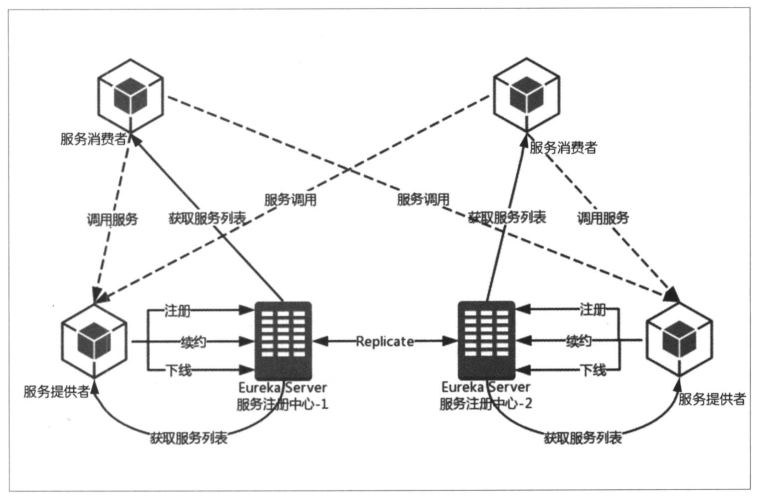

Spring Cloud Eureka是基于Netflix Eureka做的二次封装的产物，主要负责完成微服务架构中的服务治理功能。

##服务治理

服务治理主要用来实现各个微服务实例的自动注册与发现。

+ **服务注册：** 在服务治理框架中，通常都会构建一个注册中心，每个服务单元向注册中心登记自己提供的服务，将主机和端口号、版本号、通信协议等一些附加信息告知注册中心，注册中心按服务名分类组织服务清单。服务注册中心还需要以心跳的方式去检测清单中的服务是否可用，若不可用，需要从服务清单中剔除。
+ **服务发现：** 服务调用方在调用服务提供方接口的时候，并不知道具体得服务实例位置。因此，调用方需要向服务注册中心咨询服务，并获取所有服务的实例清单。

##Netflix Eureka

Spring Cloud Eureka，使用Netflix Eureka来实现服务注册和发现，既包含了服务端组件，也包含了客户端组件，且两端均采用Java编写。

Eureka服务端，也称为服务注册中心。支持高可用配置。依托于强一致性提供良好的服务实例可用性。

Eureka客户端，主要处理服务的注册和发现。在应用程序运行时，Eureka客户端向服务注册中心注册自己的服务并周期性的发送心跳更新它的服务租约。同时，也能从服务端查询当前注册的服务信息并把他们缓存到本地并周期性的刷新服务状态。

##搭建服务注册中心

**1. 引入依赖**

        <parent>
            <groupId>org.springframework.boot</groupId>
            <artifactId>spring-boot-starter-parent</artifactId>
            <version>2.0.3.RELEASE</version>
            <relativePath/> <!-- lookup parent from repository -->
        </parent>

        <dependency>
            <groupId>org.springframework.cloud</groupId>
        	<artifactId>spring-cloud-starter-netflix-eureka-server</artifactId>
        </dependency>

**2. 增加注解**

`@EnableEurekaServer`注解启动一个服务注册中心提供给其他应用进行对话。

**3. 修改配置**

默认情况下，该服务注册中心也会将自己作为客户端来尝试注册自己，所以我们需要禁用它的客户端注册行为。在`application.properties`增加以下配置：

    server.port=1111
    eureka.instance.hostname=localhost
    eureka.client.register-with-eureka=false
    eureka.client.fetch-registry=false
    eureka.client.service-url.defaultZone=http://${eureka.instance.hostname}:${server.port}/eureka
    
**4. Web访问**

启动该应用，查看服务中心情况，访问http://localhost:1111

##注册服务提供者

**1. 引入依赖**

服务提供者引入Eureka依赖。

    <dependency>
        <groupId>org.springframework.cloud</groupId>
        <artifactId>spring-cloud-starter-netflix-eureka-server</artifactId>
    </dependency>

**2. 添加注解**

在主类中增加`@EnableDiscoveryClient`注解

**3. 增加配置**

    spring.application.name=hello-server
    eureka.client.service-url.defaultZone=http://localhost:1111/eureka
    
##高可用注册中心

Eureka Server的高可用实际上就是将自己作为服务向其他服务注册中心注册自己，这样就可以形成一组互相注册的服务注册中心，以实现服务清单的互相同步，达到高可用的效果。

+ 创建`application-peer1.properties`，作为peer1服务中心的配置，并将`serviceUrl`指向peer2：

        spring.application.name=eureka-server
        server.port=1111    
        eureka.instance.hostname=peer1
        eureka.client.service-url.defaultZone=http://peer2:1112/eureka
    
+ 创建`application-peer2.properties`，作为peer2服务中心的配置，并将serviceUrl指向peer1：

        spring.application.name=eureka-server
        server.port=1112
        eureka.instance.hostname=peer2
        eureka.client.service-url.defaultZone=http://peer1:1111/eureka
        
+ 分别以peer1、peer2的配置启动应用程序

+ 服务提供方配置

        spring.application.name=hello-server
        eureka.client.service-url.defaultZone=http://peer1:1111/eureka/,http://peer2:1112/eureka/
        
##服务发现和消费

+ 服务消费者，主要完成两个目标，发现服务以及消费服务。
+ 服务发现的任务由Eureka客户端完成
+ 服务消费的任务有Ribbon完成
+ Ribbon是一个基于HTTP和TCP的客户端负载均衡器，它可以通过客户端中配置的`ribbonServerList`服务列表去轮询访问以达到均衡负载的作用。当Ribbon与Eureka联合使用时，Ribbon的服务实例清单`ribbonServerList`会被`DiscoveryEnabledNIWSServerList`重写，扩展成从Eureka注册中心获取服务端列表。同时，也会用`NIWSDiscoveryPing`来取代`IPing`，它将职责委托给Eureka来确定服务端是否启动。

简单示例：

+ 启动服务注册中心，服务提供者，服务提供者以两个不同的端口号启动
+ 创建工程名`ribbon-consumer`的Spring Boot工程，引入Ribbon模块及Eureka模块的依赖
+ 主类增加`@EnableDiscoveryClient`注解，使客户端获得服务发现的能力。同时，在该主类中创建`RestTemplate`的Spring Boot实例，并通过`@LoadBanlanced`注解开启客户端负载均衡
+ 创建`ConsumerController`类，并通过`RestTemplate`来实现对`HELLO-SERVICE`服务提供的/hello接口进行调用

##Eureka详解

###基础架构

Eureka服务治理框架的三要素：
1. **服务注册中心：** Eureka提供的服务端，提供服务注册和发现
2. **服务提供者：** 提供服务的应用，可以是Spring Boot应用，也可以是其他技术平台且遵循Eureka通讯机制的应用
3. **服务消费者：** 消费者应用从服务注册中心获取服务列表，从而使消费者可以知道去何处调用其需要的服务

###服务治理机制

####服务提供者

**服务注册**

“服务提供者”在启动的时候会发送REST请求的方式将自己注册到Eureka Server上，同时带上自身服务的一些元数据信息。Eureka Server接收到这个REST请求之后，将元数据信息存储在一个双层结构Map中，其中第一层key是服务名，第二层的key是具体服务的实例名。

**服务同步**

服务注册中心因互相注册为服务，当服务提供者发送注册请求到一个服务注册中心时，它就会将请求发送给集群中相连的其他注册中心，从而实现注册中心之间的服务同步。

**服务续约**

服务注册完成后，服务提供者会维护一个心跳用来持续告诉Eureka Server：“我还活着”，以防止Eureka Server的“剔除任务”将该服务实例从服务列表中排除出去，称该操作为服务续约。

    eureka.instance.lease-renewal-interval-in-seconds=30
    eureka.instance.lease-expiration-duration-in-seconds=90
    
`eureka.instance.lease-renewal-interval-in-seconds`用于定义服务续约任务的调用间隔时间，默认30秒  
`eureka.instance.lease-expiration-duration-in-seconds`用于定义服务失效的时间，默认90秒

####服务消费者

**获取服务**

Eureka Server 会维护一份只读的服务清单返回给客户端，该缓存清单30秒更新一次。

`eureka.client.registry-fetch-interval-seconds=30`参数修改缓存清单的更新时间。

**服务调用**

Region？
Zone？

**服务下线**

服务关闭或重启，会发送通知给Eureka Server，服务下线

####服务注册中心

**失效剔除**

Eureka Server在启动时会创建一个定时任务，默认每隔一段时间（默认60秒）将当前清单中超时（默认90秒）没有续约的服务剔除出去。

**自我保护**

统计心跳失败的比例在15分钟之内是否低于85%，若出现，不会让实例信息立即失效，尽可能保护这些注册信息。

`eureka.server.enable-self-preservation=false`可用来关闭自我保护机制

##源码分析
//TODO

