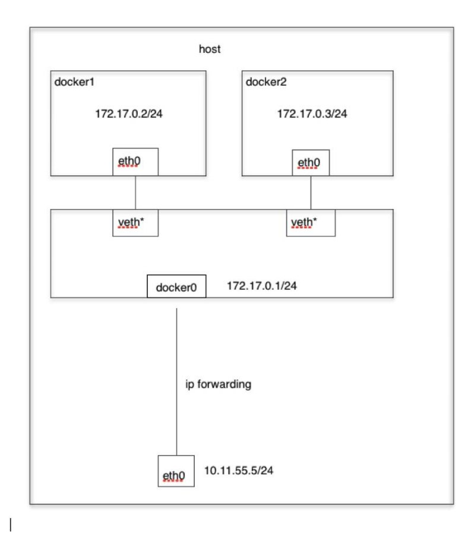
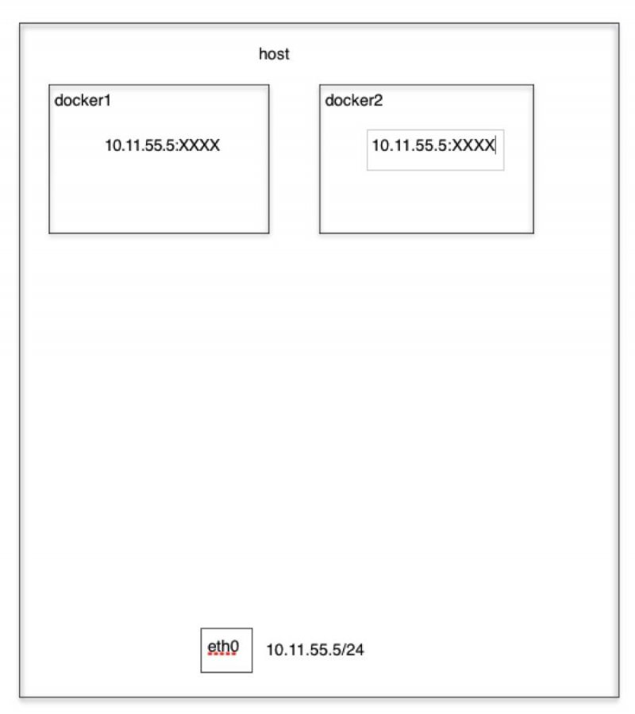
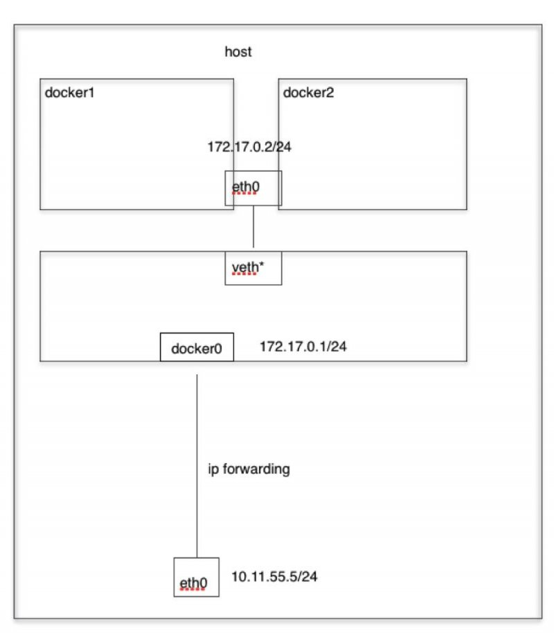
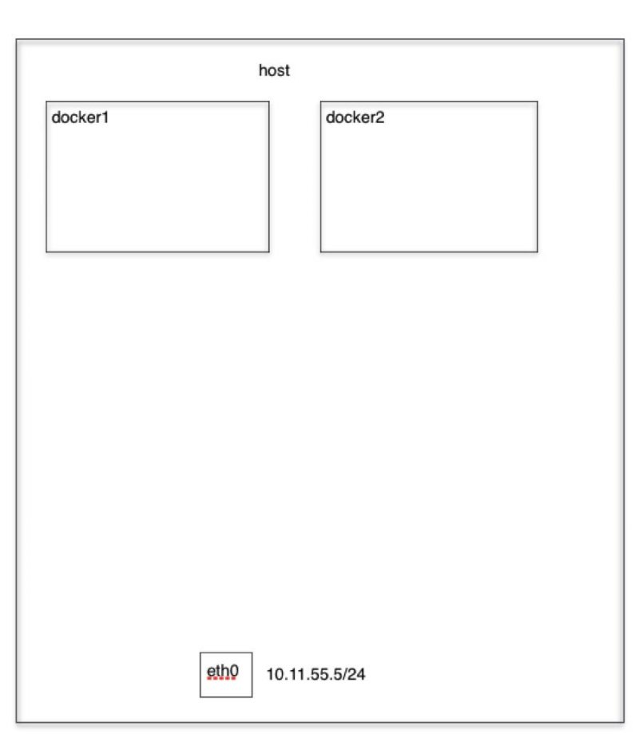

# docker网络

docker网络分为单节点网络模式、多节点网络模式。单节点网络模式分为`bridge模式`、`Host模式`、`container模式`、`none模式`，多节点主要是`overlay模式`。

## 一、四种单点网络模式

### 1.1 Bridge模式

当Docker进程启动时，会在主机上创建一个名为`docker0`的虚拟网桥，此主机上启动的Docker容器会连接到这个虚拟网桥上。

从`docker0`子网中分配一个IP给容器使用，并设置`docker0`的IP地址为容器的默认网关。在主机上创建一对虚拟网卡`veth pair`设备，Docker将`veth pair`设备的一端放在
新创建的容器中，并命名为`eth0`，另一端放在主机中，以`veth***`这样类似的名字命名，并将这个网络设备加入到`docker0`网桥中。可通过`brctl show`命令查看。

`bridge`模式是docker的默认网络模式。`bridge`模式如下图所示：

### 1.2 Host模式

若启动容器的时候使用`Host`模式，则这个容器不会获得一个独立的`Network Namespace`，而是和宿主机共用一个`Network Namespace`。容器将不会虚拟出自己的网卡，配置自己的IP等，而是使用
宿主机的IP和端口。但是，容器的其他方面，如文件系统、进程列表等还是和宿主机隔离的。

Host模式如下图所示：

### Container模式

`Container模式`指定新创建的容器和已经存在的一个容器共享一个`Network Namespace`，而不是和宿主机共享。新创建的容器不会创建自己的网卡、配置自己的IP，而是
和一个指定的容器共享IP、端口范围等。同样，两个容器除了网络方面，其他的如文件系统、进程列表等还是隔离的。两个容器的进程可以通过lo网卡设备通信。

Container模式示意图如下：

### None模式

使用`none模式`，Docker容器拥有自己的`Network Namespace`，但是，并不为Docker容器进行任何网络配置。也就是说，这个Docker容器没有网卡、IP、路由等信息。
需要我们自己为Docker容器添加网卡、配置IP等。

None模式示意图如下：

## 二、多节点网络模式

Docker默认的网络环境下，单台主机上的Docker容器可以通过`docker0`网桥直接通信，而不同主机上的Docker容器只能通过在主机上做端口映射进行通信。这种端口映射方式对很多集群应用
来说极为不方便。如果能让Docker容器之间直接使用自己的IP地址进行通信，会解决很多问题。按实现原理分为直接路由方式、桥接方式（如`pipework`）、Overlay隧道方式等

### 2.1 overlay网络模式

- Docker 在每个节点上创建了两个 linux bridge，一个用于 overlay 网络（ov-000100-1de98），一个用于非 overlay 的 NAT 网络（docker_gwbridge）
- 容器内的到overlay 网络的其它容器的网络流量走 overlay 网卡（eth0），其它网络流量走 NAT 网卡（eth1）
- 当前 Docker 创建 vxlan 隧道的ID范围为 256～1000，因而最多可以创建745个网络，因此，本例中的这个 vxlan 隧道使用的 ID 是 256
- Docker vxlan 驱动使用 4789 UDP 端口
- overlay网络模型底层需要类似 consul 或 etcd 的 KV 存储系统进行消息同步
- Docker overlay 不使用多播
- Overlay 网络中的容器处于一个虚拟的大二层网络中

参考博客地址：

[理解Docker（5）：Docker 网络](https://www.cnblogs.com/sammyliu/p/5894191.html)

[一分钟看懂Docker的网络模式和跨主机通信](http://www.a-site.cn/article/169899.html)

