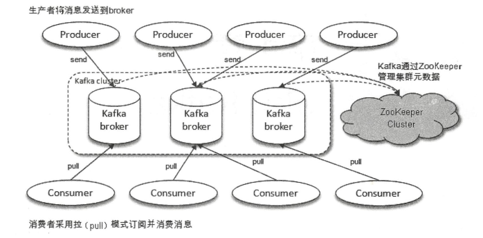
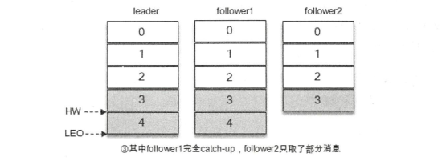

# 一、初始Kafka

- LinkedIn公司开发，采用Scala语言，多分区、多副本、基于Zookeeper协调的分布式消息系统，目前已经捐赠给Apache
- 分布式流处理平台，以高吞吐、可持久化、可水平扩展、支持流数据处理等多种特性而被广泛使用
- 三大角色
    - 消息系统：提供解耦、冗余存储、流量削峰、缓冲、异步通信、扩展性、可恢复性、消息顺序性保障、回溯消费等功能
    - 存储系统
    - 流式处理平台
    
## 1.1 基本概念

- Producer：生产者，负责创建消息，然后将其投递到Kafka中
- Consumer：消费者，消费者连接到Kafka上并接收消息，进而进行相应的业务逻辑处理。使用拉（PULL）模式从服务端拉取消息，并保存消费的具体位置
- Broker：服务代理节点
- Topic：Kafka中的消息以主题进行分类
- Partition：主题是一个逻辑概念，可以细分为多个分区，一个分区只属于单个主题，同一主题不同分区包含的消息是不同的，分区在存储层面可以看做一个可追加的日志文件
- Offset：消息在分区中的唯一标识，通过它保证分区有序，但不能保证主题有序
- Replica：Kafka为分区引入了多副本机制，该机制实现了故障自动转移。一主多从，leader副本负责处理读写请求，follow副本只负责与leader副本的消息同步。
所有副本统称AR（Assigned Replicas），与Leader副本保持一定程度同步的副本（包括Leader副本）组成ISR（In-Sync Replicas），与Leader副本同步滞后过多的副本
（不包括Leader副本）组成OSR（Out-of-Sync Replicas）
- HW：High Watermark缩写，高水位，标识一个特定的offset，消费者只能拉取到这个offset之前的消息
- LEO：Log End Offset缩写，表示当前日志文件中下一条待写入消息的offset，ISR集合中最小的LEO即为分区的HW



如下：LEO为5，HW为4



## 1.2 安装和配置

安装步骤省略

一些常见的kafka命令

- 启动kafka
```
bin/kafka-server-start.sh config/server.properties
bin/kafka-server-start.sh -daemon config/server.properties
bin/kafka-server-start.sh config/server.properties &
```

- 创建主题
```
bin/kafka-topics.sh --zookeeper localhost:2181/kafka --create --topic topic-demo --replication-factor 3 --partitions 4
```

- 获取主题的详细信息
```
bin/kafka-topic.sh --zookeeper localhost:2181/kafka --describe --topic topic-demo
```

- 命令行消费消息
```
bin/kafka-console-consumer.sh --bootstrap-server localhost:9092 --topic topic-demo
```

- 命令行发送消息
```
bin/kafka-console-producer.sh --broker-list localhost:9092 --topic topic-demo
```

## 1.3 java客户端


