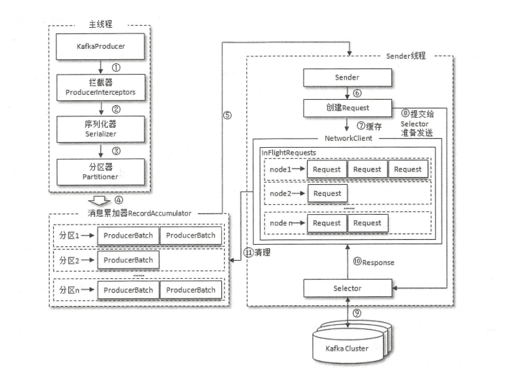

# 二、生产者

- 指的是负责向Kafka发送消息的应用程序
- 旧生产者客户端，采用Scala语言编写。新生产者客户端，采用Java语言编写
- 支持多语言，包括常用的C/C++、Python、Go等语言
- KafkaProducer线程安全

## 2.1 客户端开发

生产步骤如下：:q:qii：:wq
- 配置生产者客户端参数及创建相应的生产者实例
- 构建待发送的消息
- 发送消息
- 关闭生产者实例

### 2.1.2 消息的发送

发送消息主要有三种模式：
- 发后即忘：只管往Kafka发送消息而并不关心消息是否正确到达。性能最高，可靠性最差
- 同步：发送后，阻塞应用等待Kafka的响应。可靠性高，性能差
- 异步：在send()方法中指定Callback的回调函数，kafka在返回响应时调用该函数来实现异步的发送确认。回调函数调用保证分区有序，

### 2.1.3 序列化

- 生产者需要用序列化器把对象转换成字节数组才能通过网络发送给Kafka，消费者需要用反序列化器把从Kafka中收到的字节数组转换成相应的对象
- Kafka提供了ByteArray、ByteBuffer、Bytes、Double、Integer、Long、String这几种类型的序列化器，都实现了org.apache.kafka.common.serialization.Serializer接口
- 支持如Avro、JSON、Thrift、ProtoBuf、Protostuff等通用的序列化工具
- 可以自定义序列化器，只需要实现org.apache.kafka.common.serialization.Serializer接口即可

### 2.1.4 分区器

- 若消息中设置了partition字段，则不需要分区器
- 分区器的作用就是为消息分配分区，根据key计算partition的值，默认分区器为org.apache.kafka.clients.producer.internals.DefaultPartitioner，实现了org.apache.kafka.clients.producer.Partitioner接口，
默认分区器会对key进行哈希（MurmurHash2算法）得哈希值，根据哈希值计算分区号。若key为null，那么消息将会以轮询的方式发往主题内的各个分区
- 可自定义分区器，只需要实现Partitioner接口

### 2.1.5 生产者拦截器

- 可用来在消息发送前做一些准备工作，如按照某个规则过滤不符合要求的消息、修改消息的内容等
- 可用来在发送回调逻辑前做一些定制化的需求，比如统计类工作
- 可通过实现org.apache.kafka.clients.producer.ProducerInterceptor接口实现自定义拦截器。KafkaProducer会在消息被应答之前或消息发送失败时调用生产者
拦截器的onAcknowledgement方法，优先用户设定的Callback之前执行
- 可设置多个拦截器形成拦截链。按照拦截器定义的顺序一一执行。若某个拦截器由于异常执行失败，则下一个拦截器会接着上一个执行成功的拦截器继续执行

## 2.2 原理

**生产者客户端的整体架构如下**

- 生产者客户端由两个线程协调运行，主线程由KafkaProducer创建消息，然后通过可能的拦截器、序列化器、分区器后缓存到消息累加器（RecordAccumulator）中。Sender线程负责从RecordAccumulator
中获取消息并将其发送到kafka中
- RecordAccumulator主要缓存消息以便Sender线程可以批量发送，减少网络传输。缓存大小限制为32MB（客户端参数buffer.memory）。空间不足时，生产者send()方法
要么被阻塞，要么抛出异常。阻塞时间默认60秒（参数max.block.ms）
- 消息都会被追加到RecordAccumulator中对应分区的双端队列中（Deque），队列中的内容为ProducerBatch，即Deque<ProducerBatch>，ProducerBatch包含一至多个ProducerRecord。
- Sender从RecordAccumulator获取缓存的消息之后，会进一步将原本<分区, Deque<ProducerBatch>>的保存形式转变成<Node, List<ProducerBatch>>，Node标识Kafka
集群的broker节点
- 转换成<Node, List<ProducerBatch>>之后，Sender会进一步封装成<Node,Request>形式，这样就可以将Request请求发送各个Node了。
- 请求在从Sender线程发往Kafka之前还会保存到InFlightRequest中，InFlightRequests保存对象的具体形式为Map<NodeId,Deque<Request>>，缓存了已经发送出去但
还没有收到响应的请求。InFlightRequests可以通过配置参数限制每个连接最多缓存的请求数，配置参数为（max.in.flight.requests.per.connection），默认为5，即每个连接
最多缓存5个未响应的请求。

### 2.2.1 元数据的更新

- 元数据指Kafka集群的元数据，包括集群有哪些主题、主题有哪些分区、每个分区的Leader副本分配在哪个节点上，follow副本分配在那些节点上，哪些副本在AR、ISR等集合中、集群中有哪些节点等
- 触发更新客户端元数据的时机：客户端没有需要使用的元数据信息时，或者超过metadata.max.age.ms时间没有更新元数据，默认5分钟
- 元数据更新方式：挑选出leastLoadedNode，也就是InFlightRequests中请求数最少的node，然后向这个node发送MetadataRequest请求来获取具体的元数据信息，在创建完MeatadatRequest之后同样
存入InFlightRequests，之后的步骤与发送消息时类似。
- 元数据由Sender线程负责，但是主线程也需要读取这些消息，这里的数据同步通过synchronized和final关键字保障

### 2.2.2 重要的生产者参数

| 参数 | 描述 |
| :--- | :--- |
| bootstrap.servers | 必填，用来指定生产者客户端连接Kafka集群所需的broker地址清单，格式为 host1:port1,host2:port2,host3:port3 |
| key.serializer 和 value.serializer | 必填，指定消息key与value的序列化操作的序列化器 |
| client.id |  设置KafkaProducer对应的客户端Id，默认值为"" |
| acks | 用来指定分区中必须要有多少个副本收到这条消息，之后生产者才会认为这条消息是成功写入的，默认值为1，标识只要Leader副本成功写入消息，就算成功。acks为0，标识生产者发送消息之后不需要等待任何服务端的响应。为-1或all，表示需要ISR中所有副本都成功写入消息之后才能够收到来自服务端的成功响应 |
| max.request.size | 限制客户端能发送的消息的最大值，默认1MB |
| retries | 配置生产者重试次数，默认为0 |
| retry.backoff.ms | 默认值100，设定两次重试之间的时间间隔 |
| compression.type | 指定消息压缩方式，默认none，还可以配置为gzip、snappy、lz4等 |
| connections.max.idle.ms | 用来指定多久之后关闭限制的连接，默认值是9分钟 |
| linger.ms | 指定生产者发送ProducerBatch之前等待更多消息（ProducerRecord）加入ProducerBatch的时间，默认值为0 |

