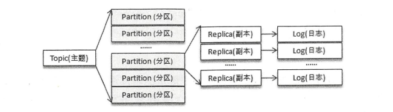

# 四、主题和分区

- 主题作为消息的归类，可以再细分为一个或多个分区，分区可以看做是对消息的二次归类
- 分区的划分为Kafka提供了可伸缩性、水平扩展的功能，多副本机制为Kafka提供了数据冗余以提高数据可靠性
- 主题、分区都是逻辑概念，分区可以有多个副本，每个副本对应一个日志文件，每个日志文件对应一到多个日志分段，每个日志分段还可以细分为索引文件、日志存储文件和快照文件等

## 4.1 主题的管理

- 通过 kafka-topic.sh 脚本进行主题管理
- 通过 KafkaAdminClient 进行主题管理
- 操作日志文件
- 操作 zookeeper 节点

### 4.1.1 创建主题

- broker端参数 auto.create.topics.enable 默认为true，表示可以自动创建分区数为 num.partitions 、副本因子 default.replication.factor 的主题。
不建议设置为true，会增加主题的管理和维护难度
- Kafka会在 log.dir 或 log.dirs 参数所配置的目录下创建相应的主题分区。主题、分区、副本和Log之间的关系如下：

- 可通过 Zookeeper 客户端来获取集群中各个broker的分区分配情况
```
代表 topic-demo 有四个分区，分区2有1个副本，在brokerId为0的节点上

[zk: localhost:2181(CONNECTED) 2] get /kafka/brokers/topics/topic-demo
{"version":1,"partitions":{"2":[0],"1":[0],"3":[0],"0":[0]}}
```
- 还可以通过 describe 指令类型查看分区副本的分配细节，如下：
```
E:\kafka_2.12-2.3.1\kafka_2.12-2.3.1\bin\windows>kafka-topics.bat --zookeeper localhost:2181/kafka --describe --topic topic-demo
Topic:topic-demo        PartitionCount:4        ReplicationFactor:1     Configs:
        Topic: topic-demo       Partition: 0    Leader: 0       Replicas: 0     Isr: 0
        Topic: topic-demo       Partition: 1    Leader: 0       Replicas: 0     Isr: 0
        Topic: topic-demo       Partition: 2    Leader: 0       Replicas: 0     Isr: 0
        Topic: topic-demo       Partition: 3    Leader: 0       Replicas: 0     Isr: 0

```
- 可通过 replica-assignment 参数手动指定分区副本的分配方案，
- 可通过 config 参数设置主题端配置，通过 --describe 或 Zookeeper节点 /config/topics/[topic] 来查看设置的参数
- 创建主题时，主题名称不能已经存在。kafka-topic.sh 脚本提供了 if-not-exists 参数，如果在创建主题时发生冲突将不做任何处理。Kafka自动将主题名中的 . 换为 _ 。
主题名称不推荐以 __ 开头，因为以 __ 开头的的主题一般看做Kafka的内部主题。
- Kafka支持broker的机架信息

### 4.1.2 分区副本的分配

- 分区分配指的是为集群指定创建主题时的分区副本分配方案，即在哪个broker中创建哪些分区的副本
    - 若使用了 replica-assignment 参数，则按照参数指定的分配策略进行分区副本的创建
    - 否则，按照内部逻辑计算分配方案，分为未指定机架信息和指定机架信息

### 4.1.3 查看主题

- kafka-topic.sh 脚本有5种指令类型：create、list、describe、alter和delete，通过 list 和 describe 指令可以方便的查看主题信息
```
kafka-topics.bat --zookeeper localhost:2181/kafka -list
kafka-topics.bat --zookeeper localhost:2181/kafka -describe
kafka-topics.bat --zookeeper localhost:2181/kafka -describe --topic topic-demo
kafka-topics.bat --zookeeper localhost:2181/kafka -describe --topic topic-demo,__consumer_offsets
```
- `under-replicated-partitions` 参数可以找出所有包含失效副本的分区。`unavailable-partitions`参数可以查看主题中没有leader副本的分区

### 4.1.4 修改主题

- 通过 kafka-topic.sh 脚本的 alter 指令可以修改分区个数、修改配置等
- 只支持增加分区，不支持减少分区。增加分区要三思而后行，因为会影响到消息基于key的分区，建议一开始就设置好分区数量
```
kafka-topics.bat --zookeeper localhost:2181/kafka --alter --topic topic-config --partition 3
kafka-topics.bat --zookeeper localhost:2181/kafka --alter --topic topic-config --config max.message.bytes=2000
```

### 4.1.5 配置管理

- kafka-config.sh 脚本专门用来对配置进行操作，在运行状态下修改原有的配置，达到动态变更的目的。
- 包含变更配置 alter 和查看配置 describe 两种指令类型
- `entity-type`参数指令操作配置的类型，`entity-name`参数指定操作配置的名称。`entity-type`可以配置4个值：brokers、topics、clients和users
- 使用 alter 指令变更配置时，需要配合 add-config 和 delete-config 这两个参数一起使用，add-config 用来实现配置的增、改，即覆盖原有配置；delete-config用来
删除被覆盖的配置以恢复默认值
```
kafka-configs.bat --zookeeper localhost:2181/kafka --describe --entity-type topics --entity-name topic-config
kafka-configs.bat --zookeeper localhost:2181/kafka --alter --entity-type topics --entity-name topic-config --add-config cleanup.policy=compact,max.message.bytes=1000
```

### 4.1.6 主题端参数

### 4.1.7 删除主题

- 当确定不再使用一个主题时，最好将其删除，这样可以释放一些资源
- 通过 kafka-topics.sh 脚本的 delete 指令删除主题，broker端配置参数 delete.topic.enable 设置为true，才可以删除成功，否则，被忽略
- 不可以删除Kafka的内部主题
- 可通过zookeeper删除主题

```
kafka-topics.sh --zookeeper localhost:2181/kafka --delete --topic topic-delete
```

## 4.2 初始KafkaAdminClient

`KafkaAdminClient`提供了多种方法，如下：
- 创建主题
- 删除主题
- 列出所有可用的主题
- 查看主题的信息
- 查询配置信息
- 修改配置信息
- 增加分区
...

```java
package com.mrrookie.practice;

import org.apache.kafka.clients.admin.AdminClient;
import org.apache.kafka.clients.admin.AdminClientConfig;
import org.apache.kafka.clients.admin.CreateTopicsResult;
import org.apache.kafka.clients.admin.NewTopic;

import java.util.Collections;
import java.util.Properties;

/**
 * KafkaAdminClient示例
 */
public class KafkaAdminClientDemo {
    public static void main(String[] args) {
        String brokerList = "localhost:9092";
        String topic = "topic-admin";

        Properties properties = new Properties();
        properties.put(AdminClientConfig.BOOTSTRAP_SERVERS_CONFIG, brokerList);
        properties.put(AdminClientConfig.REQUEST_TIMEOUT_MS_CONFIG, 30000);
        AdminClient client = AdminClient.create(properties);

        NewTopic newTopic = new NewTopic(topic, 4, (short) 1);
        CreateTopicsResult result = client.createTopics(Collections.singleton(newTopic));

        try {
            result.all().get();
        } catch (Exception e) {
            e.printStackTrace();
        }

        client.close();
    }
}
```

**主题合法性验证**

自定义实现 `org.apache.kafka.server.policy.CreateTopicPolicy`接口，然后在 broker 端的配置文件中配置参数 `create.topic.policy.class.name`
的值为实现类的全类名，就可以进行主题合法性验证

## 4.3 分区的管理

### 4.3.1 优先副本的选举

- 多副本机制提高可靠性，只有Leader副本对外提供读写服务，Follow副本只负责在内部进行消息的同步
- 负载不均衡：指的是当一个节点宕机时，该节点中的Leader副本不可用，会从其他节点中的Follow副本中选举出新的Leader副本，这样会造成负载不均衡
- 优选副本指的是AR集合列表中的第一个副本，Kafka确保所有主题的优先副本在Kafka集群中均匀分布，这样就保证了所有分区的Leader副本均衡分布
- 优选副本的选举是指通过一定的方式促使优先副本选举为Leader副本，以此来促进集群的负载均衡，这一行为也可以称为分区平衡
- Kafka提供了分区自动平衡的功能，broker端参数`auto.leader.rebalance.enable`，默认为true，Kafka会启动一个定时任务，默认300秒，计算每个节点的
分区不平衡率，若超过某个限定值就会自动执行优选副本的选举动作以求分区平衡。生产环境不建议设置分区自动平衡，不可控性可能会导致严重的性能问题。
- `kafka-perferred-replica-election.sh`脚本提供了对分区Leader副本进行重新平衡的功能。建议通过`--path-to-json-file`参数小批量的对部分分区执行优先副本的选举操作
```
kafka-perferred-replica-election.sh --zookeeper localhost:2181/kafka
kafka-perferred-replica-election.sh --zookeeper localhost:2181/kafka --path-to-json-file election.json
```

### 4.3.2 分区重分配

- 当集群中的一个节点突然宕机下线，则该节点的分区副本就失效了，Kafka不会将这些失效的分区副本自动的迁移到集群中剩余的可用broker节点上，影响整个集群的均衡
负载，还会影响到整体服务的可用性和可靠性。当新增broker节点时，只有新创建的主题分区才有可能被分配到这个节点上，而之前的主题分区并不会自动分配到新加入的节点中，
节点的负载均衡和原先节点的负载均衡之间严重不均衡。
- Kafka提供了`kafka-reassign-partitions.sh`脚本执行分区重分配工作，可在集群扩容、broker节点失效的场景下对分区进行迁移
    - 分为三个步骤：
        - 创建一个包含主题清单的JSON文件
        - 根据主题清单和broker节点清单生成一份重分配方案
        - 根据这份方案执行具体的重分配动作
- 用户可自定义重分配方案
- 分区重分配对集群性能有很大影响，实际操作中，我们将降低重分配的粒度，分成多个小批次来执行

### 4.3.3 复制限流


