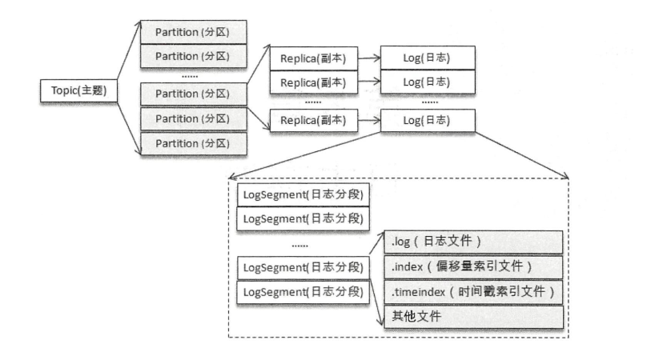
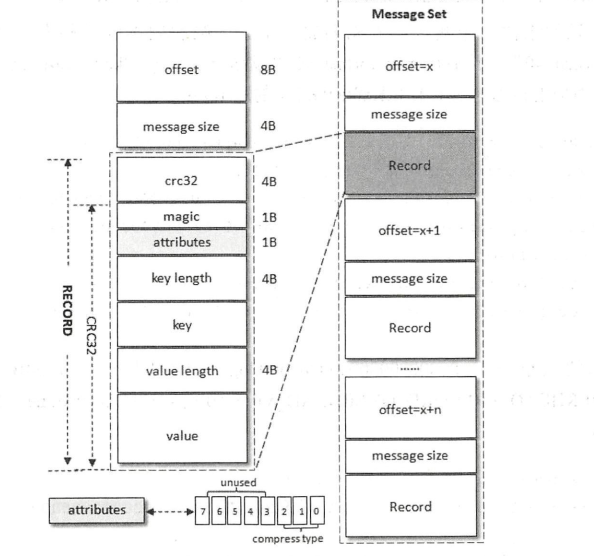

# 五、日志存储

## 5.1 文件目录布局

- Kafka中，一个分区对应一个日志（Log）。为了防止日志过大，Kafka又引入了日志分段（LogSegment）的概念，将Log切分为多个LogSegment，相当于一个巨型文件
被平均分配为多个相对较小的文件，这样也便于日志的维护和清理。
- Log和LogSegment非纯粹物理概念，Log在物理上只以文件夹的形式存储，每个LogSegment对应于磁盘上的一个日志文件和两个索引文件，以及可能的其他文件（如以 .txnidex 为后缀
的事务索引文件），主题、分区、副本、Log、LogSegment关系如下图所示：



- Log 对应一个命名形式为 <topic>-<partition> 的文件夹
- 向 Log 追加日志是顺序追加的，只有最后一个 LogSegment 才能执行该操作，在此之前的所有的 LogSegment 都不能写入数据
- 便于消息检索，每个 LogSegment 中的日志文件（.log 后缀）都有对应的两个索引文件：偏移量索引文件（.index 后缀）和时间戳索引文件（.timeindex 后缀）
- 每个 LogSegment 都有一个基准偏移量 baseOffset，用来表示当前 LogSegment 中第一条消息的offset。是一个64位长整型数

## 5.2 日志格式的演变

- 消息格式不仅关系功能维度的扩展，还牵涉性能维度的变化。Kafka消息格式经历了V0版本、V1版本和V2版本

### 5.2.1 V0版本

V0版本的消息格式如下：



- 日志头：offset 和 message size 字段。日志头固定为12B
- crc32（4B）：crc32校验值，校验范围为 magic 到 value 之间
- magic（1B）：消息格式版本号，此版本为0
- attributes（1B）：消息的属性。低3位表示压缩类型，其余位保留
- key length（4B）：表示消息Key的长度。若为-1，则表示没有设置key
- key：可选，若没有key则没有该字段
- value length（4B）：实际消息体的长度，若为-1，则表示消息为空
- value：消息体，可以为空

### 5.2.2 V1版本

- 相比V0版本，多了一个timestamp字段，表示消息的时间戳。V1版本的magic字段的值为1。V1版本的attributes字段的低3位和V0版本一样，还是表示压缩类型，
而第4位用来表示 timestamp 的类型，0代表CreateTime，1代表 LogAppendTime。timestamp类型由 broker 端参数 log.message.timestamp.type 来设置，默认值为
CreateTime。若创建 ProducerRecord 时没有指定消息的时间戳，那么 KafkaProducer 会在发送消息的时候自动添加上。

### 5.2.3 消息压缩

- Kafka实现的压缩方式是将多条消息一起进行压缩
- 生产者发送的压缩数据在 broker 中也是保持压缩状态进行存储，消费者从服务端获取的也是压缩的消息，消费者在处理消息之前才会解压消息
- Kafka日志采用的压缩方式通过参数 compression.type 配置，默认为 producer，表示保留生产者使用的压缩方式，也可配置为gzip、snappy、lz4，若配置为
uncompressed，则表示不压缩

### 5.2.4 变长字段

### 5.2.5 V2字段

## 5.3 日志索引

- Kafka索引文件以稀疏索引的方式构造消息的索引，并不保证每个消息在索引文件中都有对应的索引项。每当写入一定量的消息时，偏移量索引文件和时间戳索引文件
分别增加一个偏移量索引项和时间戳索引项，增大和减小 log.index.interval.bytes 的值，对应的增加或减小索引项的密度
- 采用二分查找法，若指定的偏移量不在索引文件中，会返回小于指定偏移量的最大偏移量
- 日志分段文件切分包含以下几个条件，满足其一即可
    - 日志分段文件大小超过了 broker 端参数 log.segment.bytes 配置的值，默认为 1GB
    - 当日志分段中消息的最大时间戳与当前系统的时间戳的差值大于 log.roll.ms 或 log.roll.hours 参数配置的值时，默认只配置了 log.roll.hours ，为7天
    - 偏移量索引文件或时间戳索引文件的大小达到 broker 端参数 log.index.size.max.bytes 配置的值，默认10MB
    - 追加的消息的偏移量与当前日志分段的偏移量之间的差值大于 Integer.MAX_VALUE。
    
### 5.3.1 偏移量索引

偏移量索引项的格式共8字节，分为两部分：
- relativeOffset：相对偏移量，表示消息相对于 baseOffset 的偏移量，占用4字节，当前索引文件的文件名即为 baseOffset 的值
- position： 物理地址，也就是消息在日志分段文件中对应的物理位置

可通过以下脚本分析索引文件：
```
bin/kafka-dump-log.sh --files 00000000000000000000.index
```

### 5.3.2 时间戳索引

时间戳索引项占用12字节，分为两个部分：
- timestamp：当前日志分段最大的时间戳
- relativeOffset：时间戳所对应的消息的相对偏移量

## 5.4 日志清理

Kafka提供了两种日志清理策略：
- 日志删除：按照一定的保留策略直接删除不符合条件的日志分段
- 日志压缩：针对每个消息的key进行整合，对于有相同key的不同value值，只保留最后一个版本

broker 端参数 log.cleanup.policy 来设置日志清理策略，默认为 delete，可设置为 "compact" 、"delete,compact"。

### 5.4.1 日志删除

- 基于时间
- 基于日志大小
- 基于日志起始偏移量

### 5.4.2 日志压缩

## 5.5 磁盘存储

### 5.5.1 页缓存

Kafka大量使用了页缓存，这是Kafka实现高吞吐的重要因素之一。Kafka提供了同步刷盘及间断性强制刷盘的功能

### 5.5.2 磁盘I/O流程

### 5.5.3 零拷贝

所谓的零拷贝是指将数据直接从磁盘文件复制到网卡设备中，而不需要经过应用程序之手。