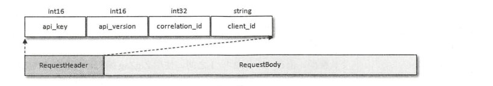
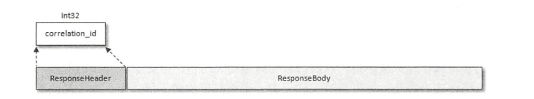
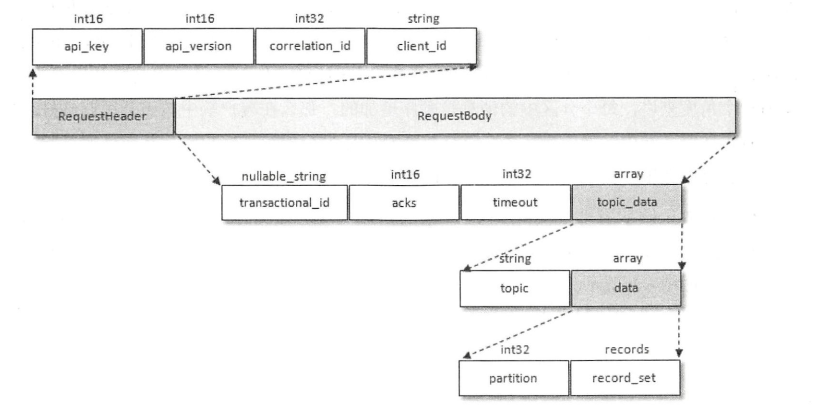
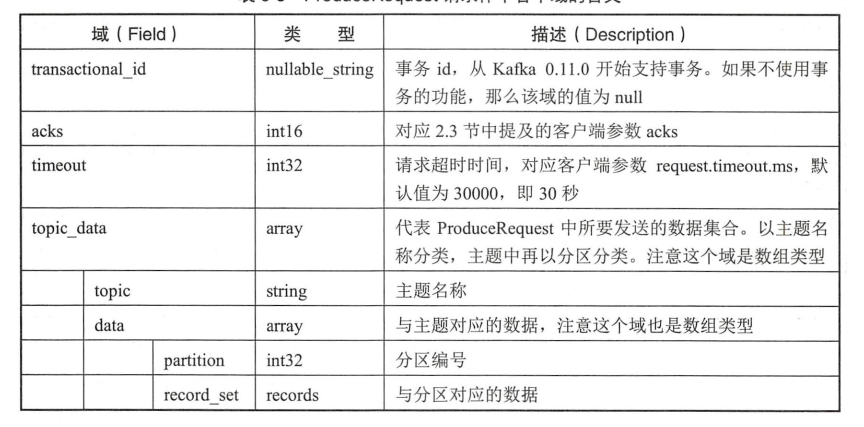
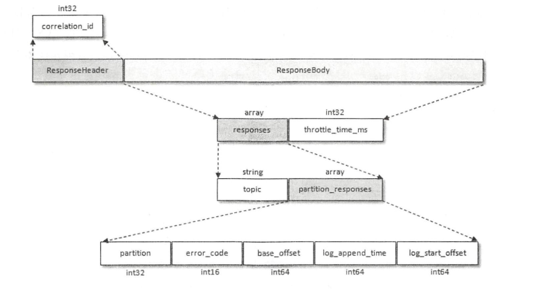
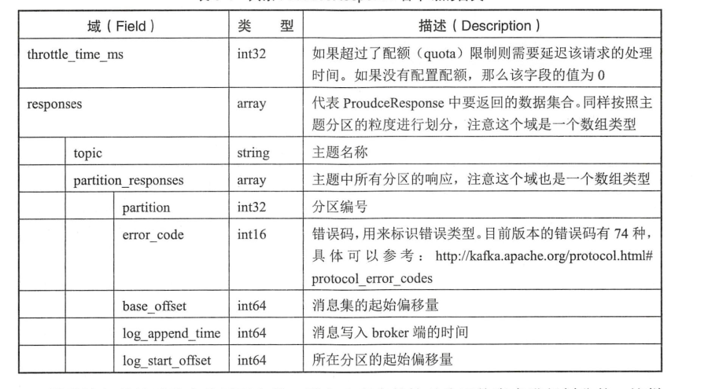
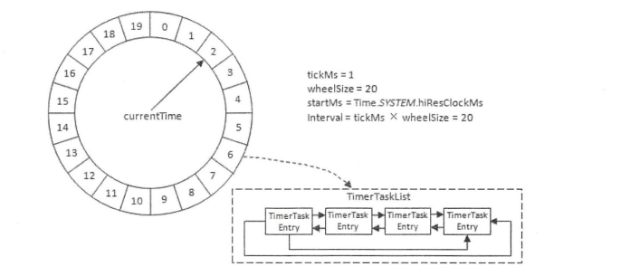
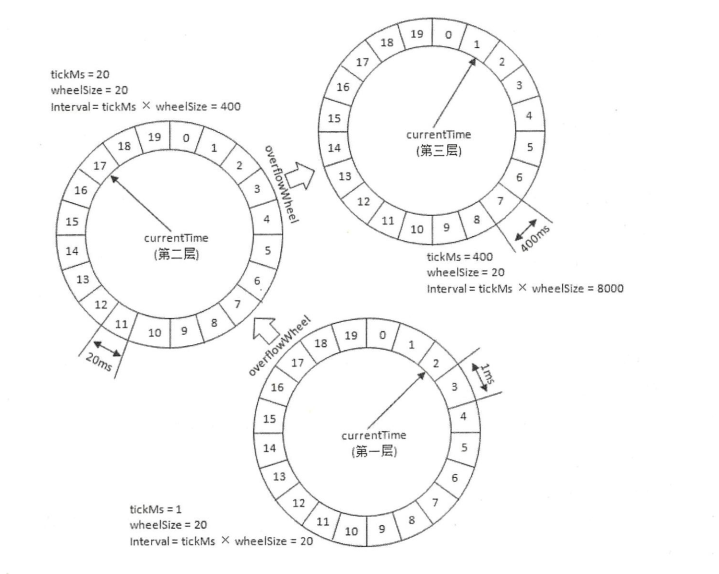

# 六、深入服务端

## 6.1 协议设计

- Kafka自定义了一组基于TCP的二进制协议，只要遵守这组协议的格式，就可以向Kafka发送消息，也可以从Kafka中拉取消息
- Kafka2.0中共包含43种协议类型，每种协议类型都有对应的请求和响应，都遵守特定的协议模式，每种类型的Request都包含相同的请求头和不同的请求体。

    - api_key：API标识，比如PRODUCER、FETCH等分别表示发送消息和拉取消息的请求
    - api_version：API版本号
    - correlation_id：客户单指定的一个数字唯一标识这次请求的ID，服务端处理完请求后也会把同样的correlation_id写到Response中，这样客户端就能把请求和响应对应起来
    - client_id：客户端ID
- 每种类型的Response也包含相同的协议响应头和不同结构的响应体

- Kafka中所有协议类型的Request和Response的结构都是具备固定格式的，并且它们都构建于多种基本数据类型之上，如boolean、int8、int16等
- 消息发送协议类型讲解，即ProduceRequest和ProduceResponse，对应的api_key=0，表示PRODUCE。ProduceRequest的组织结构如下图：

- ProduceRequest请求体中各个域的含义如下：

- ProduceResponse组织结构如下：

- ProduceResponse各个域的含义如下：

## 6.2 时间轮

- Kafka基于时间轮的概念自定义实现了一个用于延时功能的定时器
- Kafka中的时间轮（TimingWheel）是一个存储定时任务的环形队列，底层采用数组实现，数组中的每个元素可以存放一个定时任务列表（TimerTaskList）。TimerTaskList
是一个环形的双向链表，链表中的每一项表示的是定时任务项（TimeTaskEntry），其中封装了真正的定时任务（TimerTask）
- 时间轮由多个时间格组成，每个时间格代表当前时间轮的基本时间跨度（tickMs）。时间轮的时间格个数是固定的，可用wheelSize来表示，整个时间轮的总体跨度（interval）
可以通过公式 tickMs *  wheelSize计算得出。还有一个表盘指针（currentTime），用来表示时间轮当前所处的时间，currentTime是tickMs的整数倍。

- Kafka的时间轮有多层时间轮以及时间轮降低的概念。多层时间轮的设计主要是为了满足设置过期时间较长，无法放入第一层时间轮的场景。时间轮降级主要是满足当时间推进过程中，
过期时间较长的任务会移动到层级较低的时间轮中，等待执行。

## 6.3 延时操作

