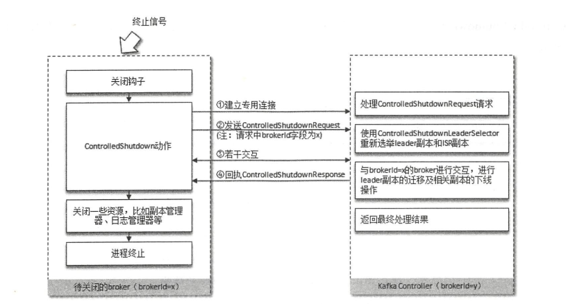

# 六、深入服务端

## 6.1 协议设计

- Kafka自定义了一组基于TCP的二进制协议，只要遵守这组协议的格式，就可以向Kafka发送消息，也可以从Kafka中拉取消息
- Kafka2.0中共包含43种协议类型，每种协议类型都有对应的请求和响应，都遵守特定的协议模式，每种类型的Request都包含相同的请求头和不同的请求体。

    - api_key：API标识，比如PRODUCER、FETCH等分别表示发送消息和拉取消息的请求
    - api_version：API版本号
    - correlation_id：客户单指定的一个数字唯一标识这次请求的ID，服务端处理完请求后也会把同样的correlation_id写到Response中，这样客户端就能把请求和响应对应起来
    - client_id：客户端ID
- 每种类型的Response也包含相同的协议响应头和不同结构的响应体

- Kafka中所有协议类型的Request和Response的结构都是具备固定格式的，并且它们都构建于多种基本数据类型之上，如boolean、int8、int16等
- 消息发送协议类型讲解，即ProduceRequest和ProduceResponse，对应的api_key=0，表示PRODUCE。ProduceRequest的组织结构如下图：

- ProduceRequest请求体中各个域的含义如下：

- ProduceResponse组织结构如下：

- ProduceResponse各个域的含义如下：

## 6.2 时间轮

- Kafka基于时间轮的概念自定义实现了一个用于延时功能的定时器
- Kafka中的时间轮（TimingWheel）是一个存储定时任务的环形队列，底层采用数组实现，数组中的每个元素可以存放一个定时任务列表（TimerTaskList）。TimerTaskList
是一个环形的双向链表，链表中的每一项表示的是定时任务项（TimeTaskEntry），其中封装了真正的定时任务（TimerTask）
- 时间轮由多个时间格组成，每个时间格代表当前时间轮的基本时间跨度（tickMs）。时间轮的时间格个数是固定的，可用wheelSize来表示，整个时间轮的总体跨度（interval）
可以通过公式 tickMs *  wheelSize计算得出。还有一个表盘指针（currentTime），用来表示时间轮当前所处的时间，currentTime是tickMs的整数倍。

- Kafka的时间轮有多层时间轮以及时间轮降低的概念。多层时间轮的设计主要是为了满足设置过期时间较长，无法放入第一层时间轮的场景。时间轮降级主要是满足当时间推进过程中，
过期时间较长的任务会移动到层级较低的时间轮中，等待执行。

## 6.3 延时操作

- 若生产者客户端发送消息时将 acks 参数设置为 -1，则Kafka在将消息写入 leader 副本的本地日志文件之后，会创建一个延时的生产操作，用来处理消息正常写入所有副本
或超时的情况，以返回相应的响应结果给客户端。
- follower副本向leader副本发送拉取请求时，Kafka会先读取一次日志文件，如果收集不到足够的消息，就会创建一个延时拉取操作以等待拉取到足够数量的消息
- 无论是延时生产还是延时拉取，都有一个专门的延时操作管理器负责管理，每个延时操作管理器都会配备一个定时器来做超时管理，定时器的底层采用时间轮实现

## 6.4 控制器

- Kafka集群中有一个或多个broker，其中有一个broker会被选举为控制器，负责管理整个集群中所有分区和副本的状态
- 控制器负责leader副本出现故障时，为该分区选举新的leader副本
- 当检测到某个分区的ISR集合发生变化时，由控制器负责通知所有broker更新其元数据信息
- 当某topic增加分区数量时，同样还是由控制器负责分区的重新分配

### 6.4.1 控制器的选举及异常恢复

- Kafka中的控制器选举工作依赖于Zookeeper，成功竞选为控制器的broker会在Zookeeper中创建/controller这个临时节点，节点中会存储brokerId字段
- Zookeeper中还有一个与控制器相关的/controller_epoch节点，这个节点是持久节点，节点中存放控制器发生变更的次数。每个和控制器交互的请求都会携带controller_epoch
值，对比请求携带值与zookeeper中/controller_epoch实际存储的值，来保证控制器的唯一性
- 具备控制器的broker需要比其他普通的broker多一分职责：
    - 监听分区相关的变化
    - 监听主题相关的变化
    - 监听broker相关的变化
    - 从Zookeeper中读取获取当前所有与主题、分区及broker有关的信息并进行相应的管理
    - 启动并管理分区状态机和副本状态机
    - 更新集群元数据
- 考虑多线程间数据的同步，Kafka控制器使用单线程基于事件队列的模型，将每个事件按照FIFO的顺序处理每个事件
- 当/controller节点发生变化，如果broker节点是数据变更前是控制器，在数据变更后需要进行 退位 操作，关闭相应资源。然后参与到broker竞选controller中。

### 6.4.2 优雅关闭

- kafka-server-stop.sh 脚本，但是一般都不会奏效
- 修改 kafka-server-stop.sh脚本，将"\.Kafka"去掉，这样能保证非极端情况下可以奏效
- 按照如下两个步骤可以优雅关闭
    - 使用java的JPS或使用Linux的ps命令查看Kafka的服务进程号
    - 使用 kill -s TERM $PIDS 或 kill -15 %PIDS 的方式来关闭进程
- 优雅关闭的原理：Kafka服务入口程序有一个名为`kafka-shutdown-hock`的关闭钩子，Kafka进程捕获到终止信号时会执行这个钩子中的内容，除执行正常关闭一些必要
的资源外，还会执行一个控制关闭（ControllerShutdown）的动作。优点：可让消息完全同步到磁盘上；ControllerShutdown关闭服务前，会对其上的leader副本进行迁移，减少分区
不可用时间。controlled.shutdown.enable设置为true，ControllerShutdown才会起作用。ControllerShutdown的执行过程如下：

- 可扩展 KafkaAdminClient 接口进行优雅关闭，实质还是调用 ControllerShutdown

### 6.4.3 分区leader的选举

- 当创建分区时，采用 OfflinePartitionLeaderElectionStategy，思路：按照AR集合中副本的顺序查找第一个存活的副本，且该副本在ISR集合中。若ISR无可用副本，则
看 unclean.leader.election.enable 参数，若为true，则代表从AR列表中找到第一个存活的副本即可。
- 分区重分配时，采用 ReassignPartitionLeaderElectionStategy，思路：从重分配的AR列表中找到第一个存活的副本，且这个副本在目前的ISR列表中
- 当发生优先副本选举时，直接将优先副本设置为leader即可（PreferredPartitionLeaderElectionStategy）
- 当节点被优雅关闭，位于关闭节点的leader副本会下线，对应分区需要执行leader选举，策略（ControllerShutdownPartitionLeaderElectionStategy）：按照AR集合中副本的顺序查找第一个存活的副本，且该副本在ISR集合中

## 6.5 参数解密

### 6.5.1 broker.id

- broker启动时会在zookeeper中的/brokers/ids路径下创建一个以当前brokerId为名称的虚节点，broker的健康检查就依赖于该虚节点
- 可通过broker端的 config/server.properties 里的 broker.id 参数来配置 brokerId
- 可通过日志目录下的meta.properties中的 broker.id 配置 brokerId
- broker.id.generation.enable 和 reserved.broker.max.id 配合可自动生成 brokerId

### 6.5.2 bootstrap.servers

### 6.5.3 服务端参数列表

