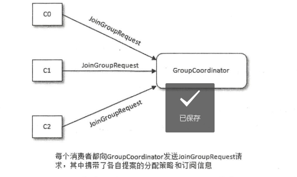

# 七、深入客户端

## 7.1 分区分配策略

- Kafka提供了消费者客户端参数 partition.assignment.strategy 来设置消费者与订阅主题之间的分区分配策略。默认为 RangeAssignor。
- Kafka提供了另外两种分配策略：RoundRobinAssignor 和 StickyAssignor
- 消费者客户端参数 partition.assignment.strategy 可以配置多个分配策略，逗号分割

### 7.1.1 RangeAssignor 分配策略

- 按照消费者总数和分区总数进行整除运算来获得一个跨度，然后将分区按照跨度进行平均分配，以保证分区尽可能均匀地分配给所有的消费者
- 对于每一个主题，RangeAssignor策略会将消费组内所有订阅这个主题的消费者按照名称的字典序排序，然后为每个消费者划分固定的分区范围，如果不够平均分配，那么字典序
靠前的消费者就会被多分配一个分区

### 7.1.2 RoundRobinAssignor 分配策略

- 将消费组内所有消费者及消费者订阅的所有主题的分区按照字典序排序，然后按照轮询方式逐个将分区依次分配给每个消费者

### 7.1.3 StickyAssignor 分配策略

- 有两个目的，当两个冲突时，第一个目标优先于第二个目标
    - 分区的分配要尽可能的均匀
    - 分区的分配尽可能与上次分配的保持相同
    
### 7.1.4 自定义分区分配策略

- 自定义分配策略必须要实现 org.apache.kafka.clients.consumer.internals.PartitionAssignor接口

## 7.2 消费者协调器和组协调器

协调器要解决的问题：
- 消费者客户端配置了两个分配策略，以哪个为准
- 若有多个消费者，彼此的分配策略并不完全一致，以哪个为准
- 多个消费者之间的分区分配是需要协同的，那么这个协同的过程是怎样的

### 7.2.1 旧版消费者客户端的问题

旧版的消费者客户端使用Zookeeper的监听器来实现上述功能。但是当消费者监听到Zookeeper节点发生变化时，一个消费组下的所有消费者会同时进行再均衡操作，而消费者之间
并不知道彼此操作的结果，可能导致Kafka工作在一个不正确的状态。会造成两个比较严重的问题：
- 羊群效应：指的是Zookeeper中一个被监听的节点变化，大量的watch通知被发送到客户端，导致在通知期间的其他操作延迟，也有可能发生类似死锁的情况
- 脑裂问题：消费者进行再均衡操作时每个消费者都与Zookeeper进行通信以判断消费者或broker变化的情况，由于Zookeeper本身的特性，可能导致在同一时刻各个消费者获取到
的状态不一致，这样会导致异常问题发生

### 7.2.2 再均衡的原理

- 全部消费组分成多个子集，每个消费组的子集在服务端对应一个 GroupCoordinator 对其进行管理，GroupCoordinator 是Kafka服务端中用于管理消费组的组件。
而消费者客户端中的 ConsumerCoordinator 组件负责与 GroupCoordinator 进行交互
- GroupCoordinator 与 ConsumerCoordinator 之间最重要的职责就是负责执行消费者再均衡的操作。如下情形会触发再均衡的操作：
    - 有新的消费者加入消费组
    - 有消费者宕机下线
    - 有消费者主动退出消费组
    - 消费组对应的 GroupCoordinator 节点发生了变更
    - 消费组内所订阅的任一主题或者主题的分区数量发生变化

再均衡操作的阶段：
- 消费者需要确定它所属的消费组对应的 GroupCoordinator 所在的broker，并创建与该 broker 相互通信的网络连接
- 消费者向 GroupCoordinator 发送 joinGroupRequest 请求，并处理响应

客户端发送 joinGroupRequest 请求：

客户端接收 JoinGroupResponse 响应：

- leader 消费者根据选举出来的分区分配策略实施具体的分区分配，然后通过 GroupCoordinator 转发给各个消费者
- 消费者加入成功后，确定消费位移，然后维持跟 GroupCoordinator 之间的心跳

## 7.3 __consumer_offsets 剖析

- 位移提交内容会保存在 __consumer_offsets 内部主题中，副本因子默认为3，可配置，分区数默认50，可配置，位移信息默认保留7天，超过会被删除掉

## 7.4 事务

### 7.4.1 消息传输保障

消息中间件的消息传输保障级别：
- at most once：至多一次
- at least once：至少一次
- exactly once：恰好一次

### 7.4.2 幂等

- 所谓幂等，就是对接口的多次调用所产生的的结果和调用一次是一致的。Kafka使用幂等可以避免生产者进行重试时重复写入消息
- 设置生产者客户端参数 enable.idempotence 为true，则开启幂等。开启幂等，需要注意 retries、acks、max.in.flight.requests.per.connection 参数的设置
- 原理主要就是比对 生产者ID、分区的序列号大小，新的提交，序列号必然等于最近的一次提交的序列号+1
- Kafka的幂等只能保证单个生产者会话中单分区的幂等

### 7.4.3 事务

- 事务可以保证对多个分区写入操作的原子性
- 设置客户端参数 transactional.id 开启事务，事务要求生产者开启幂等
- 同样的 transactionalId 开启两个生产者，前一个开启的生产者会报错
- Kafka并不能保证已提交的事务中的所有消息都能够被消费，如消息被清理、老的日志段被删除等
- KafkaProducer提供了与事务相关的方法，如初始化事务、开启事务、在事务内位移提交、提交事务、中止事务
- 消费端参数 isolation.level 可以设置为 read_uncommitted、read_commited
- 日志中除普通消息外，还有一种标记事务结束的控制消息。两种类型：COMMIT和ABORT，KafkaConsumer可以通过这个控制消息判断事务被提交还是中止
- **事务协调器的原理**

