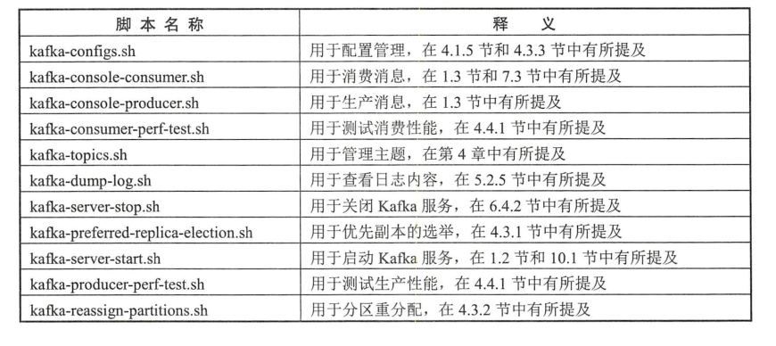
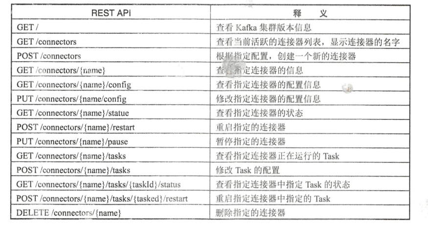

# 九、Kafka应用

## 9.1 命令行工具



### 9.1.1 消费组管理

通过`kafka-consumer-groups.sh`脚本可以查看或变更消费组的信息

```
bin/kafka-consumer-groups.sh --bootstrap-server localhost:9092 --list
```

### 9.1.2 消费位移管理

`kafka-consumer-groups.sh`脚本还提供了重置消费位移的功能，通过`reset-offsets`这个指令类型的参数实施，不过前提是消费组内没有正在运行的消费者成员。

```
bin/kafka-consumer-groups.sh --bootstrap-server localhost:9092 --group groupIdMonitor --all-topics --reset-offsets --to-earliest --execute
```

### 9.1.3 手动删除消息

`kafka-delete-records.sh`脚本可以用来删除指定位置前的消息

## 9.2 Kafka Connect

- 是一个工具，为Kafka和外部数据存储系统之间移动数据提供了一种可靠的且可伸缩的实现方式。
- 有两个核心概念
    - Source：负责导入数据到Kafka
    - Sink：负责从Kafka导出数据

Kafka Connect特性如下：
- 通用性
- 支持独立模式和分布式模式
- REST接口
- 自动位移管理
- 分布式和可扩展性
- 流式计算/批处理的集成

### 9.2.1 独立模式

`connect-standalone.sh`脚本用来实现以独立的模式运行 Kafka Connect

执行该脚本需要两个配置文件：一个是用于Woker进程运行的相关配置文件；另一个是指定Source连接器或Sink连接器的配置文件，可以同时指定多个连接器配置

```
bin/connect-standalone.sh config/connect-standalone.properties config/connect-file-source.properties
```

### 9.2.2 REST API

Kafka connect 提供了基于REST风格的API接口来管理连接器，默认端口为8083，可修改



### 9.2.3 分布式模式

## 9.3 Kafka Mirror Maker

`kafka-mirror-maker.sh`脚本实现在两个集群之间同步数据，实现原理是从源集群消费消息，然后将消息生产到目标集群中

## 9.4 Kafka Streams

是一个用于处理和分析数据的客户端库。先把存储在Kafka中的数据进行处理和分析，然后将最终所得数据结果回写到Kafka或发送到外部系统。

