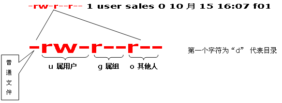

# chmod命令(2019.06.20)

- `chmod`命令用来变更文件或目录的权限
- 文件或目录权限的控制分别以读取、写入、执行3中一般权限来区分，另有3中特殊权限可供运用

## 一、权限范围的表示法

| 权限 | 描述 |
| :--- | :--- |
| u | User，即文件或目录的拥有者 |
| g | Group，即文件或目录的所属群组 |
| o | Other，除了文件或目录的拥有者或所属群组之外，其他用户皆属于这个范围 |
| a | All，即全部的用户，包含拥有者，所属群组以及其他用户 |
| r | 读取权限，数字代号为"4" |
| w | 写入权限，数字代号为"2" |
| x | 执行或切换权限，数字代号为"1" |
| - | 不具有任何权限，数字代号为"0" |
| s | 特殊功能说明：变更文件或目录的权限 |

## 二、语法

`chmod (选项) (参数)`

### 2.1 选项

| 选项 | 描述 |
| :--- | :--- |
| -c | 效果类似 -v 参数，但仅回报更改的部分 |
| -f | 不显示错误信息 |
| -R | 递归处理，将指令目录下的所有文件及子目录一并处理 |
| -v | 显示指令执行过程 | 
| --reference=<参考文件或目录> | 把指定文件或目录的所属群组全部设成和参考文件或目录的所属群组相同 |
| <权限范围>+<权限设置> | 开启权限范围的文件或目录的该选项权限设置 |
| <权限范围>-<权限设置> | 关闭权限范围的文件或目录的该选项权限设置 |
| <权限范围>=<权限设置> | 指定权限范围的文件或目录的该选项权限设置 |

## 三、 Linux文件权限

## 四、栗子

    [rookie@iZbp18hovh1qxijbodbas9Z ~]$ ll | grep test.txt
    -rw-rw-r--  1 rookie rookie        24 Jun 17 19:13 test.txt
    [rookie@iZbp18hovh1qxijbodbas9Z ~]$ chmod a+x test.txt 
    [rookie@iZbp18hovh1qxijbodbas9Z ~]$ ll | grep test.txt 
    -rwxrwxr-x  1 rookie rookie        24 Jun 17 19:13 test.txt
    [rookie@iZbp18hovh1qxijbodbas9Z ~]$ chmod o-x test.txt 
    [rookie@iZbp18hovh1qxijbodbas9Z ~]$ ll | grep test.txt 
    -rwxrwxr--  1 rookie rookie        24 Jun 17 19:13 test.txt
    [rookie@iZbp18hovh1qxijbodbas9Z ~]$ chmod o=rwx test.txt 
    [rookie@iZbp18hovh1qxijbodbas9Z ~]$ ll | grep test.txt 
    -rwxrwxrwx  1 rookie rookie        24 Jun 17 19:13 test.txt
    [rookie@iZbp18hovh1qxijbodbas9Z ~]$ chmod 664 test.txt 
    [rookie@iZbp18hovh1qxijbodbas9Z ~]$ ll | grep test.txt 
    -rw-rw-r--  1 rookie rookie        24 Jun 17 19:13 test.txt
    [rookie@iZbp18hovh1qxijbodbas9Z ~]$ 

