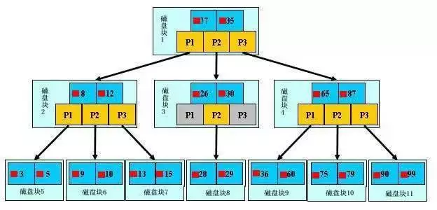

# 索引

> MySQL技术内幕：InnoDB存储引擎  
> [MySQL索引和SQL调优](https://juejin.im/post/5a6873fbf265da3e393a97fa#comment)  

索引是一种数据结构，目的是提高MySQL获取数据的效率。

MySQL支持的索引：
- B+树索引
- 哈希索引
- 全文检索

## 一、B+索引

### 1.1 结构

索引是帮助MySQL高效获取数据的数据结构。

索引的原理，不断的缩小想要获取数据的范围来筛选出最终想要的结果，同时把随机的事件变成顺序的事件。

- 什么是索引
- 为什么要用索引
- 索引的种类

## B+树索引

- 结构
- 原理
- 分裂
- 索引管理
- Cardinality值
- B+树索引分类
    - 聚集索引
    - 辅助索引
        - 联合索引
        - 覆盖索引
        
## 哈希索引

## 全文检索