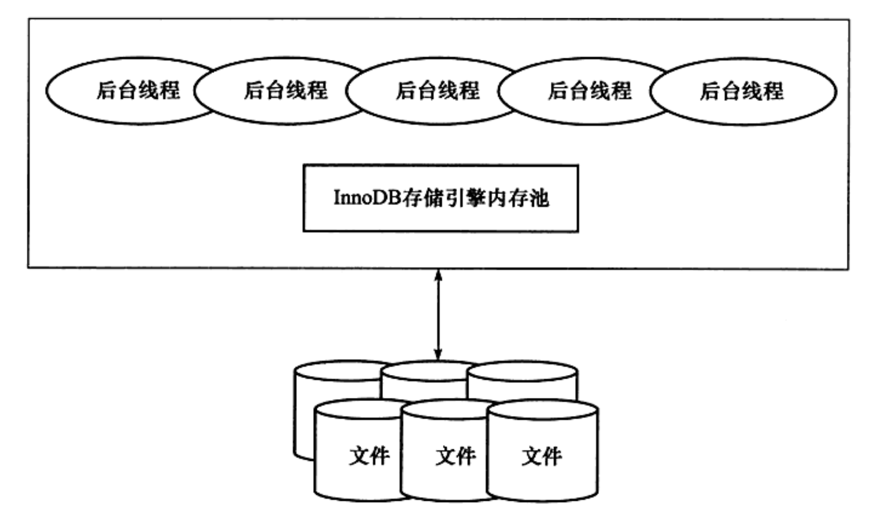
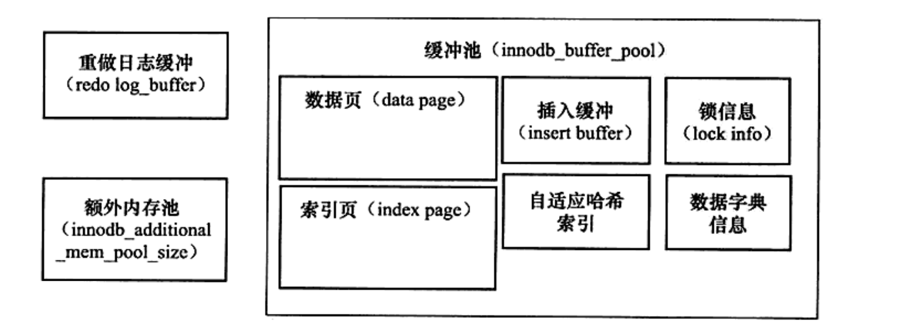

# InnoDB存储引擎

第一个完整支持ACID事务的MySQL存储引擎（BDB是第一个支持事务的MySQL存储引擎），特点是行锁设计、支持MVCC、支持外键、提供一致性非锁定读，同时被用来最有效的利用
以及使用内存和CPU。是一个高性能、高可用、高可扩展的存储引擎。

## 一、InnoDB体系架构

InnoDB存储引擎由多个内存块组成一个大的内存池，负责如下工作：
- 维护多个进程、线程需要访问的多个内部数据结构。
- 缓存磁盘上的数据，方便快速的读取，同时在对磁盘文件的数据修改之间在这里缓存。
- 重做日志（redo log）缓冲
- ...

后台线程的主要作用是负责刷新内存池中的数据，保证缓冲池中的内存缓存是最近的数据。此外，将已修改的数据文件刷新到磁盘文件中，同时保证在数据库发生异常的情况下
InnoDB能恢复到正常运行状态。

### 1.1 后台线程

#### 1.1.1 Master Thread

负责将缓冲池中的数据异步刷新到磁盘、保证数据一致性，包括脏页的刷新、合并插入缓冲、UNDO页的回收等。

#### 1.1.2 IO Thread

负责InnoDB存储引擎中的AIO请求的回调处理。

共有四个IO Thread：
- write（参数：innodb_read_io_threads）
- read（参数：innodb_write_io_threads）
- insert buffer
- log IO Thread

可通过`show engine innodb status`观察InnoDB中的IO Thread

#### 1.1.3 Purge Thread

事务被提交后，其所使用的`undolog`可能不再需要，因此需要Purge Thread来回收已经使用并分配的`undo`页。可通过MySQL数据库的配置文件中添加`innodb_purge_threads=1`
进行设置。

#### 1.1.4 Page cleaner Thread

负责脏页的刷新操作。

### 1.2 内存

#### 1.2.1 缓冲池

一块内存区域。

在数据库中进行读取页的操作，首先将从磁盘读到的页放到缓冲池中，这个过程称为将页`FIX`在缓冲池中。  
对于数据库的修改操作，则首先修改缓冲池中的页，然后再通过`Checkpoint`机制刷新到磁盘上。

通过`innodb_buffer_pool_size`参数来设置缓冲池的大小。

缓冲池中缓存的数据类型：
- 索引页
- 数据页
- undo页
- 插入缓冲
- 自适应哈希索引
- InnoDB存储的锁信息
- 数据字典信息
- ...

支持多个缓冲池实例。每个页根据哈希值平均分配到不同缓冲池实例中。可以通过参数`innodb_buffer_pool_instance`来进行配置。

查看缓冲池状态：
- `show engine innodb status;`
- `select * from information_schema.INNODB_BUFFER_POOL_STATS;`

#### 1.2.2 LRU List、Free List和Flush List

在InnoDB中，缓冲池中页的大小默认为16KB，使用改进后的LRU算法对缓冲池进行管理。新读取到的页，不再直接放到LRU列表的首部，而是放到`midpoint`位置。
`midpoint`参数可通过如下命令查看：

`show variables like 'innodb_old_blocks_pct';`

还可以通过`innodb_old_blocks_time`表示页读取到`mid`位置后需要等待多久才会被加入到LRU列表的热端。

`Free List`，当数据库启动时，`LRU List`为空，这时页都放在`Free List`中。当需要从缓冲池中分页时，首先从Free列表中查找是否有可用的空闲页，若有则将该页从Free
列表中删除，放入到LRU列表中。否则，根据LRU算法，淘汰LRU列表末尾的页，将该内存空间分配给新的页。  
当页从LRU列表的old部分加入到new部分时，称此时发生的操作为`page made young`，而因为`innodb_old_blocks_time`的设置导致页没有从old部分移动到new部分的
操作称为`page not made young`。  
可通过如下命令查看：
- `show engine innodb status;`
- `select * from information_schema.INNODB_BUFFER_POOL_STATS;`

通过如下命令可以观察每个LRU列表中每个页的具体信息：  
`select * from information_schema.innodb_buffer_page_lru;`

InnoDB存储引擎支持压缩页的功能，将原本16KB的页压缩为1KB、2KB、4KB和8KB。对于非16KB的页，是通过`unzip_lru`列表进行管理的。

`Flush List`用来管理将脏页通过`checkpoint`机制刷新回磁盘。

#### 1.2.3 重做日志缓存

InnoDB存储引擎首先将重做日志信息放入到这个缓冲区中，然后按照一定频率将其刷新到重做日志文件中。

重做日志缓冲大小由`innodb_log_buffer_size`控制，默认8MB

三种情况会将重做日志缓冲中到内容刷新到重做日志文件中：
- Master Thread每一秒将重做日志缓冲刷新到重做日志文件
- 每个事务提交时会将重做日志缓冲刷新到重做日志文件
- 当重做日志缓冲池剩余空间少于1/2时，重做日志缓冲刷新到重做日志文件

#### 1.2.4 额外的内存池

在对一些数据结构本身的内存进行分配时，需要从额外的内存池中进行申请，当该区域内存不足时，会从缓冲池中进行申请。

### 1.3 CheckPoint技术

数据库系统普遍采用了`Write Ahead Log`策略，即当事务提交时，先写重做日志，再修改页。当由于宕机而导致数据丢失时，通过重做日志来完成数据的恢复。

`CheckPoint`技术要解决的问题如下：
- 缩短数据库恢复的时间
- 缓冲池不够用时，将脏页刷新到磁盘
- 重做日志不可用时，刷新脏页

InnoDB存储引擎内部由两种`CheckPoint`：
- Sharp CheckPoint
- Fuzzy CheckPoint

`Sharp CheckPoint`发生在数据库关闭时将所有的脏页刷新到磁盘，这是默认的工作方式，即参数`innodb_fast_shutdown=1`

在InnoDB中可能发生如下几种情况的`Fuzzy CheckPoint`：
- Master Thread CheckPoint
    
    Master Thread差不多以每秒或每十秒的速度从缓冲池的脏页列表中刷新一定比例的页回磁盘。
    
- FLUSH_LRU_LIST CheckPoint

    保证LRU列表中需要有差不多100个空闲页可供使用

- Async/Sync Flush CheckPoint

    重做日志不可用时

- Dirty Page too much CheckPoint

    脏页数量太多
    
## 1.4 Master Thread 工作方式

## 1.5 InnoDB 关键特性

### 1.5.1 插入缓冲

对于非聚集索引的插入或更新操作，不是每一次直接插入到索引页中，而是先判断插入的非聚集索引页是否在缓冲池中，若在，则直接插入。若不在，则先放入到Insert Buffer对象中。然后再以一定的频率
和情况进行Insert Buffer和辅助索引页子节点的merge操作。

Insert Buffer发生的条件：
- 索引是辅助索引
- 索引不是唯一的

### 1.5.2 两次写

### 1.5.3 自适应哈希索引

### 1.5.4 异步IO

### 1.5.5 刷新邻近页

