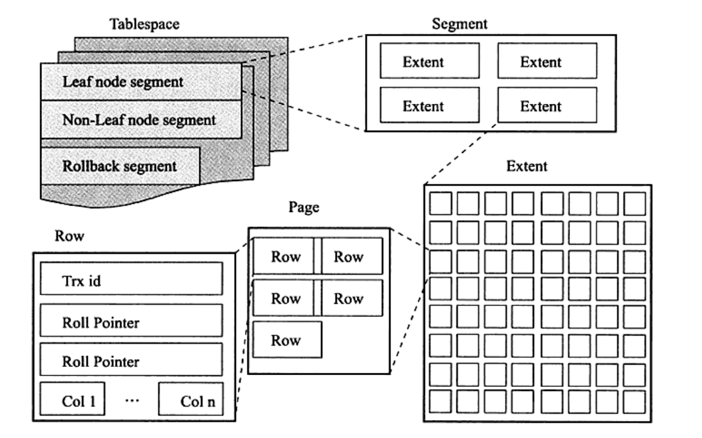
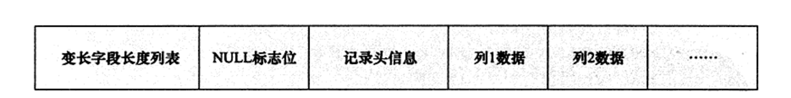
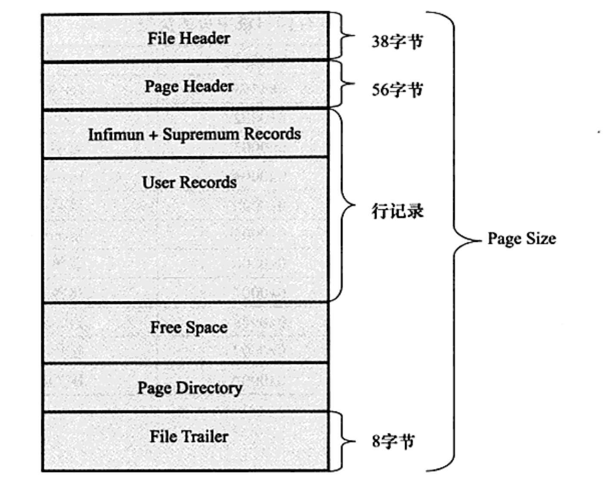

# 表

## 一、索引组织表

在`InnoDB`存储引擎中，表都是按照主键顺序组织存放的，这种存储方式的表称为索引组织表。

若表未定义主键，则`InnoDB`按照如下方式选择或创建主键：
- 定义的第一个非空唯一索引
- 自动创建一个6字节大小的指针

可通过`_rowId`字段从表中查询主键值，不支持联合主键。

## 二、InnoDB逻辑存储结构

表所有的数据逻辑存储在一个空间中，称之为表空间。表空间又由段、区、页组成。

### 2.1 表空间

默认情况下，`InnoDB`存储引擎有一个共享表空间`ibdata1`，即所有数据都存放在这个表空间内。  
若用户开启了`innodb_file_per_table`，则每张表内的数据可以单独放在一个表空间内。

若启用了`innodb_file_per_table`，每张表的表空间存储的只是数据、索引和插入缓冲`Bitmap`页，其他类的数据，如回滚信息，插入缓冲索引页、系统事务信息、二次写缓冲等还是
放在原先的共享表空间内。

### 2.2 段

常见段有数据段、索引段、回滚段等

### 2.3 区

区大小为1MB，由连续页组成。

### 2.4 页

页是`InnoDB`磁盘管理的最小单位。默认每个页大小为16KB，可通过参数`innodb_page_size`设置页大小为4K、8K、16K。

常见页类型有：
- 数据页
- undo页
- 系统页
- 事务数据页
- 插入缓冲位图页
- 插入缓冲空闲列表
- 未压缩的二进制大对象页
- 压缩的二进制大对象页

### 2.5 行

`InnoDB`存储引擎是面向列的，也就是说数据是按行进行存放的。每个页存放的行记录有硬性定义，最多允许存放16KB/2-200行记录，即7992行记录。

## 三、InnoDB行记录格式

提供如下两种格式存放行记录数据：
- Compact
- Redundant（兼容老版本）

### 3.1 Compact行记录格式

`InnoDB`存储引擎在页内部是通过一种链表的结构来串联各个行记录的。

### 3.2 Redundant行记录格式

### 3.3 行溢出数据

`InnoDB`存储引擎可以将一条记录中的某些数据存储在真正的数据页面之外。

一般为`BLOB`、`LOB`、`VARCHAR`类型的列，当一个页无法存储多于两条记录时，会放在`Uncompressed BLOB Page`中。

### 3.4 Compressed 和 Dynamic 行记录格式

新的页格式

### 3.5 CHAR的行结构存储

`InnoDB`存储引擎内部对`CHAR`类型在多字节字符集类型的存储，`CHAR`类型被明确视为了变长字符类型。

## 四、InnoDB数据页结构

`InnoDB`数据页由以下部分组成：
- File Header
- Page Header
- Infimun 和 Supremum Records
- User Records
- Free Space
- Page Directory
- File Trailer

### 4.1 File Header

用来记录页的一些头信息

### 4.2 Page Header

用来记录数据页的状态信息

### 4.3 Infimun 和 Supremum Records

在`InnoDB`存储引擎中，每个数据页中有两个虚拟的行记录，用来限定记录的边界。`Infimun`记录是比该页中任何主键值都要小的值，`Supremum`指比任何
可能大的值还要大的值。这两个值在页创建时被建立，并且在任何情况下不会被删除。

### 4.4 User Records 和 Free Space

`User Records`指实际存储行记录的内容

`Free Space`指空闲空间，链表数据结构。在一条记录被删除后，该空间会被加入到空闲链表中。

### 4.5 Page Directory

`Page Directory`页目录存放了记录的相对位置

### 4.6 File Trailer

检测页是否已经完整的写入磁盘。

