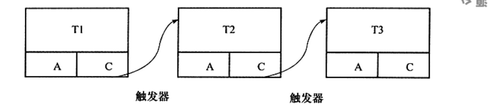
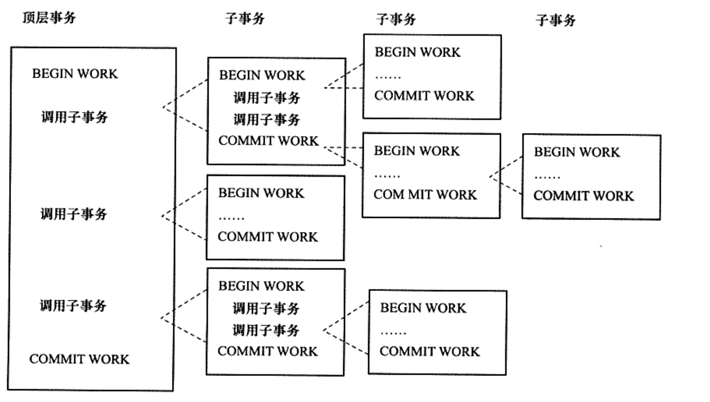
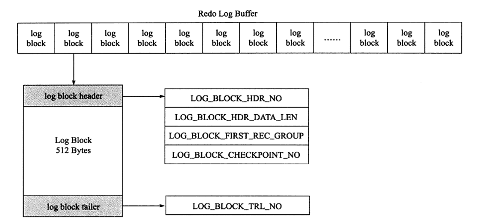

# 事务

事务会把数据从一种一致性状态转换成另一种一致状态。在数据库提交工作时，可以确保要么所有修改都已经保存了，要么所有修改都不保存。

## 一、认识事务

### 1.1 概述

事务是访问并更新数据库中各种数据项的一个程序执行单元。

**A（Atomicity）原子性：**

指整个数据库事务是不可分割的工作单位。

**C（consistency）一致性：**

一致性指事务将数据库从一种状态转变为下一种一致的状态。在事务开始之前和开始之后，数据库的完整性约束没有被破坏。

**I（isolation）隔离性：**

事务的隔离性要求每个读写事务的对象对其他事务的操作对象能相互分离，即该事务提交前对其他事务都不可见，通常这使用锁来实现。

**D（durability）持久性：**

事务一旦提交，其结果就是永久性的。即使发生宕机等故障，数据库也能将数据恢复。

### 1.2 分类

事务分为以下几类：
- 扁平事务
- 带有保存点的扁平事务
- 链事务
- 嵌套事务
- 分布式事务

**扁平事务**

在扁平事务中，所有操作都处于同一层次，其由`BEGIN WORK`开始，由`COMMIT WORK`或`ROLLBACK WORK`结束，其间的操作是原子的。

限制：不能提交或者回滚事务的一部分，或分几个步骤提交。

**带有保存点的扁平事务**

除了支持扁平事务支持的操作外，允许在事务执行过程中回滚到同一事务中较早的一个状态。**保存点**用来通知系统记住事务当前的状态，以便当之后发生错误时，事务能回到
保存点当时的状态。保存点用`SAVE WORK`函数来建立，通知系统记录当前的处理状态。

限制：系统崩溃时，所有的保存点都将消失，事务需要从开始处重新执行，而不能从最近的一个保存点继续执行。

**链事务**

可视为保存点模式的一中变种。思想是：在提交一个事务时，释放不需要的数据对象，将必要的处理上下文隐式地传给下一个开始的事务。提交事务操作和开始下一个事务操作
将合并为一个原子操作。

与带有保存点事务的不同：
- 带有保存点的事务可以回滚到任意正确的保存点，而链事务中的回滚仅限于当前事务，即只能恢复到最近的一个保存点。
- 对于锁的处理，链事务在执行`COMMIT`后即释放了当前事务所持有的锁，而带有保存点的扁平事务不影响迄今为止所持有的锁。

**嵌套事务**

1. 嵌套事务是由若干事务组成的一棵树，子树可以是嵌套事务或者扁平事务
2. 处在叶子节点的是扁平事务
3. 位于根节点的事务称为顶层事务，其他事务称为子事务。
4. 子事务既可以提交也可以回滚。提交操作并不立即生效，除非其父事务已经提交
5. 树中的任意一个事务回滚都会引起它的所有子事务一起回滚

**分布式事务**

通常是一个在分布式环境下运行的扁平事务，因此需要根据数据所在位置访问网络中的不同节点。

## 二、事务的实现

隔离性由锁来实现。原子性、一致性、持久性通过数据库的`redo log`和`undo log`来完成。

`redo log`称为重做日志，用来保证事务的原子性和持久性。`undo log`用来保证事务的一致性，帮助事务回滚和`MVCC`功能。

`redo`和`undo`都可以视为一种恢复操作。`redo`恢复提交事务修改的页操作，通常物理日志。`undo`回滚行记录到某个版本，是逻辑日志，根据每行记录进行记录。

### 2.1 redo

#### 2.1.1 基本概念

重做日志由两部分组成：一是内存中的重做日志缓冲，其是易失的；二是重做日志文件，其是持久的。

`InnoDB`通过`Force Log at Commit`机制实现事务的持久性，即当事务提交时，必须先将事务的所有日志写入到重做日志文件（`redo log`和`undo log`）进
行持久化。`redo log`用来保证事务的持久性，顺序写。`undo log`用来帮助事务回滚及`MVCC`的功能。

开始写入重做日志->重做日志缓冲->文件系统缓存->调用`fsync`->将文件系统缓存刷新到日志文件中

参数`innodb_flush_log_at_trx_commit`控制重做日志刷新到磁盘的策略。

0：事务提交时不进行写入重做日志操作，重做日志操作留在`Master Thread`中完成。  
1：表示事务提交时必须调用一次`fsync`操作  
2：表示事务提交时将重做日志写入重做日志文件，但仅写入文件系统的缓存中，不进行`fsync`操作

还有一种二进制文件（binlog），用来进行`POINT-IN-TIME`(PIT)的恢复及主从复制环境的建立。与重做日志的不同：
- 重做日志是在`InnoDB`存储引擎层产生，`binlog`文件是在`MySQL`数据库的上层产生的。
- `binlog`是一种逻辑日志，对应的是`SQL`语句；重做日志文件是物理格式日志，其记录是对于每个页的修改。
- `binlog`文件只在事务提交完成后进行一次写入；重做日志在事务进行时不断的被写入

#### 2.1.2 log block

重做日志文件以块（block）的方式进行保存的，称之为重做日志块（redo log blokc），每块大小为512字节。

`LOG_BLOCK_HDR_NO`：标记块在数组中的位置  
`LOG_BLOCK_HDR_DATA_LEN`：表示`log block`所占用的大小  
`LOG_BLOCK_FIRST_REC_GROUP`：表示`log block`中第一个日志所在的偏移量  
`LOG_BLOCK_CHECKPOINT_NO`：表示该`log block`最后被写入时的检查点第4字节的值  
`log block tailer`：值与`LOG_BLOCK_HDR_NO`相同

#### 2.1.3 log group

#### 2.1.4 重做日志格式

#### 2.1.5 LSN

#### 2.1.6 恢复

### 2.2 undo

#### 2.2.1 基本概念

`undo`用于进行回滚操作。`undo`存放在共享表空间内的一个特殊段中，称为`undo段`。`undo`是逻辑日志，只能将数据库逻辑的恢复到原来的样子。`InnoDB`存储引擎
中`MVCC`的实现是通过`undo`来完成的，实现非锁定读。`undo log`的产生会伴随着`redo log`的产生，因为`undo log`也需要持久性的保护。

#### 2.2.2 undo存储管理

#### 2.2.3 undo log 格式

#### 2.2.4 purge

`purge`用于最终完成`delete`和`update`操作，是因为`InnoDB`存储引擎支持`MVCC`，所以记录不能在事务提交时立即进行处理。

#### 2.2.5 group commit

## 三、事务控制语句

- START TRANSACTION | BEGIN
- COMMIT
- ROLLBACK
- SAVEPOINT identifier
- RELEASE TO [SAVEPOINT] identifier
- ROLLBACK TO [SAVEPOINT] identifier
- SET TRANSACTION

## 四、隐式提交的SQL语句

- DDL语句：ALTER DATABASE...，ALTER EVENT，TRUNCATE TABLE...
- 用来隐式修改MySQL架构的操作：CREATE USER、DROP USER...
- 管理语句：ANALYZE TABLE、CHECK INDEX...

## 五、对于事务操作的统计

QPS：每秒请求数  
TPS：每秒事务处理的能力。计算方法（com_commit + com_rollback）/ time

必须设置显式提交事务，以上两个参数才有用

`handler_commit`和`handler_rollback`这两个参数也可以用于事务统计操作，但MySQL不同版本，不一定准确。

## 六、事务的隔离级别

## 七、分布式事务

## 八、不好的事务习惯

### 8.1 不要在循环中提交

### 8.2 不要使用自动提交

### 8.3 不要使用自动回滚

### 8.4 不要使用长事务

