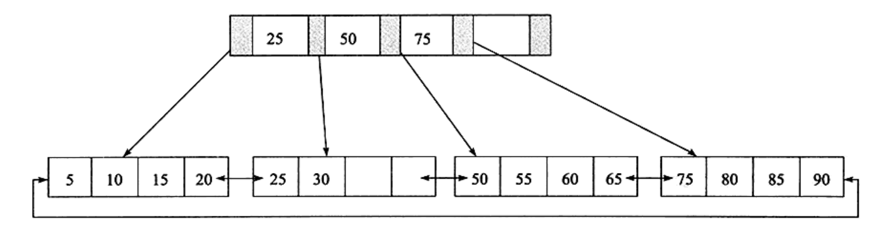

# 索引

## 一、InnoDB存储引擎索引概述

`InnoDB`存储引擎支持以下几种常见的索引：
- B+树索引
- 全文索引
- 哈希索引

哈希索引自适应，由`InnoDB`存储引擎根据表的使用情况自动为表生成哈希索引，不能人为干预。

B+树索引的构造类似与二叉树，根据键值快速找到数据，由平衡二叉树演化而来，但不是二叉树。B+树索引并不能找到一个给定键值的具体行，能找到的只是被查找数据行所在的页，
然后数据库把页读取到内存中，再在内存中进行查找，最后得到要查找的数据。

## 二、数据结构与算法

- 二分查找法
- 二叉查找树
    左子树的键值总是小于根的键值，右子树的键值总是大于根的键值，可通过中序遍历得到键值的排序输出
- 平衡二叉树（AVL树）
    符合二叉查找树的定义，其次必须满足任何节点的两个子树的高度最大差为1。平衡二叉树对于更新、插入操作，要通过左旋、右旋来维持平衡，有一定的开销
    
## 三、B+树

精简定义B+树：是为磁盘或其他直接存取辅助设备设计的一种平衡查找树。在B+树中，所有记录节点都按键值的大小顺序存放在同一层的叶子节点上，由各叶子节点指针进行连接。

如下：高度为2，每页可存放4条记录，扇出为5

### 3.1 B+树的插入操作

？？？？？

### 3.2 B+树的删除操作

？？？？？

## 四、B+树索引

B+树索引的本质是B+树在数据库中的实现。具有高扇出性，在数据库中，B+树的高度一般都在2～4层，也就是查找某一键值的行记录时只需要2到4次的IO。

B+树索引可分为聚集索引（clustered index）和辅助索引（secondary index）。

### 4.1 聚集索引

`InnoDB`存储引擎表是索引组织表，即表中数据按照主键顺序存放。而聚集索引就是按照每张表的主键构造一棵B+树，同时叶子节点中存放的即为整张表的行记录数据，也将
聚集索引的叶子节点称为数据页。

聚集索引对于按照主键查询、主键范围查询，速度非常快。

### 4.2 辅助索引

辅助索引，也称为非聚集索引，叶子节点并不包含行记录的全部数据。叶子节点除了包含键值以外，每个叶子结点中的索引行中还包含一个书签。该书签用来告诉`InnoDB`存储引擎
哪里可以找到与索引相对应的行数据

### 4.3 B+树索引的分裂

### 4.4 B+树索引的管理

- 索引管理
- Fast Index Creation

## 五、Cardinality值

### 5.1 什么是Cardinality值

表示索引中不重复记录数量的预估值

### 5.2 InnoDB存储引擎的Cardinlity统计

## 六、B+树索引的使用

### 6.1 不同应用中B+树索引的使用

### 6.2 联合索引

### 6.3 覆盖索引

### 6.4 优化器不使用索引的情况

### 6.5 索引提示

### 6.6 Multi-Range Read优化

### 6.7 Index Condition Pushdown (ICP)优化

## 七、哈希算法

### 7.1 哈希表

### 7.2 InnoDB存储引擎中的哈希算法

### 7.3 自适应哈希索引

## 八、全文索引

### 8.1 概述

### 8.2 倒排索引

### 8.3 InnoDB全文检索

