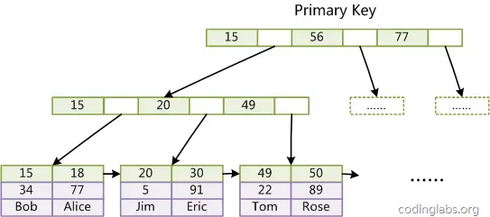
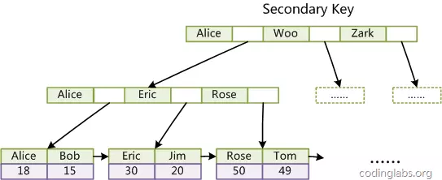

# 分享

- 索引
    - 索引是个啥玩意？
    - 索引能给你带来什么快感？
    - 都有哪些索引
        - B+索引
        - 哈希索引
        - 全文检索
    - B+树索引
        - 为啥加上索引查询数据会那么那么快？
        - 索引种类
            - 聚集索引
            - 辅助索引
        - 索引结构
        - 如何建立合适的索引？
            - 最左前缀原理
            - 尽量采用自增字段做主键
            - =和in可以乱序
            - 尽量选择区分度高的列作为索引
            - 索引列不能参与计算
            - 尽量的扩展索引，不要新建索引
        - explain

- 锁
    - 为啥要有锁？
    - 锁的种类
        - 排他锁
        - 共享锁
        - 意向排他锁
        - 意向共享锁
    - 锁的三种算法
        - 记录锁
        - 间隙锁
        - 临键锁
    - 隔离级别
        - 脏读
        - 不可重复读
        - 幻读
    - 死锁
        - 如何避免死锁
            - 使用事务，不使用 lock tables 。
            - 尽量避免大事务，占有的资源锁越多，越容易出现死锁。建议拆成小事务。
            - 操作完之后立即提交事务，特别是在交互式命令行中。
            - 降低隔离级别。如果业务允许，将隔离级别调低也是较好的选择，比如将隔离级别从 RR 调整为 RC，可以避免掉很多因为 gap 锁造成的死锁。
            - 以固定的顺序访问表和行。交叉访问更容易造成事务等待回路。
            - 为表添加合理的索引。防止没有索引出现表锁，出现死锁的概率会突增。
            - 最好不要用 (SELECT ... FOR UPDATE or SELECT ... LOCK IN SHARE MODE)。

- 事务
    - 未完待续。。。。

**B+聚集索引结构**

**B+辅助索引结构**

