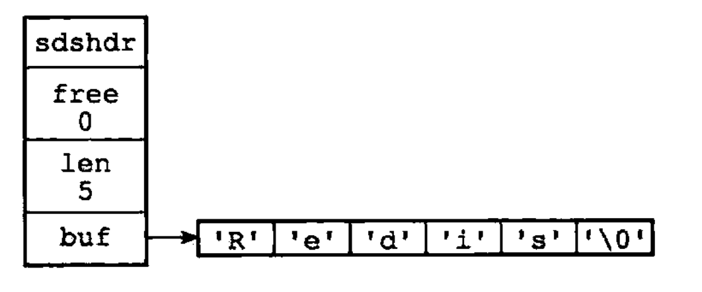

# 简单动态字符串

- 简单动态字符串（simple dynamic string，SDS）数据结构定义
- C语言字符串与SDS字符串的区别
- SDS内存分配策略

## 一、SDS的定义

```C
struct sdshdr {
 
    // 记录buf数组中已使用字节的数量
    // 等于SDS保存字符串的长度
    int len;
 
    // 记录buf数组中未使用字节的数量
    int free;
 
    // 字节数组，用于保存字符串
    char buf[];
 
};
```

SDS示例如下：




## 二、SDS与C字符串的区别

| C字符串 | SDS |
| :--- | :--- |
| 获取字符串长度的复杂度为O(N)|获取字符串长度的复杂度为O(1)|
|API是不安全的，可能会造成缓冲区溢出|API是安全的，不会造成缓冲区溢出|
|修改字符串N次必然需要执行N次内存重分配| 修改字符串N次最多需要执行N次内存重分配|
|只能保存文本数据|可以保存文本或者二进制数据|
|可以使用所有<string.h>库中的函数|可以使用一部分<string.h>库中的函数|

## 三、SDS内存分配策略

内存重分配通常是一个耗时的策略，SDS通过未使用空间解除字符串长度与底层数组长度之间的关联，实现空间预分配、惰性空间释放两种优化措施

### 3.1 空间预分配

空间预分配优化SDS的字符串增长操作：当SDS的API对一个SDS进行修改，并需要对SDS进行空间扩展的时候，程序不仅会为SDS分配修改所需要的空间，还为SDS分配额外的未使用空间。

- 若对SDS修改之后，SDS的长度将小于1MB，则程序分配与len属性同样大小的未使用空间
- 若对SDS修改之后，SDS的长度将大于等于1MB，则程序会分配1MB的使用空间

### 3.2 惰性空间释放

惰性空间释放优化对SDS的字符串缩短操作：当SDS的API需要缩短SDS保存的字符串时，程序并不立即使用内存重分配来回收缩短后多出来的字节，而是使用free属性将这些字节的数量记录起来，等待将来使用。当然，SDS也提供了相应的API，让我们可以在有需要时，真正的释放SDS的未使用空间，所以不用担心内存浪费。

## 四、SDS API


