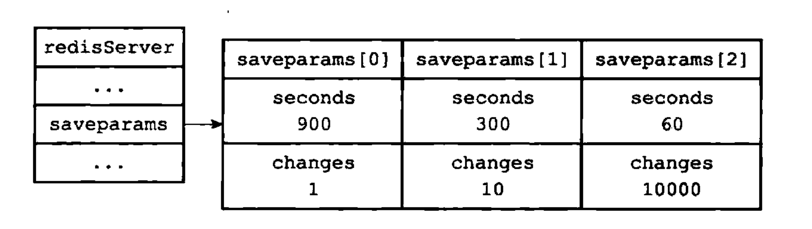
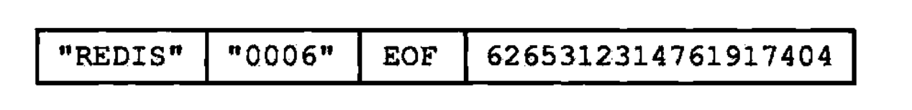

# RDB持久化

## 一、RDB文件的创建和载入

- `SAVE`以及`BGSAVE`命令可用于生成RDB文件
- `SAVE`命令阻塞Redis服务器进程，直到RDB文件创建完成为止，期间，服务器不处理任何命令请求
- `BGSAVE`命令会派生出一个子进程，由子进程负责创建RDB文件，期间，服务器可继续处理命令请求
- RDB文件的载入由服务器启动时自动完成，载入期间，服务器会一直处于阻塞状态，直至载入完成
- 若服务器开启了AOF持久化功能，则AOF文件的载入优先级高于RDB文件

### 1.1 BGSAVE命令执行时的服务器状态

`BGSAVE`命令执行期间，Redis服务仍然可以继续处理客户端的命令请求，但在`BGSAVE`命令执行期间，服务器处理`SAVE`、`BGSAVE`、`BGREWRITEAOF`三个命令的方式会和平时有所不同：

- `BGSAVE`命令执行期间，客户端发送的`SAVE`命令会被服务器拒绝，防止父进程和子进程同时执行两个`rdbSave`调用，产生竞争条件
- `BGSAVE`命令执行期间，客户端发送的`BGSAVE`命令也会被服务器拒绝，防止产生竞争条件
- `BGREWRITEAOF`和`BGSAVE`两个命令不能同时执行：
    - 若`BGSAVE`命令正在执行，则`BGREWRITEAOF`命令会被延迟到`BGSAVE`命令执行完毕之后执行
    - 若`BGREWRITEAOF`命令正在执行，则`BGSAVE`命令会被服务器拒绝
    
## 二、自动间隔性保存

可通过`save`选项设置多个保存条件，只要其中一个条件满足，服务器就会执行`BGSAVE`命令

### 2.1 设置保存条件

服务器根据`save`选项设置的保存条件，设置服务器状态`redisServer`结构的`saveparams`属性：

```
struct redisServer {
    
    // ...
    
    // 记录了保存条件的数组
    struct saveparam *saveparams;
    
    // ...
};

```

`saveparam`结构如下：

```
struct saveparam {

    // 秒数
    time_t seconds;
    
    // 修改数
    int changes;

};
```

假如，设置的条件如下：

```
save 900 1
save 300 10
save 60 10000
```

则服务器状态中的`saveparams`数组将会是下图中的样子：



### 2.2 dirty计数器和lastsave属性

除了`saveparams`数组之外，服务器状态还维持着一个`dirty`计数器，以及一个`lastsave`属性：
- `dirty`计数器记录距离上一次成功执行`SAVE`命令或者`BGSAVE`命令之后，服务器对数据库状态（服务器中的所有数据库）进行了多少次修改（包括写入、删除、更新等操作）
- `lastsave`属性是一个UNIX时间戳，记录了服务器上一次成功执行`SAVE`命令或者`BGSAVE`命令的时间

```
struct redisServer {

    // ...
    
    // 修改计数器
    long dirty;
    
    // 上一次执行保存的时间
    time_t lastsave;

};
```

<font color='red'>`BGSAVE`执行期间的更新操作，计数器如何计数？？？？</font>

## 三、RDB文件结构


- `REDIS`部分，长度5字节，保存着"REDIS"五个字符
- `db_version`长度为4字节，记录RDB的版本号
- `database`部分包含着零个或任意多个数据库，以及各个数据库的键值对数据：
    - 若所有数据库都为空，则这个部分也为空，长度为0个字节
    - 若有至少一个数据库不为空，那么这个部分非空，长度不定
- `EOF`长度为1字节，标志着RDB文件正文内容的结束
- `check_sum`为8字节长的无符号整数，保存着程序对`REDIS`、`db_version`、`database`、`EOF`四个部分内容进行计算得到的值，通过该部分，检查RDB文件是否有出错或者损坏的情况


下图为`database`部分为空的RDB文件结构：



### 3.1 databases 部分

每个非空数据库在RDB文件中都可以保存为`SELECTDB`、`db_number`、`key_value_pairs`三个部分，如图所示：


- `SELECTDB`常量长度为1字节，标示接下来要读入的将是一个数据库号码
- `db_number`保存着数据库号码
- `key_value_pairs`部分保存数据库中的所有键值对数据，包括过期时间


### 3.2 key_value_pairs部分

1. `key_value_pairs`部分不带过期时间的键值对由以下部分组成：

    
    
    - `TYPE`长度1字节，记录`value`的类型
    - `key`总是一个字符串对象，长度不定
    - `value`保存值，长度不定

2. 带有过期时间的键值对在RDB文件中的结构


- `EXPIRETIME_MS`常量长度为1字节，标示接下来要读取的将是一个以毫秒为单位的过期时间
- `ms`长度8字节，记录一个以毫秒为单位的UNIX时间戳

### 3.3 value的编码


