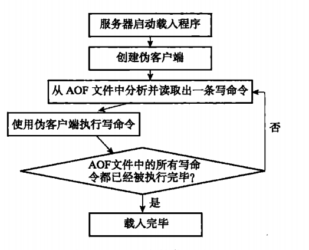
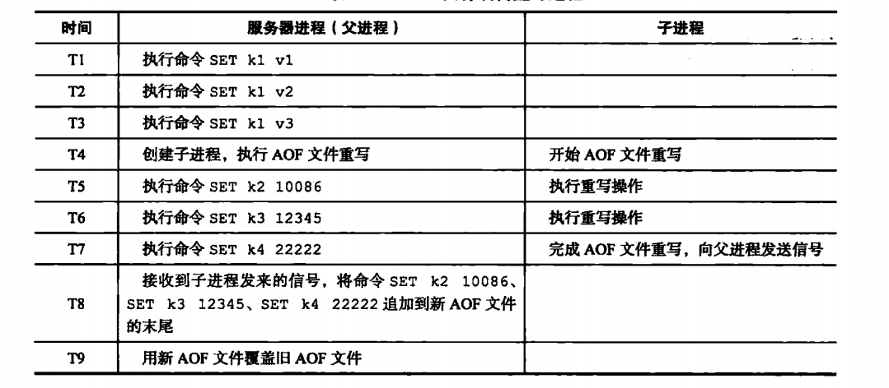

# AOF持久化

RDB持久化通过保存数据库中的键值对来记录数据库状态的不同，AOF持久化是通过保存Redis服务器所执行的写命令来记录数据库状态。

## 一、AOF持久化的实现

AOF持久化功能的实现可分为命令追加、文件写入、文件同步三个步骤。

### 1.1 命令追加

```
struct redisServer {
    // ...
    
    // AOF缓冲区
    sds aof_buf;
    
};
```

当Redis的AOF持久化功能打开时，服务器在执行完一个写命令之后，会以协议格式将被执行的写命令追加到服务器状态的`aof_buf`缓冲区的末尾

### 1.2 AOF文件的写入和同步

服务器配置的`appendfsync`选项来决定AOF持久化写入同步的时机，默认为`everysec`：

| appendfsync选项的值 | AOF持久化写入的时机 |
| :--- | :--- |
| always | 将`aof_buf`缓冲区中的所有内容写入并同步到AOF文件 |
| everysec | 将`aof_buf`缓冲区中的所有内容写入到AOF文件，如果上次同步AOF文件的时间距离现在超过一秒钟，那么再次对AOF文件进行同步，并且这个同步操作是由一个线程专门负责的 |
| no | 将`aof_buf`缓冲区中的所有内容写入到AOF文件，但并不对AOF文件进行同步，何时同步由操作系统来决定 |


三种配置的比较

| 选项 | 效率 | 安全 |
| :--- | :--- | :--- |
| always | 低 | 高 |
| everysec | 较高 | 较高 |
| no | 较高 | 低 |

## 二、AOF文件的载入和还原



## 三、AOF重写

通过重写，解决随着服务器的运行，AOF文件体积不断膨胀的问题

### 3.1 AOF文件重写的实现

从数据库中读取键现在的值，然后用一条命令去记录键值对，代替之前记录这个键值对的多条命令，这就是AOF重写功能的实现原理

为避免执行命令时造成客户端缓冲区溢出，重写程序在处理列表、哈希表、集合、有序集合这四种可能会带有多个元素的键时，将元素数量与`redis.h/REDIS_AOF_REWRITE_LTEMS_PER_CMD`常量值进行对比，若超过常量的值，则重写
程序使用多条命令来记录键的值，而不是一条命令。

### 3.2 AOF后台重写

Redis将AOF重写程序放到子进程里执行：
- 子进程进行AOF重写期间，服务器进程（父进程）可以继续处理命令请求
- 子进程带有服务器进程的数据副本，使用子进程而不是线程，可在避免使用锁的情况下，保证数据的安全性

子进程进行AOF重写期间，服务器进程还需继续处理命令请求，而新的命令可能会对现有的数据库状态进行修改，使服务器当前的数据库状态和重写后的AOF文件所保存的数据库状态不一致。

通过将重写期间产生的新命令放入到AOF重写缓冲区中，在AOF重写完成之后，将AOF重写缓冲区中的命令追加到新的AOF文件中，过程如下：




