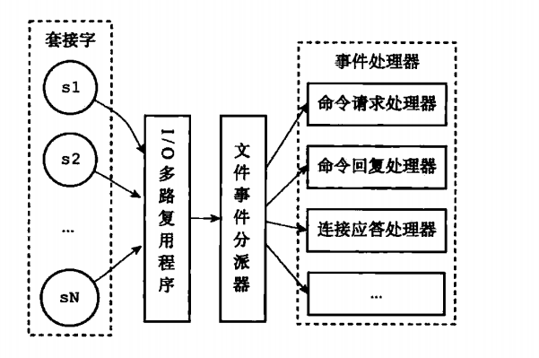
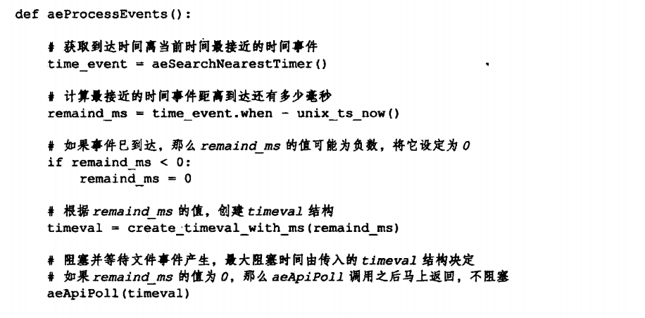
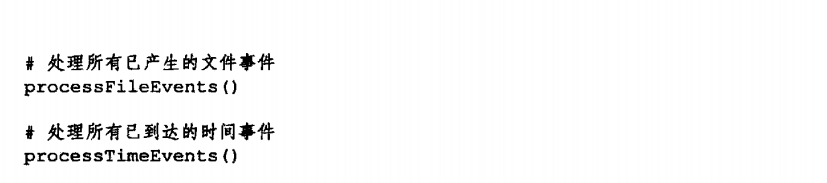
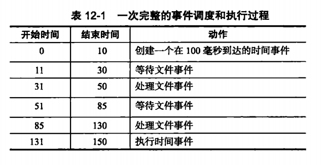

# 事件

Redis服务器是一个事件驱动程序，服务器需要处理以下两类事件：
- 文件事件：服务器对套接字操作的抽象
- 时间事件：服务器对定时操作的抽象

## 一、文件事件

文件事件处理器：基于`Reactor`模式开发

- 使用I/O多路复用程序监听多个套接字，并根据套接字目前执行的任务来为套接字关联不同的事件处理器
- 当被监听的套接字准备好执行连接应答（accept）、读取（read）、写入（write）、关闭（close）等操作时，与操作相对应的文件
事件就会产生，这时文件事件处理器就会调用套接字之前关联好的事件处理器来处理这些事件

### 1.1 文件事件处理器的构成

### 1.2 IO多路复用程序的实现

### 1.3 事件的类型

IO多路复用程序可以监听多个套接字的`ae.h/AE_READABLE`事件和`ae.h/AE_WRITEABLE`事件：
- 当套接字变的可读时，或者有新的应答时，套接字产生`AE_READABLE`事件
- 当套接字变得可写时，套接字产生`AE_WRITEABLE`事件

当同时产生`AE_READABLE`和`AE_WRITEABLE`事件时，先处理`AE_READABLE`再处理`AE_WRITEABLE`。

### 1.4 API

### 1.5 文件事件的处理器

文件事件处理器分为：
- 连接应答处理器：对连接服务器的各个客户端进行应答
- 命令请求处理器：接收客户端传来的命令请求
- 命令回复处理器：返回命令的执行结果
- 复制处理器：主从服务器进行复制操作时，主从服务器都需要关联复制处理器

## 二、时间事件

Redis的时间事件分为以下两类：
- 定时事件：让一段程序在指定的时间之后执行一次
- 周期性时间：让一段程序每隔指定时间就执行一次

一个时间事件主要由以下三个属性组成：
- id：服务器为时间事件创建的全局唯一ID（标识号）
- when：毫秒精度的UNIX时间戳，记录了时间事件的到达时间
- timeProc：时间事件处理器，是一个函数

一个时间事件是定时事件还是周期性时间取决于时间事件处理器的返回值：
- 若返回`ae.h/AE_NOMORE`，则为定时事件
- 若返回非`ae.h/AE_NOMORE`的整数值，则为周期性事件

### 2.1 实现

服务器将所有时间事件放在一个无序链表中，每当时间时间执行器运行时，就遍历整个链表，查找所有已到达的时间事件，并调用相应的事件处理器。

无序链表并不影响时间事件处理器的性能：

因为，目前版本中，正常模式下只有`serverCron`一个时间事件，在`benchmark`模式下，也只使用两个时间事件

### 2.2 API

### 2.3 时间事件应用实例：serverCron函数

### 2.4 事件的调度与执行

`ae.c/aeProcessEvents`函数负责文件事件以及时间事件的调度，决定何时处理文件事件，何时处理时间事件，以及花多少时间来处理他们。函数伪代码如下：

以下是事件的调度和执行规则：
1. `aeApiPoll`函数的最大阻塞时间由到达时间最接近当前时间的时间事件决定，这个方法既可以避免服务器对时间事件进行频繁的轮询，也可以确保`aeApiPoll`不会阻塞过长时间
2. 随着文件事件的不断执行，时间逐渐向时间事件所设置的到达时间逼近，并最终来到到达时间，这时服务器就可以开始处理到达的时间事件了
3. 对文件事件和时间事件的处理都是同步、有序、原子的执行的，服务器不会中断事件处理，也不会对事件进行抢占，因此，事件处理器都会尽可能的减少程序的阻塞时间，并在有需要时主动让出执行权，从而降低造成事件饥饿的可能性。
4. 时间事件的实际处理时间，通常会比时间事件设定的到大时间稍晚一些

一次完整的事件调度和执行过程，如图：

