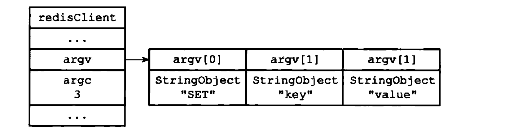
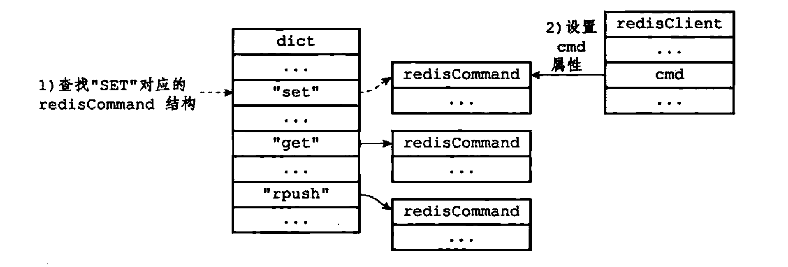

# 客户端

- Redis服务器是一个一对多的服务器程序：一个服务器可以与多个客户端建立网络连接并交互
- 服务器为客户端建立了相应的`redis.h/redisClient`结构（客户端状态），该结构保存了客户端当前的状态信息及执行相关功能时需要用到的数据结构
- Redis服务器状态结构的`clients`属性是一个链表，该链表保存了所有与服务器连接的客户端的状态结构，对客户端执行批量操作，或者查找某个指定的客户端，都可以通过遍历`clients`链表来完成
    ```C
    struct redisServer {
        // ...
        
        // 一个链表，保存了所有客户端状态
        list *clients;
        
        // ...
    };
    ```

## 一、客户端属性

客户端属性包含的属性可以分为两类：
- 通用属性
- 与特定功能相关的属性：如操作数据库时需要用到的`db`属性和`dictid`属性，执行事务时需要用到的`mstate`属性等

### 1.1 套接字描述符

```C
typedef struct redisClient {
    // ...
    
    int fd;
    
    // ...
} redisClient;
```

- 伪客户端：`fd`属性为-1，伪客户端处理的命令请求来源于AOF文件或者Lua脚本，而不是网络，所以这种客户端不需要套接字连接，也就不需要套接字描述符
- 普通客户端：`fd`属性的值为大于-1的整数

执行`CLIENT list`可以列出目前所有连接到服务器的普通客户端

### 1.2 名字

默认，客户端是没有名字的

使用`CLIENT setname`命令可以为客户端设置一个名字

```C
typedef struct redisClient {
    // ...
    
    robj *name;
    
    // ...
} redisClient;
```
   
### 1.3 标志

```C
typedef struct redisClient {
    // ...
    
    int flags;
    
    // ...
} redisClient;
```

`flags`属性的值可以是单个标志，也可以是多个标志

- `REDIS_MASTER`标示客户端为一个主服务器
- `REDIS_SLAVE`标示客户端是一个从服务器
- `REDIS_PRE_PSYNC`标示客户端代表的是一个版本低于Redis2.8的从服务器
- `REDIS_LUA_CLIENT`标示客户端是专门用于处理Lua脚本里面包含的Redis命令的伪客户端
- `REDIS_MONITOR`标示客户端正在执行`MONITOR`命令
- `REDIS_UNIX_SOCKET`标示服务器使用`UNIX`套接字来连接客户端
- `REDIS_UNBLOCKED`标示客户端已经从`REDIS_BLOCKED`标志所表示的阻塞状态中脱离出来，不再阻塞
- `REDIS_MULTI`标志标示客户端正在执行事务
- `REDIS_DIRTY_CAS`标示事务使用`WATCH`命令监视的数据库键已被修改，表示事务的安全性已经被破坏
- `REDIS_DIRTY_EXEC`标志标示事务在命令入队时出现了错误，表示事务的安全性已经被破坏
- `REDIS_CLOSE_ASAP`标示客户端的输出缓冲区大小超出了服务器允许的范围，服务器会在下一次执行`serverCron`函数时关闭这个客户端


### 1.4 输入缓冲区

```C
typedef struct redisClient {
    // ...
    
    sds querybuf;
    
    // ...
} redisClient;
```

输入缓冲区大小动态缩小或扩大，但最大不能超过1GB

### 1.5 命令与命令参数

```C
typedef struct redisClient {
    // ...
    
    robj **argv;
    
    int argc;
    
    // ...
} redisClient;
```

服务器对命令请求的内容进行解析，并将得出的命令参数以及命令参数的个数保存到客户端状态的`argv`属性和`argc`属性

`argv`属性是一个数组，数组中的每个项都是一个字符串对象，其中`argv[0]`是要执行的命令，而之后的其他项则是传给命令的参数

`argc`属性则负责记录`argv`数组的长度



### 1.6 命令的实现函数

服务器根据`argv[0]`的值，在命令表中查找命令所对应的命令实现函数。

命令表是一个字典，字典的键是一个SDS结构，保存了命令的名字，字典的值是命令所对应的`redisCommand`结构，这个结构保存了命令的实现函数、命令的标志、命令应该给定的参数个数、命令的总执行次数等

当程序在命令表中成功找到`argv[0]`所对应的`redisCommand`结构时，将客户端状态的`cmd`指针指向这个结构

```C
typedef struct redisClient {
    // ...
    
    struct redisCommand *cmd;
    
    // ...
} redisClient;
```



### 1.7 输出缓冲区

输出缓冲区保存命令的回复

分为固定输出缓冲区与可变输出缓冲区：
- 固定输出缓冲区：用于保存长度较小的回复，比如OK、简短的字符串值、整数值等
- 可变大小输出缓冲区：保存长度比较大的回复，比如一个非常长的字符串值、一个由很多项组成的列表等

```C
typedef struct redisClient {
    // ...
    
    char buf[REDIS_REPLY_CHUNK_BYTES];
    
    // 记录buf数组目前已使用的字节数量
    int bufpos;
    
    // 可变大小，使用链表存储
    list *reply;
    
    // ...
} redisClient;
```

### 1.8 身份验证

```C
typedef struct redisClient {
    // ...
    
    int authenticated;
    
    // ...
} redisClient;
```

当服务器开启了身份验证功能时，`authenticated`属性为0代表未通过验证，当`authenticated`属性为1代表通过验证

### 1.9 时间

```C
typedef struct redisClient {
    // ...
    
    // 记录了创建客户端的时间
    time_t ctime;
    
    // 记录了客户端与服务器最后一次进行互动的时间
    time_t lastinteraction;
    
    // 用来计算客户端的空转时间
    time_t obuf_soft_limit_reached_time;
    
    // ...
} redisClient;
```

## 二、客户端的创建和关闭

### 2.1 创建普通客户端

当客户端通过`connect`函数连接到服务器时，服务器就会调用连接事件处理器，为客户端创建相应的客户端状态，并将这个客户端状态添加到服务器状态结构的`clients`链表的末尾。

### 2.2 关闭普通客户端

- 客户端进程退出或被杀死
- 客户端发送了不符合协议格式的命令请求
- 客户端成为`CLIENT KILL`命令的目标
- 客户端空转时长超出了服务器设置了`timeout`配置选项。有例外情况：当客户端是主服务器，从服务器正在被`BLPOP`命令阻塞，则客户端空转时长超过了timeout的值，客户端也不会被服务器关闭
- 客户端命令请求超出了输入缓冲区的限制大小
- 命令回复大小超过了输出缓冲区的限制大小
    - 硬性限制
    - 软性限制
    
### 2.3 Lua脚本的伪客户端

服务器会在初始化时创建负责执行`Lua`脚本中包含的`Redis`命令的伪客户端，并添加到`lua_client`属性中

```C
struct redisServer {
    // ...
    
    redisClient *lua_client;
    
    // ...
};
```

服务器关闭时，伪客户端被关闭

### 2.4 AOF文件的伪客户端

服务器载入AOF文件时，创建用于执行AOF文件包含的Redis命令的伪客户端，载入完成后，关闭这个伪客户端


