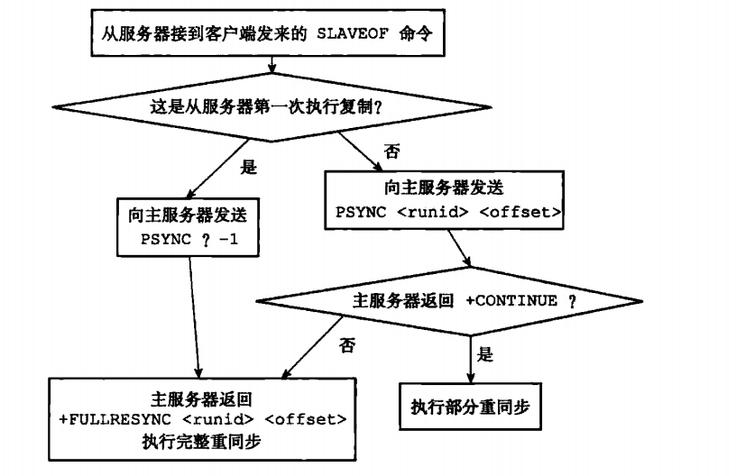

# 复制

通过执行`SLAVEOF`命令或者设置`slaveof`选项，可以让一个服务器去复制另一个服务器，被复制的服务器为主服务器，而对主服务器进行复制的服务器则被称为从服务器。

介绍2.8版本前后复制功能实现的原理

## 旧版复制功能的实现

分为同步和命令传播两个操作：
- 同步操作用于将从服务器的数据库状态更新至主服务器当前所处的数据库状态
- 命令传播操作用于在主服务器的数据库状态被修改，导致主从服务器的数据库状态出现不一致时，让主从服务器的数据库重新回到一致状态

### 同步


1. 从服务器向主服务器发送`SYNC`命令
2. 主服务器执行`BGSAVE`，生成RDB文件，使用缓冲区记录从现在开始执行的所有写命令
3. 发送RDB文件给从服务器，从服务器载入RDB文件
4. 主服务器发送缓冲区中的写命令给从服务器，从服务器执行这些命令

### 命令传播

主服务器会将自己执行的写命令，也即是造成主从服务器不一致的那一条写命令，发送给从服务器执行，当从服务器执行了相同的写命令之后，主从服务器将再次回到一致状态。

## 旧版复制功能的缺陷

旧版中，从服务器段线重连，需要重新发送`SYNC`执行同步操作，效率底下

## 新版复制功能的实现

2.8版本之后，使用`PSYNC`命令替换`SYNC`命令来执行复制时的同步操作

`PSYNC`具有完整重同步和部分重同步两种模式：
- 完整重同步与`SYNC`命令的步骤一致，从服务器通过加载主服务器发送的`RDB`文件，以及执行缓冲区中的命令进行同步
- 部分重同步用于处理断线重连之后的重复制情况：当断线重连后，如果条件允许，主服务器会将断线期间的命令发送给从服务器去执行，以此将数据库更新至主服务器当前所处的状态。

## 部分重同步的实现

由以下三个部分组成：
- 主服务器的复制偏移量和从服务器的复制偏移量
- 主服务器的复制积压缓冲区
- 服务器的运行ID

### 复制偏移量

主从服务器都会维护一个复制偏移量。通过复制偏移量，可以很容易的知道主从服务器状态是否一致，相差多少。


### 复制积压缓冲区

复制积压缓冲区是由主服务器维护的一个固定长度先进先出队列，默认为1MB


当从服务器重新连上主服务器时，从服务器通过`PSYNC`命令将自己的复制偏移量`offset`发送给主服务器，主服务器根据这个复制偏移量来决定对从服务器执行何种同步操作：
- 如果`offset`偏移量之后的数据仍然存在于复制积压缓冲区里面，那么主服务器将对从服务器执行部分重同步操作
- 相反，若`offset`偏移量之后的数据已经不存在于复制积压缓冲区，那么主服务器将对从服务器执行完整重同步操作。


### 服务器运行ID

当从服务器对主服务器进行初次复制时，主服务器会将自己的运行ID传送给从服务器，而从服务器会将这个运行ID保存起来。

当从服务器断线并重新连上一个主服务器时，从服务器会向当前连接的主服务器发送之前保存的运行ID

## PSYNC命令的实现



## 复制的实现

1. 设置主服务器的地址和端口
    ```C
    struct redisServer {
        // ...
        
        // 主服务器的地址
        char *masterhost;
        
        // 主服务器的端口
        int masterport;
    };
    ```

2. 建立套接字连接
3. 发送PING命令
4. 身份验证
    
5. 发送端口信息

    从服务器执行命令`REPLCONF listening-port <port-number>`，向主服务器发送从服务器的监听端口号。主服务器在接收到这个命令之后，会将端口号记录在从服务器对应的客户端状态的`slave_listening_port`属性中。
    
    ```C
    typedef struct redisClient {
        // ...
        
        // 从服务器的监听端口号
        int slave_listenint_port;
        
        // ...
    } redisClient;
    ```
6. 同步
7. 命令传播

## 心跳检测

命令传播阶段，从服务器默认以每秒一次的频率，向主服务器发送命令：
`REPLCONF ACK <replication_offset>`

有三个作用：
- 检测主从服务器的网络连接状态
- 辅助实现`min-slaves`选项
- 检测命令丢失


