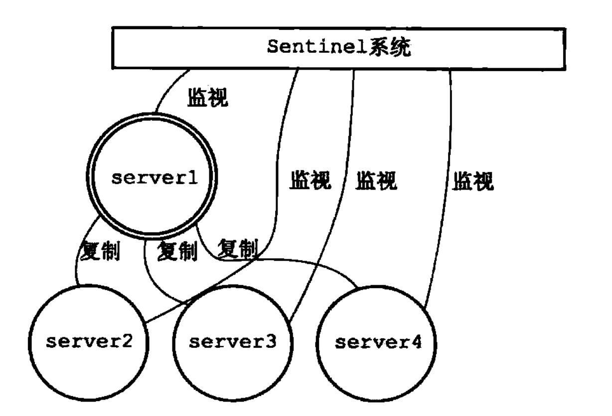
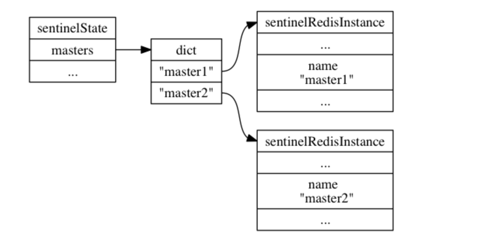
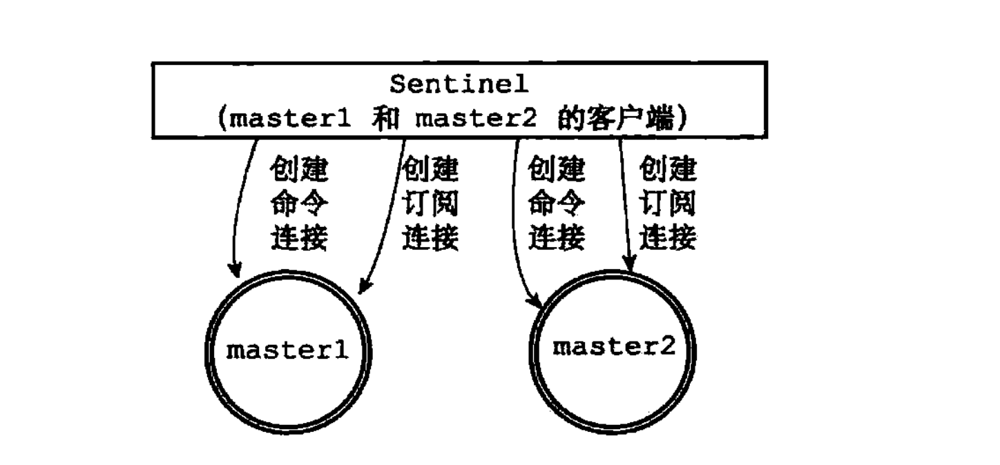
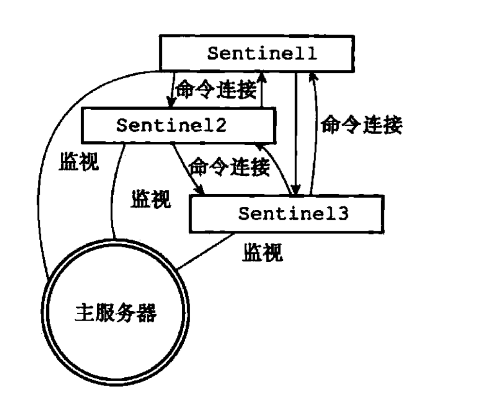
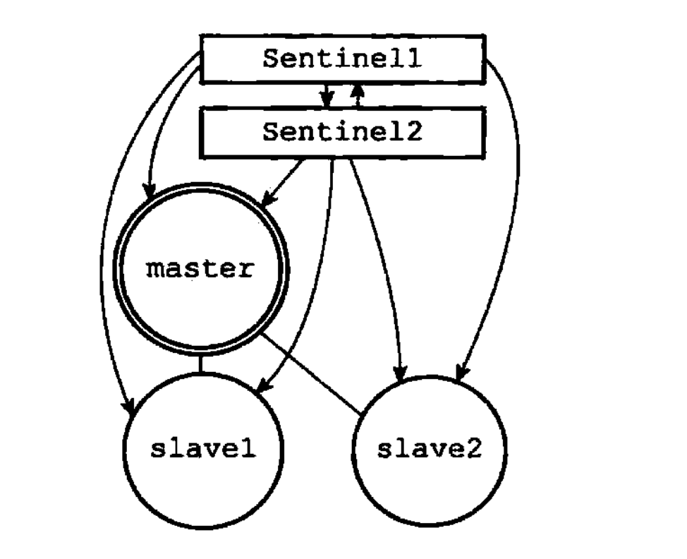
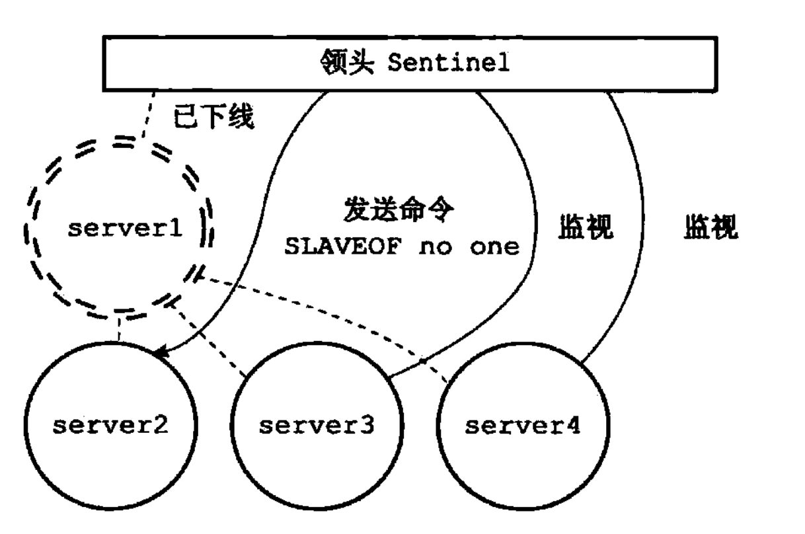

# 哨兵

何为哨兵？哨兵是Redis的高可用解决方案：由一个或多个哨兵实例组成的哨兵系统可以监视任意多个主服务器，以及这些主服务器属下的所有从服务器。并在被监视的主服务器进入下线状态时，自动将下线主服务器
属下的某个从服务器升级为新的主服务器，然后由新的主服务器代替已下线的主服务器继续处理命令请求。

哨兵系统图示如下：


## 启动及初始化哨兵系统流程

启动哨兵系统使用以下命令
```
redis-sentinel /path/to/your/sentinel.conf
或
redis-server /path/to/your/sentinel.conf --sentinel
```

当哨兵系统启动时，需要执行以下步骤：
1. 初始化服务器
2. 将普通Redis服务器使用的代码替换成`Sentinel`专用代码
3. 初始化`Sentinel`状态
    
    `Sentinel`状态数据结构如下：
    ```
    struct sentinelState {
    
        // 当前纪元，用于实现故障转移
        uint64_t current_epoch;
    
        // 保存了所有被这个 sentinel 监视的主服务器
        // 字典的键是主服务器的名字
        // 字典的值则是一个指向 sentinelRedisInstance 结构的指针
        dict *masters;
    
        // 是否进入了 TILT 模式？
        int tilt;
    
        // 目前正在执行的脚本的数量
        int running_scripts;
    
        // 进入 TILT 模式的时间
        mstime_t tilt_start_time;
    
        // 最后一次执行时间处理器的时间
        mstime_t previous_time;
    
        // 一个 FIFO 队列，包含了所有需要执行的用户脚本
        list *scripts_queue;
    
    } sentinel;
    ```

4. 根据指定的配置文件，初始化`Sentinel`的监视主服务器列表

    `sentinelRedisInstance`数据结构代表一个被`Sentinel`监视的Redis服务器实例。
    ```
    typedef struct sentinelRedisInstance {
    
        // 标识值，记录了实例的类型，以及该实例的当前状态
        int flags;
    
        // 实例的名字
        // 主服务器的名字由用户在配置文件中设置
        // 从服务器以及 Sentinel 的名字由 Sentinel 自动设置
        // 格式为 ip:port ，例如 "127.0.0.1:26379"
        char *name;
    
        // 实例的运行 ID
        char *runid;
    
        // 配置纪元，用于实现故障转移
        uint64_t config_epoch;
    
        // 实例的地址
        sentinelAddr *addr;
    
        // SENTINEL down-after-milliseconds 选项设定的值
        // 实例无响应多少毫秒之后才会被判断为主观下线（subjectively down）
        mstime_t down_after_period;
    
        // SENTINEL monitor <master-name> <IP> <port> <quorum> 选项中的 quorum 参数
        // 判断这个实例为客观下线（objectively down）所需的支持投票数量
        int quorum;
    
        // SENTINEL parallel-syncs <master-name> <number> 选项的值
        // 在执行故障转移操作时，可以同时对新的主服务器进行同步的从服务器数量
        int parallel_syncs;
    
        // SENTINEL failover-timeout <master-name> <ms> 选项的值
        // 刷新故障迁移状态的最大时限
        mstime_t failover_timeout;
    
        // ...
    
    } sentinelRedisInstance;
    ```
    
    
5. 创建连向主服务器的网络连接

    `Sentinel`会与主服务器创建命令连接和订阅连接，命令连接用于发送命令，订阅连接用于接收订阅频道的消息，防止客户端断线等因素造成的消息丢失。
    
    
## 哨兵系统与主从服务器的交互

1. 获取主服务器信息
    
    `Sentinel`系统默认十秒一次，向主服务器发送`INFO`命令，分析主服务器的回复内容来获取主服务器及从服务器的相关信息
    
2. 获取从服务器信息

    同样，以默认十秒一次，向从服务器发送`INFO`命令，分析回复内容，更新从服务器实例状态
    
3. 向主服务器和从服务器发送信息

    默认情况下，`Sentinel`以两秒一次，向主从服务器发送哨兵状态及主服务器状态。
    
4. 接收来自主服务器和从服务器的频道信息

    监视同一个主服务器的多个`Sentinel`系统可以通过同一频道进行信息交换，更新各自主服务器中的实例结构。
    多个`Sentinel`系统之间也会创建命令连接，用于以后主服务器选举时进行通信等。
    
    
## 故障转移

默认情况下，`Sentinel`会以每秒一次的频率向所有主、从服务器及其他`Sentinel`发送`PING`命令，并通过回复判断实例是否在线



1. 当主服务器在配置时间内，连续未向`Sentinel`回复命令，则主观判定该主服务器下线
2. 当某个`Sentinel`主观判断某个主服务器下线以后，会向其他`Sentinel`发送命令确认该主服务器是否下线，若超过指定数量的`Sentinel`系统确认主服务器下线，则判断该主服务器客观下线
3. 当主服务器客观下线之后，所有`Sentinel`系统会首先选举出来一个`Sentinel`负责故障转移。选举方式，以支持数量判断。
4. 故障转移步骤如下：

    1) 在所有从服务器中选举一个出来作为新的主服务器
    2) 将所有从服务器改为复制新的主服务器
    3) 当旧的主服务器上线时，作为新的主服务器的从服务器
    



