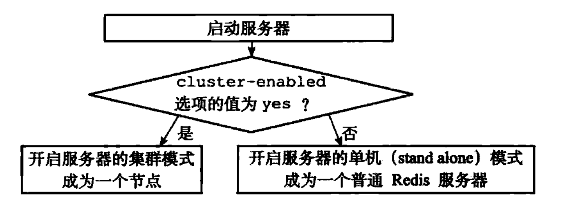

# 集群

集群是Redis提供的分布式数据库方案，集群通过分片来进行数据共享，并提供复制和故障转移功能。

## 一、节点

Redis集群通常由多个节点（node）组成。

通过`CLUSTER MEET <ip> <port>`命令可以将指定`ip`、`port`的节点加入到当前节点所在的集群。

通过`CLUSTER NODES`的命令可以查看当前集群的节点情况。

### 1.1 启动节点

一个节点就是一个运行在集群模式下的Redis服务器，Redis在启动时会根据`cluster-enabled`配置选项是否为`yes`来决定是否开启服务器的集群模式。


服务器判断是否开启集群模式的过程如下：


### 1.2 集群数据结构

`clusterNode`结构保存了一个节点的当前状态，比如节点的创建时间、节点的名字、节点当前的配置纪元、节点的IP地址端口号等。

```C
struct clusterNode {

    // 创建节点的时间
    mstime_t ctime;
    
    // 节点的名字，由40个十六进制字符组成
    char name[REDIS_CLUSTER_NAMELEN];
    
    // 节点标识，使用各种不同的标识值记录节点的角色（比如主节点或者从节点）
    // 以及节点目前所处的状态（比如在线或下线）
    int flags;
    
    // 节点当前的配置纪元，用于实现故障转移
    unit64_t configEpoch;
    
    // 节点的IP地址
    char ip[REDIS_IP_STR_LEN];
    
    // 节点的端口号
    int port;
    
    // 保存连接节点所需的有关信息
    clusterLink *link;
    
    //...
};
```

`clusterLink`结构保存了连接节点所需的有关信息，比如套接字描述符，输入缓冲区和输出缓冲区。

```C
typedef struct clusterLink {

    // 连接的创建时间
    mstime_t ctime;
    
    // TCP 套接字描述符
    int fd;
    
    // 输出缓冲区，保存着等待发送给其他节点的消息
    sds sndbuf;
    
    // 输入缓冲区，保存着从其他节点接收到的消息
    sds rcvbuf;
    
    // 与这个连接相关联的节点，如果没有的话为NULL
    struct clusterNode *node;

} clusterLink;
```

每个节点都保存着一个`clusterState`结构，这个结构记录了在当前节点的视角下，集群目前所处的状态，例如集群是在线还是下线，集群包含多少个节点，集群当前
的配置纪元等。

```C
typedef struct clusterState {

    // 指向当前节点的指针
    clusterNode *myself;
    
    // 集群当前的配置纪元，用于实现故障转移
    uint64_t currentEpoch;
    
    // 集群当前的状态：是在线还是下线
    int state;
    
    // 集群中至少处理着一个槽的节点的数量
    int size;
    
    // 集群节点名单（包括myself节点）
    // 字典的键为节点的名字，字典的值为节点对应的clusterNode结构
    dict *nodes;

} clusterState;
```

集群某个节点的`clusterState`结构如下：


### 1.3 CLUSTER MEET命令的实现

向节点A发送`CLUSTER MEET <ip> <port>`，节点A与节点B通信流程如下：
1. 节点A会为节点B创建一个`clusterNode`结构，并将该结构添加到自己的`clusterState.nodes`字典里面
2. 之后，节点A根据`CLUSTER MEET`命令给定的IP地址和端口号，向节点B发送一条`MEET`消息。
3. 如果一切顺利，节点B将接收到节点A发送的`MEET`消息，节点B会为节点A创建一个`clusterNode`结构，并将该结构添加到自己的`clusterState.nodes`字典里面
4. 之后，节点B将向节点A返回一条`PONG`消息
5. 如果一切顺利，节点A将接收到节点B返回的`PONG`消息，通过这条`PONG`消息节点A可以知道节点B已经成功的接收到自己发送的`MEET`消息
6. 之后，节点A将向节点B返回一条`PING`消息
7. 如果一切顺利，节点B将接收到节点A返回的`PING`消息，通过这条`PING`消息节点B可以知道节点A已经成功地接收到自己返回的`PONG`消息，握手完成。
8. 节点A将节点B的信息通过`Gossip`协议传播给集群中的其他节点，让其他节点也与节点B进行握手。

节点的握手过程如下：


## 二、槽指派

Redis集群通过分片的方式来保存数据库中的键值对：集群的整个数据库被分为16384个槽（slot），数据库中的每个键都属于这16384个槽的其中一个，集群中的每个节点
可以处理0个或最多16384个槽。

当数据库中的16384个槽都有节点在处理时，集群处于上线状态；相反的，如果数据库中有任意一个槽没有得到处理，那么集群处于下线状态。

- `CLUSTER INFO`命令可以显示当前的集群状态
- `CLUSTER ADDSLOTS <slot> [slot ...]`可以将一个槽或多个槽指派给节点负责

### 2.1 记录节点的槽指派信息

```C
struct clusterNode {
    // ...
    
    // 二进制位数组，2048个字节，包含16384个二进制位
    unsigned char slots[16384/8];
    
    // 记录节点负责处理的槽的数量
    int numslots;
};
```

如下，为一个负责处理槽1、3、5、8、9、10的slots数组示例：


### 2.2 传播节点的槽指派信息

一个节点除了会将自己负责处理的槽记录在`clusterNode`结构的`slots`属性和`numslots`属性之外，还会将自己的`slots`数组通过消息发送给集群中的其他节点，
以此来告知其他节点自己目前处理的槽。

接收到消息的节点，会从自己的`clusterState.nodes`字典中查找发送槽信息节点对应的`clusterNode`结构，并对结构中的`slots`数组进行保存或更新。

### 2.3 记录集群所有槽的指派信息

```C
typedef struct clusterState{

    // ...

    // 包含16384项，每个数组项都是一个指向`clusterNode`结构的指针    
    clusterNode *slots[16384];

} clusterState;
```

下图为`clusterState`结构的`slots`数组：


### 2.4 CLUSTER ADDSLOTS 命令的实现

伪代码如下：


## 三、在集群中执行命令

当客户端向节点发送与数据库键相关的命令时，接收命令的节点会计算出命令要处理的数据库键属于哪个槽，并检查这个槽是否指派给了自己。

判断客户端是否转向的流程图如下：


### 3.1 计算键属于哪个槽

节点使用如下算法计算键属于哪个槽：
```C
def slot_number(key):
    return CRC16(key) & 16383;
```

使用`CLUSTER KEYSLOT <key>`命令可以查看一个给定键属于哪个槽。

### 3.2 判断槽是否由当前节点负责处理

- 计算出键对应的槽之后，节点检查自己在`clusterState.slots`数组，是否是自身节点处理
- 若不是，则向客户端返回`MOVED`错误，指引客户端转向正在处理槽的节点

### 3.3 MOVED错误

`MOVED <slot> <ip>:<port>`

### 3.4 节点数据库的实现

节点只能使用0号数据库，单机Redis服务器没有这一限制。

节点使用`clusterState.slots_to_keys`跳跃表保存槽与键之间的关系，分值是槽号，成员是键。`CLUSTER GETKEYSINSLOT <slot> <count>`命令可以返回最多
`count`个属于槽`slot`的数据库键，这个命令就是通过遍历`slots_to_keys`跳跃表实现的。

```C
typedef struct clusterState{

    // ...
    
    zskiplist *slots_to_keys;

    // ...
} clusterState;
```

## 四、重新分片

Redis集群的重新分片操作可以将任意数量已经指派给某个节点（源节点）的槽改为指派给另一个节点（目标节点），并且相关槽所属的键值对也会从源节点移动到目标节点。

重新分片操作可以在线进行，集群不需要下线，并且源节点与目标节点都可以继续处理命令请求。

### 4.1 重新分片的实现原理

重新分片操作由Redis集群管理软件`redis-trib`负责执行。

1. `redis-trib`对目标节点发送`CLUSTER SETSLOT <slot> IMPORTING <source_id>`命令，让目标节点准备好从源节点导入属于槽`slot`的键值对。
2. `redis-trib`对源节点发送`CLUSTER SETSLOT <slot> MIGRATING <target_id>`命令，让源节点准备好将属于槽`slot`的键值对迁移到目标节点。
3. `redis-trib`向愿节点发送`CLUSTER GETKEYSINSLOT <slot> <count>`命令，获得最多`count`个属于槽`slot`的键值对的键名。
4. 对于步骤3获得的每个键名，`redis-trib`都向源节点发送一个`MIGRATE <target_ip> <target_port> <key_name> 0 <timeout>`命令，将被选中的键
原子地从源节点迁移至目标节点。
5. 重复执行步骤3和步骤4，直到愿节点保存的所有属于槽`slot`的键值对都被迁移到目标节点为止。
6. `redis-trib`向集群中的任一节点`CLUSTER SETSLOT <slot> NODE <target_id>`命令，将槽`slot`指派给目标节点，这一指派信息会通过消息发送至整个集群，
最终集群中的所有节点都会知道槽`slot`已经指派给了目标节点。

对槽`slot`进行重新分片的过程如下：


## 五、ASK错误

当客户端向源节点发送一个与数据库键相关的命令，并且该命令要处理的数据库键正好就属于正在被迁移的槽中，处理流程如下：


### 5.1 CLUSTER SETSLOT IMPORTING 命令的实现

`clusterState`结构的`importing_slots_from`数组记录了当前节点正在从其他节点导入的槽：

```C
typedef struct clusterState {

    // ...
    
    clusterNode *importing_slots_form[16384];
    
    // ...

} clusterState;
```

### 5.2 CLUSTER SETSLOT MIGRATING 命令的实现

`clusterState`结构的`migrating_slots_to`数组记录了当前节点正在迁移至其他节点的槽：

```C
typedef struct clusterState {

    // ...
    
    clusterNode *migrating_slots_to[16384];
    
    // ...

} clusterState;
```

### 5.3 ASK错误

如果节点收到一个关于键`key`的命令请求，并且键`key`所属的槽`i`正好就指派给了这个节点，那么节点会尝试在自己的数据库中查找键`key`，如果找到了的话，节点就直接执行客户
端发送的命令。相反，节点会检查自己的`clusterState.migrating_slots_to[i]`，看键`key`所属的槽`i`是否正在进行迁移，如果槽`i`的确在进行迁移的话，那么节点会向
客户端发送一个`ASK`错误，引导客户端到正在导入槽`i`的节点去查找键`key`。首先向目标节点发送一个`ASKING`命令，之后再重新发送原本想要执行的命令。

流程如下：


### 5.4 ASKING命令

`ASKING`命令唯一要做的就是打开发送该命令的客户端的`REDIS_ASKING`标识。

节点判断是否执行客户端命令的过程如下：


## 六、复制和故障转移


