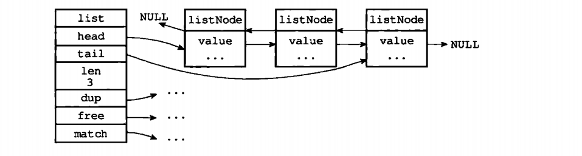

#链表

- 链表被广泛用于实现Redis的各种功能，比如列表键、发布订阅、慢查询、监视器等
- Redis的链表是双端链表，链表节点由listNode结构表示，每个节点都有一个指向前置节点和后置节点的指针
- 每个链表使用一个list结构表示，这个结构带有表头节点指针、表尾节点指针以及链表长度等信息
- 链表头结点的前置节点和表尾节点的后置节点都指向NULL，所以Redis链表实现的是无环链表
- 通过为链表设置不同的类型特定函数，Redis的链表可以用于保存各种不同类型的值

## 一、链表和链表节点的实现

### 1.1 链表节点

每个链表节点使用一个`adlist.h/listNode`结构来表示：

```C
typedef struct listNode {
	
	// 前置节点
	struct listNode *prev;
	
	// 后置节点
	struct listNode *next;
	
	// 节点的值
	void *value;
}listNode;
```

### 1.2 链表

`adlist.h/list`结构来表示链表

```C
typedef struct list {
	
	// 表头节点
	listNode *head;
	
	// 表尾节点
	listNode *tail;
	
	// 链表所包含的节点数量
	unsigned long len;
	
	// 节点值复制函数
	void *(*dup)(void *ptr);
	
	// 节点值释放函数
	void *(*free)(void *ptr);
	
	// 节点值对比函数
	int (*match)(void *ptr, void *key);
	
} list;
```

`dup`、`free`和`match`成员用于实现多态链表所需的类型特定函数：
- `dup`函数用于复制链表节点所保存的值
- `free`函数用于释放链表节点所保存的值
- `match`函数则用于对比链表节点所保存的值和另一个输入值是否相等

### 1.3 链表图示



## 二、链表API


