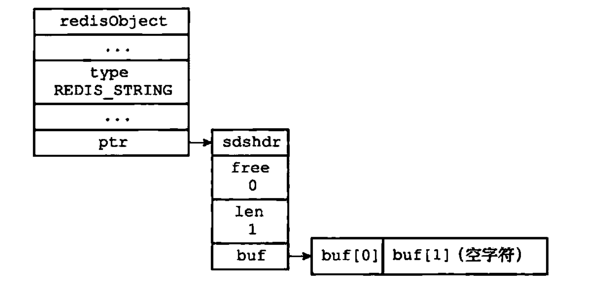
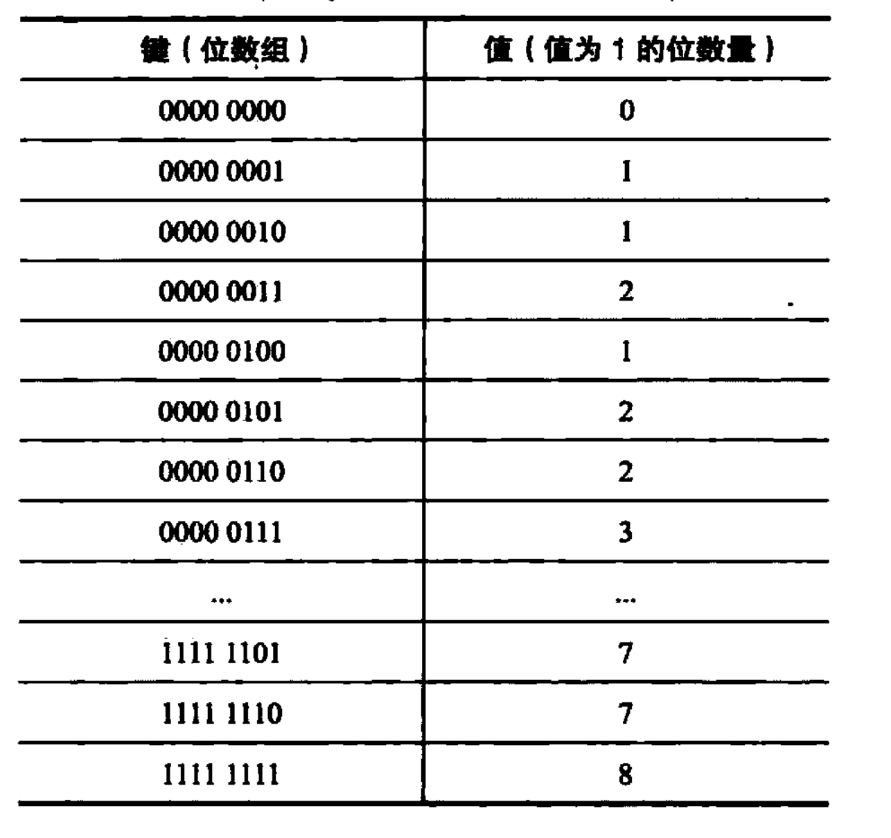

# 二进制位数组

Redis提供了`SETBIT`、`GETBIT`、`BITCOUNT`、`BITOP`四个命令用于处理二进制位数组。

- `SETBIT`命令用于为位数组指定偏移量上的二进制位设置值。
```
SETBIT bit 0 1
```
- `GETBIT`命令用于获取位数组指定偏移量上的二进制位的值。
```
GETBIT bit 0
```
- `BITCOUNT`用于统计位数组里面，值为1的二进制位的数量。
```
BITCOUNT bit
```
- `BITOP`命令可以对多个位数组进行按位与（and）、按位或（or）、按位异或（xor）、取反（not）运算。
```
BITOP AND and-result x y z
BITOP OR or-result x y z
BITOP XOR xor-result x y z
BITOP NOT not-value value
```

## 一、位数组的表示

Redis使用字符串对象来表示位数组，因为字符串对象使用的`SDS`数据结构是二进制安全的，所以程序可以直接使用`SDS`结构来保存位数组，并使用`SDS`结构的操作函数
来处理位数组。

如下图所示，为一字节长的位数组，逆序存储二进制位值。



## 二、GETBIT命令的实现

`GETBIT`命令用于返回位数组`bitarray`在`offset`偏移量上的二进制位的值。
```
GETBIT <bitarray> <offset>
```

`GETBIT`命令执行过程如下：
1. 计算`byte=[offset / 8]`，`byte`值记录了`offset`偏移量指定的二进制位保存在位数组的哪个字节。
2. 计算`bit=(offset mod 8) + 1`，`bit`值记录了`offset`偏移量指定的二进制位是`byte`字节的第几个二进制位。
3. 根据`byte`值和`bit`值，在位数组`bitarray`中定位`offset`偏移量指定的二进制位，并返回这个位的值。

## 三、SETBIT命令的实现

`SETBIT`用于将位数组`bitarray`在`offset`偏移量上的二进制位的值设置为`value`，并向客户端返回二进制位被设置之前的旧值。

```
SETBIT <bitarray> <offset> <value>
```

以下是`SETBIT`命令的执行过程：
1. 计算`len = [offset / 8] + 1`，`len`值记录了保存`offset`偏移量指定的二进制位至少需要多少字节。
2. 检查`bitarray`键保存的位数组（也即是SDS）的长度是否小于`len`，如果是的话，将`SDS`的长度扩展为`len`字节，并将所有新扩展空间的二进制位的值设置为0
3. 计算`byte = [offset / 8]`，`byte`值记录了`offset`偏移量指定的二进制位保存在位数组的哪个字节。
4. 计算`bit = (offset mod 8) + 1`，`bit`值记录了`offset`偏移量指定的二进制位是`byte`字节的第几个二进制位。
5. 根据`byte`值和`bit`值，在`bitarray`键保存的位数组中定位`offset`偏移量指定的二进制位，首先将指定二进制位现在值保存在`oldvalue`变量，然后将新值
`value`设置为这个二进制的值。
6. 向客户端返回`oldvalue`变量的值。

## 四、BITCOUNT命令的实现

`BITCOUNT`命令用于统计给定数组中，值为1的二进制位的数量。

### 4.1 二进制位统计算法：查表算法

查表算法指的是，创建一个表，表的键为某种排列的位数组，而表的值则是相应位数组中，值为1的二进制位的数量。

如下：可以快速检查8位长数组包含多少个1



### 4.2 二进制位统计算法：variable-precision SWAR算法


### 4.3 二进制位统计算法：Redis的实现

`BITCOUNT`命令的实现用到了查表和`variable-precision SWAR`两种算法：
- 查表算法使用键长为8位的表，表中记录了从`00000000`到`11111111`在内的所有二进制位的汉明重量。
- `variable-precision SWAR`算法，`BITCOUNT`命令在每次循环中载入128个二进制位，然后调用四次32位`variable-precision SWAR`算法

若未处理的二进制位的数量大于128位，那么程序使用`variable-precision SWAR`算法，否则，使用查表算法。

## 五、BITOP命令的实现

因为`C`语言直接支持对字节执行逻辑与、逻辑或、逻辑异或和逻辑非操作，索引`BITOP`命令的`AND`、`OR`、`XOR`、`NOT`四个操作都是直接基于这些逻辑操作实现的。

