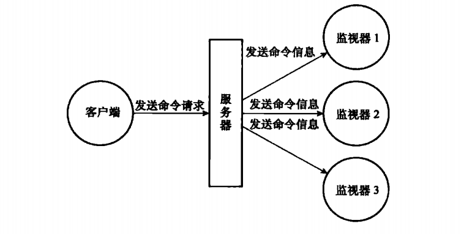

# 监视器

通过执行`MONITOR`命令，客户端可以将自己变为一个监视器，实时的接收并打印出服务器当前处理的命令请求的相关信息。

每当客户端发送一条命令请求给服务端，服务器除了会处理这条命令请求之外，还会将关于这条命令请求的信息发送给所有监视器。



## 一、成为监视器

伪代码如下：

```C
def MONITOR():

    # 打开客户端的监视器标志
    client.flags |= REDIS_MONITOR
    
    # 将客户端添加到服务器状态的 monitors 链表的末尾
    server.monitors.append(client)
    
    # 向客户端返回 OK
    send_reply("OK")
```

