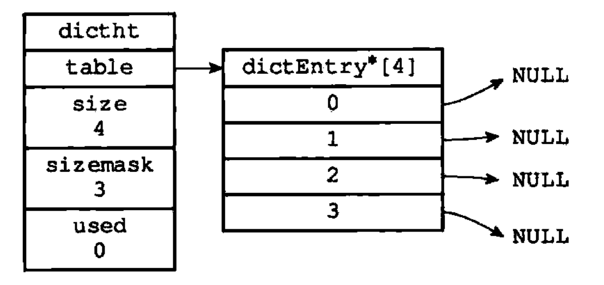
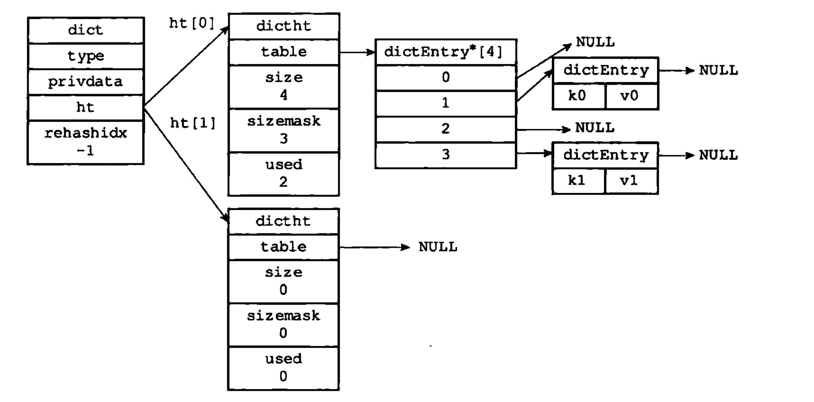

# 字典

- 又称为符号表、关联数组、映射
- 一种保存键值对的数据结构
- 字典中每个健都是独一无二的
- Redis中的数据库、哈希键等用到了字典

## 一、字典的实现

字典使用哈希表作为底层实现，一个哈希表包含多个哈希节点，每个哈希节点保存了字典的一个键值对

### 1.1 哈希表

```C

typedef struct dictht {

    // 哈希表数组
    dictEntry **table;
    
    // 哈希表大小
    unsigned long size;
    
    // 哈希表大小掩码，用来计算索引值
    // 总是等于 size - 1
    unsigned long sizemask;
    
    // 该哈希表已有节点数量
    unsigned long used;

} dictht;

```

`sizemask`属性的值总是等于`size - 1`，这个属性和哈希值一起决定一个键应该被放到table数组的哪个索引上面

**空哈希表图示如下**



### 1.2 哈希表节点

```C

typedef struct dictEntry {

    // 键
    void *key;
    
    // 值
    union{
        void *val;
        uint64_tu64;
        int64_ts64;
    } v;
    
    // 指向下一个哈希表节点，形成链表
    struct dictEntry *next;

} dictEntry;

```

- `v`属性保存着键值对中的值，其中键值对的值可以是一个指针，或者是一个`uint64_t`整数，又或者是一个`int64_t`整数
- `next`属性是指向另一个哈希表节点的指针，这个指针可以将多个哈希值相同的键值对连接在一起，以此来解决键冲突问题

### 1.3 字典

```C

typedef struct dict {

    // 类型特定函数
    dictType *type;
    
    // 私有数据
    void *privdata;
    
    // 哈希表
    dictht ht[2];
    
    // rehash索引
    // 当rehash不在进行时，值为-1
    long rehashidx;

} dict;

```

`type`属性和`privdata`属性是针对不同类型的键值对，为创建多态字典而设置的：
- `type`属性是一个指向`dictType`结构的指针，每个`dictType`结构保存了一簇用于操作特定类型键值对的函数，Redis会为用途不同的字典设置不同的类型特定函数
- `privdata`属性保存了需要传给那些类型特定函数的可选参数
- `ht`属性是一个包含两个项的数组，数组的每一项都是一个`dictht`哈希表，一般情况下，字典只使用`ht[0]`哈希表，`ht[1]`哈希表只会在对`ht[0]`哈希表进行`rehash`时使用
- `rehash`属性记录`rehash`目前的进度，如果目前没有`rehash`，那么它的值为-1

**普通状态下字典图示：**



## 二、哈希算法

```C

    // 使用字典设置的哈希函数，计算键key的哈希值
    hash = dict -> type -> hashFunction(key);
    
    // 使用哈希表的sizemask属性和哈希值，计算出索引值
    // 根据情况不同，ht[x]可以是ht[0]或者ht[1]
    index = hash & dict -> ht[x].sizemask;

```

**注意**

当字典用作数据库的底层实现，或者哈希键的底层实现时，Redis使用`MurmurHash2`算法来计算键的哈希值。因为`MurmurHash2`算法对于有规律的键，仍能给出一个很好的随机分布性。

## 三、解决键冲突

当有两个或以上数量的键被分配到了哈希表数组的同一个索引上面时，我们称这些键发生了冲突。  
使用链地址法来解决键冲突，每个哈希表节点都有一个next指针，多个哈希表节点可以用next指针构成一个单向链表。  
新节点总是添加到链表的表头位置。

## 四、rehash

进行`rehash`的目的是为了保持哈希表的负载因子维持在一个合理的范围之内。

Redis对哈希表进行`rehash`的步骤如下：
1. 为字典的ht[1]哈希表分配空间，分配空间大小的策略如下：
    - 若是扩展操作，那么ht[1]的大小为第一个大于等于`ht[0].used*2`的 2^n
    - 若是收缩操作，那么ht[1]的大小为第一个大于等于`ht[0].used`的 2^n
2. 将保存在`ht[0]`中的所有键值对rehash到`ht[1]`上面：rehash指的是重新计算键的哈希值和索引值，然后将键值对放置到`ht[1]`哈希表的指定位置上
3. 释放`ht[0]`，将`ht[1]`设置为`ht[0]`，并在`ht[1]`新创建一个空白哈希表，为下一次rehash作准备。

### 4.1 哈希表的扩展和收缩

当以下条件中的任意一个被满足时，程序会自动开始对哈希表进行扩展操作：
1. 服务器目前没有在执行`BGSAVE`命令或者`BGREWRITEAOF`命令，并且哈希表的负载因子大于等于1
2. 服务器目前正在执行`BGSAVE`命令或者`BGREWRITEAOF`命令，并且哈希表的负载因子大于等于5

负载因子计算公式如下：

```C

// 负载因子 = 哈希表已保存节点数量 / 哈希表大小
load_factor = ht[0].used / ht[0].size

```

在`BGSAVE`和`BGREWRITEAOF`期间，Redis需要创建当前服务器进程的子进程，而大多数操作系统都是采用写时复制技术来优化子进程的使用效率，所以在子进程存在期间，服务器会提高执行扩展操作所需的负载因子，从而尽可能的避免在子进程存在期间进行哈希表的扩容操作，这可以避免不必要的内存写入操作，最大限度节约内存。

当哈希表的负载因子小于0.1时，程序自动开始对哈希表进行收缩操作。

## 五、渐进性rehash


