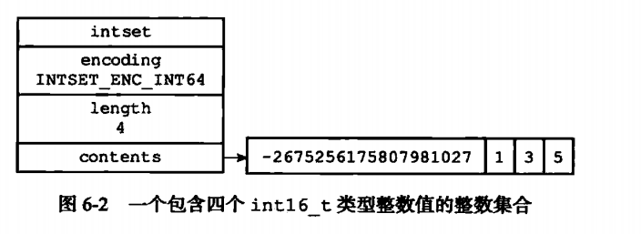

# 整数集合

当Redis集合只包含整数值元素，并且这个集合的元素数量不多时，Redis就会使用整数集合作为集合键的底层实现。

## 一、整数集合的实现

每个`intset.h/intset`结构表示一个整数集合：

```C

typedef struct intset {

    // 编码方式
    uint32_t encoding;
    
    // 集合包含的元素数量
    uint32_t length;
    
    // 保存元素的数组
    int8_t contents[];

} intset;

```

- `contents`数组是整数集合的底层实现：整数集合的每个元素都是`contents`数组的一个数组项，从小到大有序排列，不重复
- `length`属性记录了整数集合包含的元素数量
- `contents`数组的真正类型取决于`encoding`属性的值：
    - `int16_t`类型
    - `int32_t`类型
    - `int64_t`类型
    
图示：


## 二、升级

每当我们要将一个新元素添加到整数集合里面，并且新元素的类型比整数集合现有所有元素的类型都要长时，整数集合需要先进行升级，然后才能将新元素添加到整数集合里面。

升级步骤如下：
1. 根据新元素的类型，扩展整数集合底层数组的空间大小，并为新元素分配空间
2. 将底层数组现有的所有元素都转换成与新元素相同的类型，并将类型转换后的元素放置到正确的位置上，而且在放置元素的过程中，需要继续维持底层数组的有序性不变
3. 将新元素添加到底层元素数组里面

### 2.1 升级的好处

- 提升灵活性
- 节约内存

### 2.2 降级

不支持降级

## 三、重点回顾

- 整数集合是集合键的底层实现之一
- 整数集合底层实现为数组，数组以有序、无重复的方式保存集合元素，在有需要时，程序会根据新添加元素的类型，改变这个数组的类型
- 升级操作为整数集合带来了操作上的灵活性，并且尽可能的节约了内存
- 整数集合只支持升级，不支持降级


