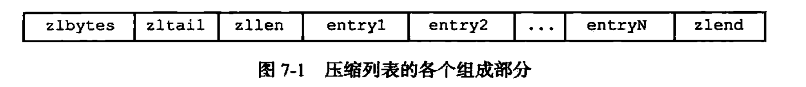

# 压缩列表

- 列表键、哈希键的底层实现之一
    - 当列表键只包含少量列表项，并每个列表项要么是小整数值，要么是长度比较短的字符串
    - 当哈希键只包含少量键值对，并每个键值对的键和值要么是小整数值，要么是长度比较短的字符串
    
## 一、压缩列表的构成

- 压缩列表是Redis为节约内存而开发的，由一系列特殊编码的连续内存块组成的顺序型数据结构
- 一个压缩列表可以包含任意多个节点，每个节点可以保存一个字节数组或者一个整数值

| 属性 | 类型 | 长度 | 用途 |
| :--- | :--- | :--- | :--- |
| zlbytes | uint32_t | 4字节 | 记录整个压缩列表占用的内存字节数：在对压缩列表进行内存重分配，或者计算`zlend`的位置时使用 |
| zltail | uint32_t | 4字节 | 记录压缩列表表尾节点距离压缩列表的起始地址有多少字节：通过这个偏移量，程序无须遍历整个压缩列表就可以确定表尾节点的地址 |
| zllen | uint16_t | 2字节 | 记录了压缩列表包含的节点数量：当这个属性的值小与`uint16_max`时，这个属性的值就是压缩列表包含的节点数量；当这个值等于`uint16_max`时，节点的真实数量需要遍历整个压缩列表才能计算得出 |
| entryx | 列表节点 | 不定 | 压缩列表包含的各个节点，节点的长度由节点保存的内容决定 | 
| zlend | uint8_t | 1字节 | 特殊值`0xff`(十进制255)，用于标记压缩列表的末端 |

## 二、压缩列表节点的构成

每个压缩列表节点可以保存一个字节数组或者一个整数值
- 字节数组长度可以是
    - `2^6-1`
    - `2^14-1`
    - `2^32-1`
- 整数值可以是以下六种长度的其中一种
    - 4位长，介于0到12之间的无符号整数
    - 1字节长的有符号整数
    - 3字节长的有符号整数
    - int16_t类型整数
    - int32_t类型整数
    - int64_t类型整数
    

### 2.1 previous_entry_length

以字节为单位，记录了压缩列表前一个节点的长度

该属性的长度可以是1字节或者5字节
- 若前一节点长度小于254字节，则该属性长度为1字节，前一节点的长度就保存在这一个字节里面
- 若前一节点的长度大于等于254字节，则该属性的长度为5字节：其中属性的第一个字节被设置为0XFE，而之后的四个字节则用于保存前一节点的长度

从表尾遍历到表头的过程就用到了该属性

### 2.2 encoding

- 一字节、两字节、五字节，值的最高位为00、01或者10的是字节数组编码
- 一字节，值的最高位以11开头的是整数编码

### 2.3 content

节点的`content`属性负责保存节点的值，节点值可以是一个字节数组或者整数，值的类型和长度由`encoding`属性决定

## 三、连锁更新

在对压缩列表进行添加、删除节点的操作，都有可能引起操作节点的后续节点`previous_entry_length`属性的内存重分配。Redis将这种在特殊情况下产生的连续多次空间扩展操作称之为连锁更新。

## 四、重点回顾

- 压缩列表是一种为节约内存而开发的顺序型数据结构
- 压缩列表被用作列表键、哈希键的底层实现之一
- 压缩列表可以包含多个节点，每个节点可以保存一个字节数组或者整数值
- 添加或者删除节点，可能会引发连锁更新操作

