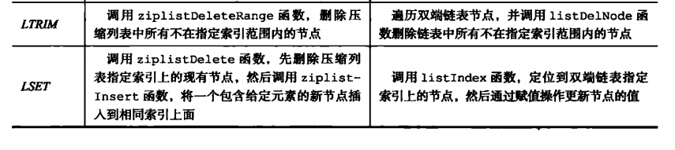

# 对象

- Redis基于SDS、双端链表、字典、压缩列表、整数集合等数据结构创建了一个对象系统，该系统包含字符串对象、列表对象、哈希对象、集合对象和有序集合对象五种类型的对象，每种对象都用到了至少一种数据结构。
- Redis可以根据对象的类型来判断一个对象是否可以执行给定的命令
- 针对不同的使用场景，为对象设置多种不同的数据结构，优化对象在不同场景下的使用效率
- Redis对象系统基于引用计数回收内存、实现对象共享
- Redis对象记录访问时间记录信息，在服务器启用了`maxmemory`功能的情况下，空转时间较长的键可能会优先被服务器删除

## 一、对象的类型和编码

Redis的对象由`redisObject`结构表示

```C

typedef struct redisObject {

    // 类型
    unsigned type:4;
    
    // 编码
    unsigned encoding:4;
    
    // 指向底层实现数据结构的指针
    void *ptr;

} redisObject;

```

### 1.1 类型

对象的`type`属性记录了对象的类型，下表列出了`type`属性的值以及`TYPE`命令在面对不同类型的值对象时所产生的的输出

| 对象 | 对象type属性的值 | TYPE命令的输出 |
| :--- | :--- | :--- |
| 字符串对象 | REDIS_STRING | "string" |
| 列表对象 | REDIS_LIST | "list" |
| 哈希对象 | REDIS_HASH | "hash" |
| 集合对象 | REDIS_SET | "set" |
| 有序集合对象 | REDIS_ZSET | "zset" |

### 1.2 编码和底层实现

`encoding`属性记录了对象所使用的的编码，即这个对象使用什么数据结构作为对象的底层实现，下表列出了`encoding`属性可能的值：

| 编码常量 | 编码所对应的底层数据结构 |
| :--- | :--- |
| REDIS_ENCODING_INT | long类型的整数 |
| REDIS_ENCODING_EMBSTR | embstr编码的简单动态字符串 |
| REDIS_ENCODING_RAW | 简单动态字符串 |
| REDIS_ENCODING_HT | 字典 |
| REDIS_ENCODING_LINKEDLIST | 双端链表 |
| REDIS_ENCODING_ZIPLIST | 压缩列表 |
| REDIS_ENCODING_INTSET | 整数集合 |
| REDIS_ENCODING_SKIPLIST | 跳跃表和字典 |

每种类型的对象都至少使用了两种不同的编码，下表为每种类型的对象可以使用的编码

| 类型 | 编码 | 对象 |
| :--- | :--- | :--- |
| REDIS_STRING | REDIS_ENCODING_INT | 使用整数值实现的字符串对象 |
| REDIS_STRING | REDIS_ENCODING_EMBSTR | 使用embstr编码的简单动态字符串实现的字符串对象 |
| REDIS_STRING | REDIS_ENCODING_RAW | 使用简单动态字符串实现的字符串对象 |
| REDIS_LIST | REDIS_ENCODING_ZIPLIST | 使用压缩列表实现的列表对象 |
| REDIS_LIST | REDIS_ENCODING_LINKEDLIST | 使用双端列表实现的列表对象 |
| REDIS_HASH | REDIS_ENCODING_ZIPLIST | 使用压缩列表实现的哈希对象 |
| REDIS_HASH | REDIS_ENCODING_HT | 使用字典实现的哈希对象 |
| REDIS_SET | REDIS_ENCODING_INTSET | 使用整数集合实现的集合对象 |
| REDIS_SET | REDIS_ENCODING_HT | 使用字典实现的集合对象 |
| REDIS_ZSET | REDIS_ENCODING_ZIPLIST | 使用压缩列表实现的有序集合对象 |
| REDIS_ZSET | REDIS_ENCODING_SKIPLIST | 使用跳跃表和字典实现的有序集合对象 |

通过`encoding`属性极大的提高了Redis的灵活性和效率，因为Redis可以根据不同的使用场景来为一个对象设置不同的编码，从而优化对象在某一场景下的效率。

## 二、字符串对象

字符串对象的编码可以是`int`、`raw`或者`embstr`

1. int编码的字符串对象

    如果一个字符串对象保存的是整数值，并且这个整数值可以用`long`类型来表示，那么字符串对象会将整数值保存在字符串对象结构的`ptr`属性里面
    （将 `void*`转为 `long`），并将字符串对象的编码设置为`int`。

    下图为`int`编码的字符串对象

    

2. raw编码的字符串对象

    如果字符串对象保存的是一个字符串值，并且这个字符串值得长度大于32字节，则字符串对象将使用一个简单动态字符串（SDS）来保存这个字符串值，并将对象的编码设置为`raw`。
    
    下图为`raw`编码的字符串对象
    
    

3. embstr编码的字符串对象

    如果字符串对象保存的是一个字符串值，并且这个字符串值得长度小于等于32字节，则字符串对象将使用`embstr`编码的方式来保存这个字符串值。
    
    `embstr`编码专门用来保存短字符串的一种优化编码方式，与`raw`一样，都使用`redisObject`和`sdshdr`结构来表示字符串对象，不同之处在于`raw`编码调用两次内存分配来分别创建`redisObject`结构和
    `sdshdr`结构，而`embstr`编码则通过一次内存分配函数来分配一块连续的空间，空间中依次包含`redisObject`和`sdshdr`两个结构。`embstr`编码创建的内存结构块如下图所示：
    
    
    
    `embstr`编码字符串的好处：
    
    - 内存分配次数从两次降低为一次
    - 释放内存从两次降为一次
    - 所有数据保存在一块连续的内存里面，比起`raw`编码的字符串对象能够更好的利用缓存带来的优势

    下图为`embstr`编码的字符串对象：
    
    
    
### 2.1 编码的转换

`int`编码、`embstr`编码的字符串对象在条件满足的情况下，会被转换成`raw`编码的字符串对象。

例如对`int`编码、`embstr`编码进行修改操作等

### 2.2 字符串命令的实现


    
## 三、列表对象

列表对象的编码可以是`ziplist`或者`linkedlist`

1. ziplist编码

    下图为`ziplist`编码的列表对象

    

2. linkedlist编码

    下图为`linkedlist`编码的列表对象
    
    
    
### 3.1 编码转换

当列表对象可以同时满足一下两个条件时，列表对象使用`ziplist`编码：
- 保存的所有字符串元素的长度都小于64字节
- 列表对象保存的元素数量小于512个

不能满足以上两个条件的列表对象需要使用`linkedlist`编码

### 3.2 列表命令的表现




## 四、哈希对象

哈希对象的编码可以是`ziplist`或者`hashtable`

1. ziplist编码的哈希对象

    - 保存了同一键值对的两个节点总是紧挨在一起，保存键的节点在前，保存值得节点在后
    - 先添加的键值对会被放在压缩列表的表头方向，而后来添加的键值对会被放在压缩列表的表尾方向
    
    下图为`ziplist`编码的哈希对象示意图：
    
    
    
    
2. hashtable编码的哈希对象

    - 字典中的每个键都是一个字符串对象，对象中保存了键值对的键
    - 字典中的每个值都是一个字符串对象，对象中保存了键值对的值
    
    下图为`hashtable`编码的哈希对象示意图：
    
    
    
### 4.1 编码转换

当哈希表同时满足以下条件时，哈希对象使用`ziplist`编码：
- 所有键值对的键和值的字符串长度都小于64字节
- 保存的键值对数量小于512个

### 4.2 哈希命令的实现


## 五、集合对象

集合对象的编码可以是`intset`或者`hashtable`

- `intset`编码的集合对象：


- `hashtable`编码的集合对象：


### 5.1 编码转换

当集合对象可以同时满足以下两个条件时，对象使用`intset`编码：
- 所有元素都是整数值
- 保存的元素数量不超过512个

### 5.2 集合命令


## 六、有序集合对象

有序集合的编码可以是`ziplist`或者`skiplist`。

1. ziplist编码的有序集合对象

    - 每个集合元素使用两个紧挨在一起的压缩列表节点来保存，第一个节点保存元素的成员，第二个节点保存元素的分值
    - 压缩列表的集合元素按分值从小到大进行排序
    
    下图为`ziplist`编码的有序集合对象示意图：

    
    

2. 
    
