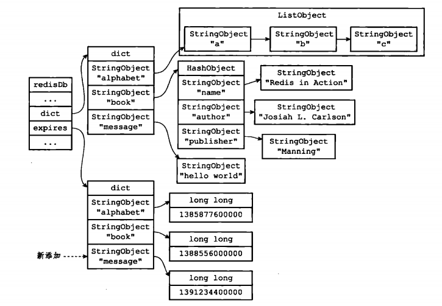
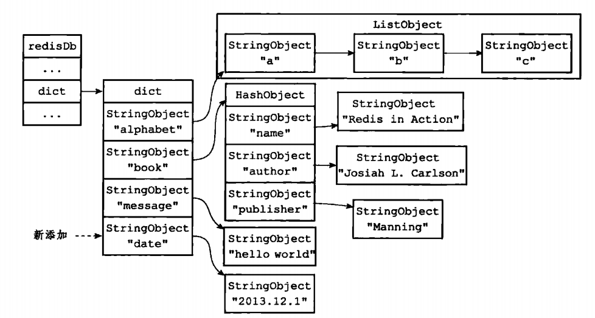
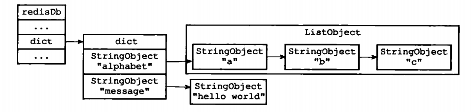
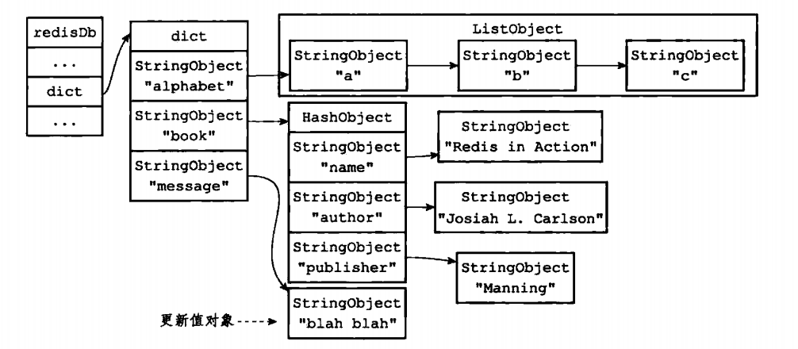
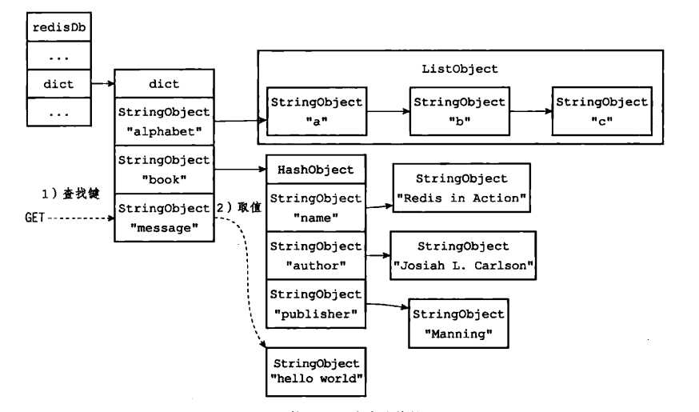
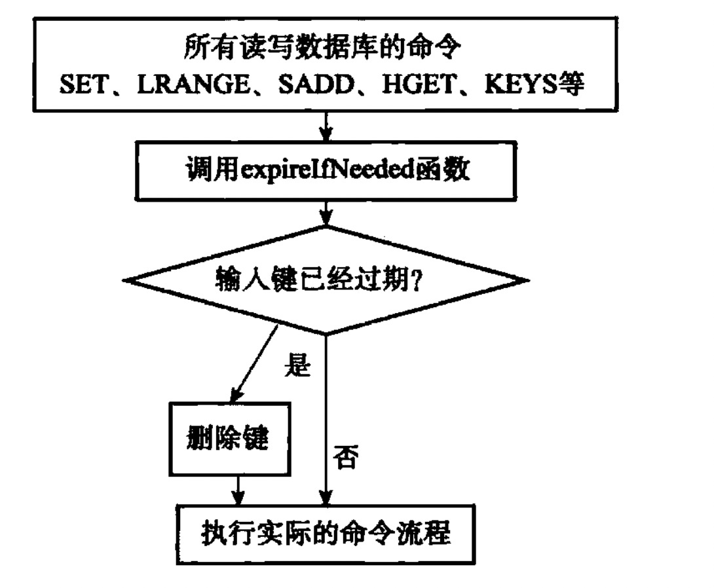

# 数据库

- 服务器保存数据库的方法
- 客户端切换数据库的方法
- 数据库保存键值对的方法
- 针对数据库添加、删除、查看、更新操作的实现方法
- 保存键过期时间的方法
- 服务器自动删除过期键的方法

## 一、服务器中的数据库

```C

struct redisServer {

    // 一个数组，保存着服务器中的所有数据库
    redisDb *db;
    
    // 服务器的数据库数量，默认16，可通过配置服务器配置的`database`选项设置
    int dbnum;

};

```

## 二、切换数据库

客户端连接redis，默认连接到0数据库，可通过`SELECT`命令切换

```C

typedef struct redisClient {

    // 记录客户端当前正在使用的数据库
    redisDb *db;

} redisClient;

```

`SELECT`命令主要是通过修改`redisClient`结构中的`db`属性，来切换数据库。

## 三、数据库键空间

redis数据库的数据结构如下：

```C
    
    // 数据库键空间，保存着数据库中的所有键值对
    dict *dict;
    
    // 过期字典，保存着键的过期时间，key为指向键的指针，value为以毫秒为单位的时间戳
    dict *expires;
    
```

数据库存储图示：



### 3.1 增加键



### 3.2 删除键



### 3.3 更新键



### 3.4 对键取值



### 3.5 读取键空间时的维护操作

- 更新键空间的命中和不命中次数，可通过`INFO stats`命令的`keyspace_hits`属性和`keyspace_misses`属性查看
- 更新键的LRU（最后一次使用）时间，这个值可以用于计算键的闲置时间，使用`OBJECT idletime <key>`命令可以查看`key`的闲置时间
- 若发现键过期，则删除键
- 若该键使用`WATCH`命令被监视，则该键被修改后，会将该键标记为脏（dirty），从而让事务程序注意到这个键已经被修改
- 服务器每修改一个键之后，都会对脏键计数器的值增1，该计数器会触发服务器的持久化和复制操作
- 若服务器开启了数据库通知功能，则在对键进行修改之后，服务器将按照配置发送相应的数据库通知

## 四、设置键的生存时间或过期时间

```
// 以秒为单位为数据库中的某个键设置生存时间
EXPIRE key seconds

// 以毫秒为单位为数据库中的某个键设置生存时间
PEXPIRE key milliseconds

// 过期时间设置为时间戳，单位为秒
EXPIREAT key timestamp

// 过期时间设置为时间戳，单位为毫秒
PEXPIREAT key milliseconds-timestamp

// 以秒为单位，返回键的剩余过期时间
TTL key

// 以毫秒为单位，返回键的剩余过期时间
PTTL key

// 解除键的过期时间设置
PERSIST key

```

- 设置过期时间命令可以用`EXPIRE`、`PEXPIRE`、`EXPIREAT`、`PEXPIREAT`，但底层都是调用的`PEXPIREAT`
- 通过`PERSIST`命令可以解除键和值在过期字典中的关联
- `TTL`、`PTTL`都是都是通过计算键的过期时间与当前时间的差来实现的

## 五、过期键删除策略

1. 定时删除
    设置键过期时间同时，创建定时器
    
    优点：
    - 内存友好
    
    缺点：
    - CPU不友好
    - 定时器需要用到Redis服务器的时间事件（时间事件是什么？），无序链表实现的时间事件，查找复杂度为O(N)
    
2. 惰性删除

    程序只会在取出键时才对键进行过期检查
    
    优点：
    - CPU时间友好
    
    缺点：
    - 内存不友好
        
3. 定期删除

    定期删除中和了定时删除与惰性删除，但难点是确定删除操作执行的时长和频率
    
## 六、Redis的过期键删除策略

惰性删除 + 定期删除

### 6.1 惰性删除策略的实现

所有读写数据库的Redis命令在执行之前都会调用`expireIfNeeded`函数对输入键进行检查。下图为函数逻辑：



### 6.2 定期删除策略的实现

过期键的定期删除策略由`redis.c/activeExpireCycle`函数实现，每当Redis的服务器周期性操作`redis.c/serverCron`函数执行时，`activeExpireCycle`函数就会被调用，
在规定的时间内，分多次遍历服务器中的各个数据库，从数据库的`expires`字典中随机检查一部分键的过期时间，并删除其中的过期键。

## 七、AOF、RDB和复制功能对过期键的处理

- `SAVE`或者`BGSAVE`命令生成RDB文件，已过期的键不会被保存到新的RDB文件中
- 载入RDB文件时，过期键的处理策略视服务器是主服务器还是从服务器而定：
    - 主服务器，过期键不会被载入
    - 从服务器，所有键都会被载入
- 当过期键被惰性或者定期删除，AOF文件会添加一条`DEL`命令。当过期键没有被删除，AOF文件不会受到影响
- AOF重写时，过期键不会被保存到AOF文件中

### 7.1 复制

当服务器运行在复制模式下，从服务器的过期键删除动作由主服务器控制：
- 主服务器删除一个过期键之后，会显式向所有从服务器发送一个`DEL`命令，告知从服务器删除这个过期键
- 从服务器执行客户端发送的命令时，即使发现过期键，也不删除
- 从服务器只有接收到主服务器发送的`DEL`命令，才会删除过期键

## 八、数据库通知

- 键空间通知：某个键执行了什么命令
- 键事件通知：某个命令被什么键执行了

服务器配置的`notify-keyspace-events`选项决定服务器所发送通知的类型：
- AKE：键空间、键事件
- AK：键空间
- AE：键事件
- K$：只发送字符串相关的键空间通知
- E1：只发送和列表键有关的键事件通知

