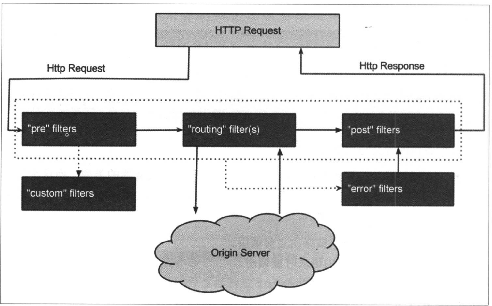

#背景

+ 需要一套机制来有效降低维护路由规则与服务实例列表的难度
+ 需要一套机制能够很好的解决微服务架构中，对于微服务接口访问时各前置校验的冗余问题

#功能

+ 网关用于所有外部客户端访问的调度和过滤，实现了请求路由、负载均衡、校验过滤以及与服务治理框架的结合、请求转发时的熔断机制、服务的聚合等一系列功能

#快速入门

##构建网关

+ 创建一个SpringBoot工程，并引入依赖如下：

    <dependency>
        <groupId>org.springframework.cloud</groupId>
        <artifactId>spring-cloud-starter-netflix-zuul</artifactId>
    </dependency>
    
+ 创建应用主类，使用`@EnableZuulProxy`注解开启`Zuul`的API网关服务功能

    @EnableZuulProxy
    @SpringBootApplication
    public class GatewayApplication {
    
        public static void main(String[] args) {
            SpringApplication.run(GatewayApplication.class, args);
        }
    }
    

+ 在`application.properties`中配置基础信息，如应用名、端口等

    spring.application.name=api-gateway
    server.port=5555
    
##请求路由

###传统路由方式

    spring.application.name=api-gateway
    server.port=5555
    
    zuul.routes.api-a-url.path=/api-a-url/**
    zuul.routes.api-a-url.url=http://localhost:8080/
    
当访问`http://localhost:5555/api-a-url/hello`时，API网关将会将请求路由到`http://localhost:8080/hello`提供的服务接口上

###面向服务的路由

传统路由配置方式并不友好，需要运维人员花费大量时间维护各个路由`path`与`url`的关系。面向服务的路由，则是通过`zuul`与`eureka`的无缝整合，可以让路由的`path`不是具体的`url`，而是让它们映射到某个具体的服务，而具体的`url`则交给`eureka`的服务发现机制去自动维护。

+ 增加eureka的依赖

    <dependency>
        <groupId>org.springframework.cloud</groupId>
        <artifactId>spring-cloud-starter-netflix-eureka-server</artifactId>
    </dependency>
    
+ `application.properties`相关配置

    spring.application.name=api-gateway
    server.port=5555
    
    zuul.routes.api-a.path=/api-a/**
    zuul.routes.api-a.service-id=hello-service
    
    zuul.routes.api-b.path=/api-b/**
    zuul.routes.api-b.service-id=feign-consumer
    
    eureka.client.service-url.defaultZone=http://localhost:19999/eureka
    

##请求过滤

+ 定义一个简单的`Zuul`过滤器

    public class AccessFilter extends ZuulFilter {
        @Override
        public String filterType() {
            return "pre";
        }
    
        @Override
        public int filterOrder() {
            return 0;
        }
    
        @Override
        public boolean shouldFilter() {
            return true;
        }
    
        @Override
        public Object run() throws ZuulException {
            RequestContext requestContext = RequestContext.getCurrentContext();
            HttpServletRequest httpServletRequest = requestContext.getRequest();
    
            Object accessToken = httpServletRequest.getParameter("accessToken");
            if (accessToken == null) {
                requestContext.setSendZuulResponse(false);
                requestContext.setResponseStatusCode(401);
                return null;
            }
    
            return null;
        }
    }
    

+ `filterType`过滤器的类型，决定过滤器的请求在哪个生命周期中执行
+ `filterOrder`过滤器的执行顺序，当请求在一个阶段中存在多个过滤器时，需要根据该方法返回的值依次执行
+ `shouldFilter`判断过滤器是否需要被执行
+ `run`过滤器的具体逻辑
+ 需要创建具体的Bean，过滤器才能生效

    @EnableZuulProxy
    @SpringBootApplication
    public class GatewayApplication {
    
        public static void main(String[] args) {
            SpringApplication.run(GatewayApplication.class, args);
        }
    
        @Bean
        public AccessFilter accessFilter() {
            return new AccessFilter();
        }
    }
    
##路由详解

###传统路由配置

+ 单实例配置

    zuul.routes.user-service.path=/user-service/**
    zuul.routes.user-service.url=http://localhost:8080/
    
+ 多实例配置

    zuul.routes.user-service.path=/user-service/**
    zuul.routes.user-service.service-id=user-service
    ribbon.eureka.enable=false
    user-service.ribbon.listOfServers=http://localhost:8080/,http://localhost:8081
    
###服务路由配置

+ 服务路由配置，可采用`zuul.routes.<serviceId>=<path>`的简洁方式进行配置
+ 默认情况下，所有`Eureka`上的服务都会被`Zuul`自动的创建映射关系来进行路由。可以使用`zuul.ignored-services`参数来设置一个服务名匹配表达式来定义不自动创建路由的规则
+ `Zuul`提供了自定义服务与路由映射关系的功能，如可将服务名为`userservice-v1`自动映射为`/v1/userservice/**`

        @Bean
        public PatternServiceRouteMapper patternServiceRouteMapper() {
            return new PatternServiceRouteMapper(
                    "(?<name>^.+)-(?<version>v+$)",
                    "${version}/${name}");
        }
        
+ 路径匹配采用Ant风格
    + `?`——匹配任意单个字符
    + `*`——匹配任意数量的字符
    + `**`——匹配任意数量的字符，支持多级目录
    
+ 使用`zuul.ignored-patterns=/**/hello/**`忽略`hello`接口
+ `zuul.prefix=/api`全局的为路由规则增加前缀信息
+ `zuul.routes.api-b.url=forward:/local`，通过`forward`实现本地跳转，保证网关内部有对应`local`的接收处理
+ 默认情况下，`zuul`请求路由时，会过滤掉HTTP请求头信息中的一些敏感信息。默认的敏感头信息通过`zuul.sensitiveHeaders`参数定义，包括`cookie`、`Set-Cookie`、`Authorization`三个属性
    + 通过设置全局参数为空覆盖默认值，`zuul.sensitiveHeaders=`
    + 对指定路由开启自定义敏感头，`zuul.routes.<route>.customSensitiveHeaders=true`
    + 将指定路由的敏感头设置为空，`zuul.routes.<route>.sensitiveHeaders=`
    
+ `zuul.addHostHeader=true`使网关在路由转发前为请求设置`Host`头信息，以标示最初的服务端请求地址

##过滤器详解

###过滤器

Spring Cloud Zuul实现的过滤器必须包含4个基本特征：过滤类型、执行顺序、执行条件、具体操作
+ `filterType`:函数返回值代表过滤器的类型（在HTTP请求过程中定义的各个阶段）
    + `pre`：可以在请求被路由之前调用
    + `routing`：在路由请求时被调用
    + `post`：在routing和error过滤器之后被调用
    + `error`：处理请求时发生错误时被调用
+ `filterOrder`：定义过滤器的执行顺序，数值越小优先级越高
+ `shouldFilter`：判断过滤器是否被执行
+ `run`：过滤器的具体逻辑

###请求生命周期

###异常处理

+ `try-catch`处理：在自定义的过滤器处理逻辑中增加`try-catch`，在`catch`中对`error.status_code`等进行赋值
+ `ErrorFilter`处理：

###禁用过滤器

使用`zuul.<SimpleClassName>.<filterType>.disable=true`对过滤器进行禁用

##动态加载

###动态路由

###动态过滤器

eg：动态路由及动态过滤器都是通过分布式配置中心进行实现

